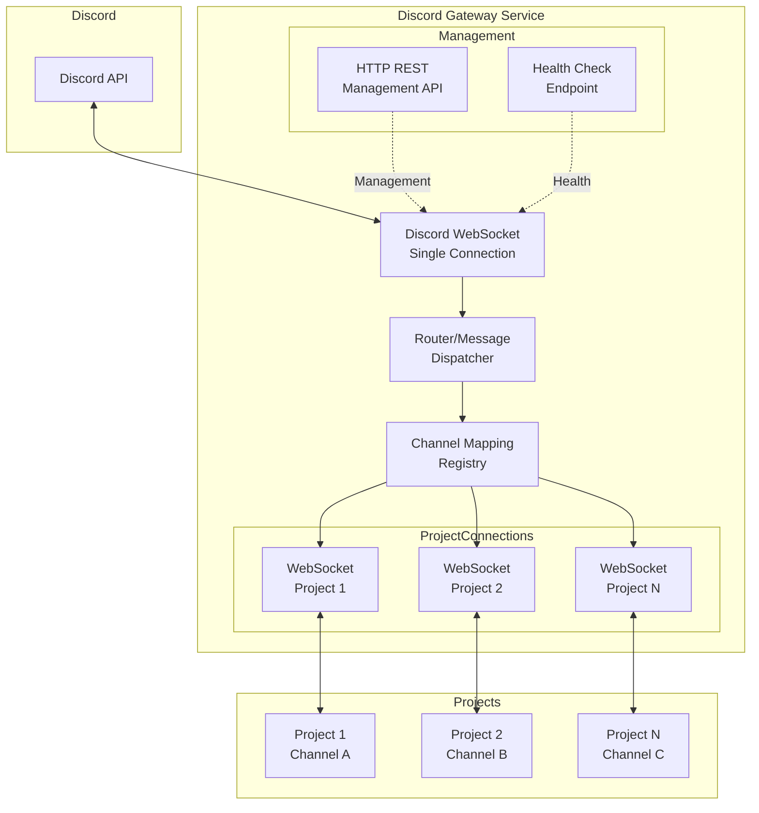
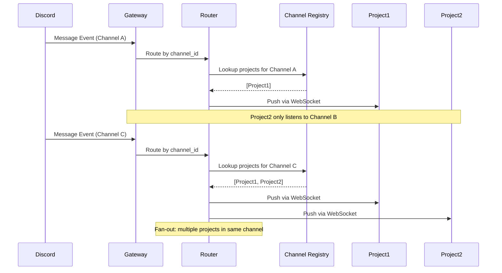
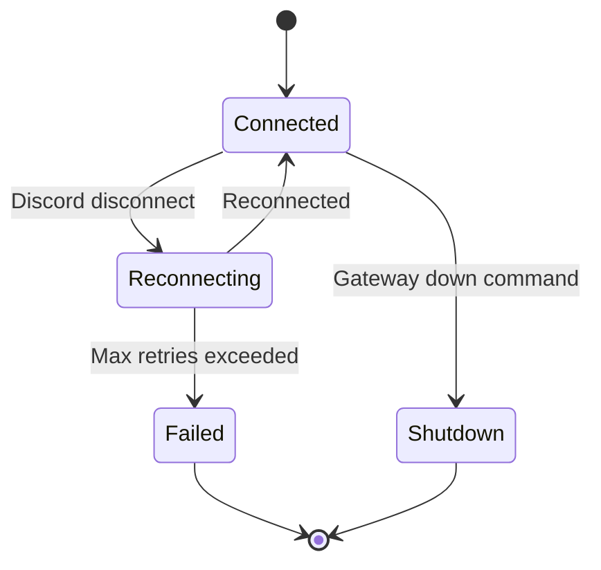
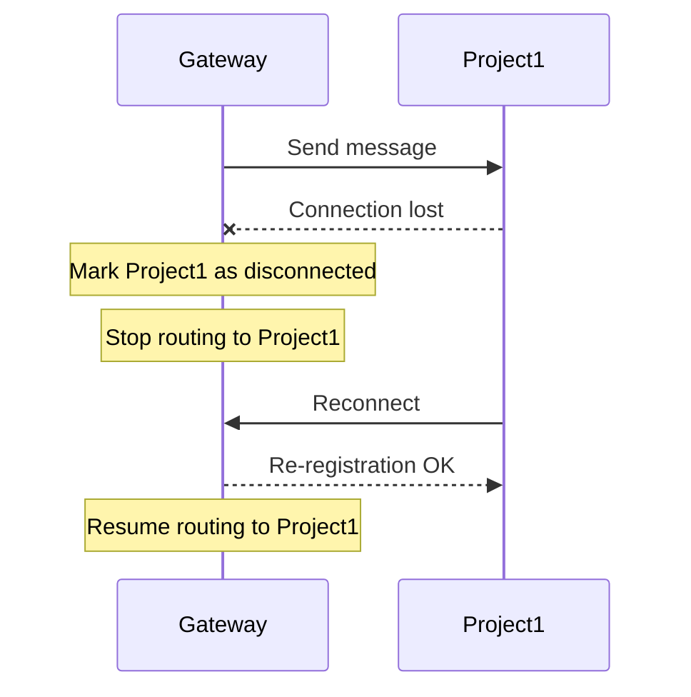

# Discord Gateway Service Technical Plan

## Overview

This document outlines a comprehensive plan for implementing a standalone Discord Gateway Service that allows multiple switchboard projects to share a single Discord token while handling different channels independently.

---

## 1. Gateway Architecture

### 1.1 High-Level Architecture



### 1.2 Single Discord Connection Strategy

The gateway maintains **one** Discord WebSocket connection using [`twilight-gateway`](src/discord/gateway.rs:9):

- **Connection Management**: Uses existing [`DiscordGateway`](src/discord/gateway.rs:95) struct with twilight-gateway
- **Intents**: Configurable via gateway config (default: GUILD_MESSAGES + DIRECT_MESSAGES + MESSAGE_CONTENT = 21504)
- **Event Filtering**: Gateway filters events at source, only processing channels configured in channel mapping

### 1.3 Message Routing Flow



### 1.4 Channel Registry

The gateway maintains a dynamic registry of channel-to-project mappings:

```rust
// src/gateway/registry.rs
pub struct ChannelRegistry {
    /// Maps Discord channel_id -> list of connected projects
    channel_to_projects: HashMap<String, Vec<ProjectId>>,
    /// Maps project_id -> project connection details
    projects: HashMap<ProjectId, ProjectConnection>,
}

impl ChannelRegistry {
    /// Register a project for specific channels
    pub fn register(&mut self, project: ProjectConnection, channels: Vec<String>);
    
    /// Unregister a project (removes from all channels)
    pub fn unregister(&mut self, project_id: &ProjectId);
    
    /// Get all projects listening to a channel
    pub fn projects_for_channel(&self, channel_id: &str) -> &[ProjectId];
}
```

---

## 2. Configuration Design

### 2.1 Gateway Configuration File (TOML)

Location: `./gateway.toml` (project root) or `./switchboard-gateway.toml`

```toml
# Discord Gateway Configuration
# ==============================

# Discord Bot Token (required)
# Can use env var syntax: ${DISCORD_TOKEN}
discord_token = "${DISCORD_TOKEN}"

# Gateway listening ports
[server]
# HTTP port for management API and health checks
http_port = 9745
# WebSocket port for project connections
ws_port = 9746

# Logging configuration
[logging]
level = "info"
file = ".switchboard/gateway.log"

# Channel Mappings
# ===============
# Maps Discord channel IDs to project endpoints
# Format: channel_id = project_endpoint

[[channels]]
# Project 1 listens to channel 123456789
channel_id = "123456789"
project_name = "dev-agent"
# Project's WebSocket URL or port
# If local, use "localhost:PORT"
# If remote, use full URL "wss://project.example.com/ws"
endpoint = "localhost:9001"

[[channels]]
# Project 2 listens to channel 987654321
channel_id = "987654321"
project_name = "prod-agent"
endpoint = "localhost:9002"

[[channels]]
# Fan-out example: Multiple projects in same channel
channel_id = "111222333"
project_name = "analytics-agent"
endpoint = "localhost:9003"

# Optional: Default project for unmapped channels
# [default]
# project_name = "fallback-agent"
# endpoint = "localhost:9099"
```

### 2.2 Per-Project Configuration

Each switchboard project that wants to use the gateway should have a section in their `switchboard.toml`:

```toml
# switchboard.toml (for each project)

[gateway]
# Enable gateway integration
enabled = true

# Gateway connection settings
# Can be "localhost" (default) or "wss://gateway.example.com"
host = "localhost"
http_port = 9745
ws_port = 9746

# Channels this project wants to listen to
# Can reference env vars: ${MY_CHANNEL_ID}
channels = [
    "123456789",
    "987654321"
]

# Reconnection settings
[gateway.reconnect]
# Maximum reconnection attempts (0 = infinite)
max_attempts = 10
# Initial backoff in seconds
initial_backoff = 1
# Maximum backoff in seconds
max_backoff = 60
```

### 2.3 Configuration Loading

```rust
// src/gateway/config.rs

#[derive(Debug, Deserialize)]
pub struct GatewayConfig {
    pub discord_token: String,
    pub server: ServerConfig,
    pub logging: LoggingConfig,
    pub channels: Vec<ChannelMapping>,
}

#[derive(Debug, Deserialize)]
pub struct ChannelMapping {
    pub channel_id: String,
    pub project_name: String,
    pub endpoint: String,
}

impl GatewayConfig {
    /// Load from gateway.toml or switchboard-gateway.toml
    pub fn load(path: Option<&str>) -> Result<Self, ConfigError>;
    
    /// Load from environment with defaults
    pub fn from_env() -> Result<Self, ConfigError>;
}
```

---

## 3. Project Integration

### 3.1 Protocol Design

The gateway communicates with projects via WebSocket using JSON messages:

#### Connection Handshake

```json
// Client -> Gateway: Registration
{
    "type": "register",
    "project_name": "dev-agent",
    "channels": ["123456789", "987654321"],
    "protocol_version": "1.0"
}

// Gateway -> Client: Registration Response
{
    "type": "register_ack",
    "status": "ok",
    "session_id": "uuid-v4",
    "gateway_info": {
        "version": "1.0.0",
        "discord_connected": true
    }
}
```

#### Message Delivery

```json
// Gateway -> Client: New Discord Message
{
    "type": "message",
    "channel_id": "123456789",
    "message": {
        "id": "msg-uuid",
        "content": "Hello from Discord!",
        "author": {
            "id": "user-123",
            "username": "developer",
            "bot": false
        },
        "timestamp": "2026-03-02T12:00:00Z",
        "guild_id": "guild-456"
    }
}
```

#### Heartbeat Protocol

```json
// Client -> Gateway: Heartbeat
{
    "type": "heartbeat",
    "session_id": "uuid-v4",
    "timestamp": 1709380800
}

// Gateway -> Client: Heartbeat Ack
{
    "type": "heartbeat_ack",
    "session_id": "uuid-v4",
    "server_time": 1709380860
}
```

#### Message Types Summary

| Type | Direction | Description |
|------|-----------|-------------|
| `register` | Client→Gateway | Project registration with channels |
| `register_ack` | Gateway→Client | Registration response |
| `register_error` | Gateway→Client | Registration failed |
| `message` | Gateway→Client | Discord message delivery |
| `heartbeat` | Bidirectional | Connection health check |
| `heartbeat_ack` | Gateway→Client | Heartbeat response |
| `channel_subscribe` | Client→Gateway | Subscribe to additional channels |
| `channel_unsubscribe` | Client→Gateway | Unsubscribe from channels |
| `gateway_status` | Gateway→Client | Periodic status broadcast |
| `shutdown` | Gateway→Client | Gateway shutting down |

### 3.2 Project Client Library

Projects can use a client library to connect to the gateway:

```rust
// src/gateway/client.rs

pub struct GatewayClient {
    project_name: String,
    ws_sender: mpsc::Sender<String>,
    ws_receiver: mpsc::Receiver<String>,
    session_id: Option<String>,
    // ... connection state
}

impl GatewayClient {
    /// Connect to gateway
    pub async fn connect(
        gateway_url: &str,
        project_name: String,
        channels: Vec<String>,
    ) -> Result<Self, GatewayClientError>;
    
    /// Receive messages from gateway
    pub async fn recv(&mut self) -> Result<GatewayMessage, GatewayClientError>;
    
    /// Send heartbeat
    pub async fn heartbeat(&mut self) -> Result<(), GatewayClientError>;
    
    /// Check if connected
    pub fn is_connected(&self) -> bool;
}
```

### 3.3 Handling Gateway Unavailability

Projects should implement reconnection logic:

```rust
// Reconnection strategy for projects
struct ReconnectStrategy {
    max_attempts: u32,
    initial_backoff: Duration,
    max_backoff: Duration,
}

impl ReconnectStrategy {
    fn next_delay(&self, attempt: u32) -> Duration {
        let delay = self.initial_backoff * 2.pow(attempt);
        delay.min(self.max_backoff)
    }
}

// Connection state machine
enum ConnectionState {
    Disconnected,
    Connecting,
    Registered,
    Reconnecting { attempt: u32 },
    Failed { reason: String },
}
```

---

## 4. CLI Commands

### 4.1 Gateway Subcommand

Add gateway management to CLI:

```rust
// src/cli/commands/gateway.rs

#[derive(Parser)]
pub enum GatewayCommand {
    /// Start the Discord Gateway Service
    Up(GatewayUpCommand),
    
    /// Stop the Discord Gateway Service
    Down,
    
    /// Show gateway status and connected projects
    Status,
    
    /// Reload gateway configuration
    Reload,
}
```

### 4.2 Command: `switchboard gateway up`

```bash
# Start gateway in foreground
switchboard gateway up

# Start gateway in background
switchboard gateway up --detach

# Start with custom config
switchboard gateway up --config /path/to/gateway.toml

# Start with verbose logging
switchboard gateway up -v
```

**Implementation:**
- Parse `gateway.toml` or `switchboard-gateway.toml`
- Validate Discord token
- Create HTTP server for management API
- Create WebSocket server for project connections
- Connect to Discord Gateway
- Register channel mappings
- Run event loop with graceful shutdown

### 4.3 Command: `switchboard gateway status`

```bash
# Show gateway status
switchboard gateway status

# Output example:
# ┌─────────────────────────────────────────────────────┐
# │ Discord Gateway Service Status                      │
# ├─────────────────────────────────────────────────────┤
# │ Status:           Running                            │
# │ Discord:          Connected (user_id: 123456789)    │
# │ Uptime:           2h 34m 15s                         │
# │ Connected Projects: 3                                │
# ├─────────────────────────────────────────────────────┤
# │ Projects:                                          │
# │   - dev-agent     (localhost:9001) [CH: 123456789] │
# │   - prod-agent    (localhost:9002) [CH: 987654321] │
# │   - analytics     (localhost:9003) [CH: 111222333]  │
# └─────────────────────────────────────────────────────┘
```

### 4.4 Command: `switchboard gateway down`

```bash
# Stop the gateway gracefully
switchboard gateway down

# Force stop (SIGKILL)
switchboard gateway down --force
```

### 4.5 Project Auto-Registration

Projects can connect automatically on startup:

```rust
// In project code (switchboard discord integration)
async fn connect_to_gateway(config: &GatewayProjectConfig) {
    let client = GatewayClient::connect(
        &format!("ws://{}:{}/ws", config.host, config.ws_port),
        "my-project".to_string(),
        config.channels.clone(),
    ).await;
    
    // Handle messages...
}
```

---

## 5. Edge Cases

### 5.1 Gateway Downtime



**Handling:**
- Projects track gateway state
- On disconnect, projects enter "reconnecting" state
- Exponential backoff for reconnection attempts
- Queue messages locally during disconnect (optional)
- Send "gateway_unavailable" event to project

### 5.2 Project Disconnection



**Handling:**
- Gateway detects WebSocket disconnect
- Remove project from channel mappings temporarily
- Project can re-register with same session_id for resume
- Cleanup stale connections after timeout (30 seconds)

### 5.3 Discord Rate Limiting

```mermaid
flowchart LR
    subgraph Discord
        RT[Rate Limit]
    end
    
    subgraph Gateway
        QM[Queue Manager]
        RL[Rate Limit<br/>Tracker]
    end
    
    QM -->|Request| RT
    RT -->|429| RL
    RL -->|Wait| QM
    
    Note over QM: Per-channel rate limit tracking
    Note over QM: Respect global Discord rate limits
```

**Handling:**
- Track requests per channel
- Implement request queuing with delays
- Handle 429 responses with Retry-After header
- Exponential backoff on repeated rate limits

### 5.4 Fan-Out (Multiple Projects per Channel)

**Scenario:** Channel A has 3 subscribed projects

```rust
// Message routing for fan-out
fn route_message(&self, channel_id: &str, message: &DiscordMessage) {
    let projects = self.channel_registry.projects_for_channel(channel_id);
    
    for project_id in projects {
        if let Some(project) = self.get_project(project_id) {
            let _ = project.send(message);
            // Continue even if one fails
        }
    }
}
```

**Guarantees:**
- Best-effort delivery to all subscribers
- Failure to one project doesn't affect others
- Order preserved within each project's stream

### 5.5 Message Ordering

- Messages delivered in Discord event order
- Each project receives messages in same order as Discord
- No ordering guarantees between different projects

---

## 6. Implementation Phases

### Phase 1: Basic Gateway with Single Project

**Goal:** Gateway connects to Discord, forwards messages to one project

**Tasks:**
- [ ] Create gateway module structure: `src/gateway/mod.rs`
- [ ] Implement config loading from `gateway.toml`
- [ ] Create HTTP server with health check endpoint
- [ ] Create WebSocket server for project connections
- [ ] Implement basic registration protocol
- [ ] Wire up Discord Gateway connection
- [ ] Implement message routing to single project
- [ ] Add CLI command `switchboard gateway up`

**Files to create:**
- `src/gateway/mod.rs` - Gateway module
- `src/gateway/config.rs` - Configuration
- `src/gateway/server.rs` - HTTP/WS servers
- `src/gateway/protocol.rs` - Message protocol
- `src/gateway/routing.rs` - Message routing
- `src/cli/commands/gateway.rs` - CLI command

**Files to modify:**
- `src/cli/mod.rs` - Add GatewayCommand
- `Cargo.toml` - Add tokio-tungstenite for WebSocket

### Phase 2: Channel Routing with Config File

**Goal:** Support multiple channels mapped to different projects

**Tasks:**
- [ ] Implement ChannelRegistry
- [ ] Support channel mapping in config
- [ ] Route messages by channel_id
- [ ] Support channel subscribe/unsubscribe at runtime
- [ ] Add configuration validation

**Files to create/modify:**
- `src/gateway/registry.rs` - Channel registry
- `src/gateway/config.rs` - Extended config

### Phase 3: Multi-Project Support & Reconnection

**Goal:** Robust multi-project with reconnection handling

**Tasks:**
- [ ] Implement project connection management
- [ ] Add heartbeat protocol
- [ ] Implement reconnection logic
- [ ] Handle project disconnections gracefully
- [ ] Add fan-out message delivery
- [ ] Implement rate limit handling

**Files to create/modify:**
- `src/gateway/connections.rs` - Connection management
- `src/gateway/heartbeat.rs` - Heartbeat protocol
- `src/gateway/ratelimit.rs` - Rate limiting

### Phase 4: CLI Integration & Monitoring

**Goal:** Complete CLI experience with status monitoring

**Tasks:**
- [ ] Implement `switchboard gateway status`
- [ ] Implement `switchboard gateway down`
- [ ] Add PID file management
- [ ] Add proper logging
- [ ] Create gateway client library for projects

**Files to create/modify:**
- `src/gateway/client.rs` - Client library
- `src/cli/commands/gateway.rs` - Complete CLI

---

## 7. File Structure

```
src/
├── gateway/
│   ├── mod.rs           # Gateway module exports
│   ├── config.rs        # Configuration structs
│   ├── server.rs        # HTTP/WS server
│   ├── protocol.rs      # Message protocol
│   ├── routing.rs       # Message routing
│   ├── registry.rs      # Channel/project registry
│   ├── connections.rs   # Connection management
│   ├── heartbeat.rs     # Heartbeat protocol
│   ├── ratelimit.rs     # Discord rate limiting
│   └── client.rs        # Client library for projects
│
└── cli/
    └── commands/
        └── gateway.rs   # Gateway CLI commands
```

---

## 8. Dependencies

```toml
# Cargo.toml additions

# WebSocket support for project connections
tokio-tungstenite = "0.24"
futures-util = "0.3"

# For UUID-based session IDs
uuid = { version = "1.10", features = ["v4", "serde"] }

# For async trait support (if needed)
async-trait = "0.1"

# Already available:
# - tokio = "1.40" (full features)
# - twilight-gateway = "0.17"
# - serde_json = "1.0"
# - toml = "0.8"
# - tracing = "0.1"
```

---

## 9. API Endpoints

### Management HTTP API

| Method | Endpoint | Description |
|--------|----------|-------------|
| GET | `/health` | Health check |
| GET | `/status` | Gateway status |
| GET | `/projects` | List connected projects |
| GET | `/channels` | List channel mappings |
| POST | `/reload` | Reload configuration |

### WebSocket Endpoint

| Endpoint | Description |
|----------|-------------|
| `/ws` | Project WebSocket connection |

---

## 10. Security Considerations

1. **Token Storage**: Discord token in config file should reference env var, not plain text
2. **Project Authentication**: Projects register with name; consider adding shared secret
3. **TLS**: Production deployments should use TLS (wss://)
4. **Rate Limiting**: Respect Discord's rate limits to avoid bot suspension

---

## 11. Testing Strategy

### Unit Tests
- Config loading/validation
- Message protocol parsing
- Channel registry operations
- Rate limiting logic

### Integration Tests
- Gateway to Discord connection
- Project registration flow
- Message routing
- Reconnection handling

### Manual Testing
- CLI commands
- Multiple projects with fan-out
- Gateway restart scenarios

---

## Summary

This plan provides a comprehensive blueprint for implementing a Discord Gateway Service that:

1. **Maintains a single Discord WebSocket connection** - Efficient resource usage
2. **Routes messages by channel** - Based on configurable channel mapping
3. **Supports multiple projects** - Each project connects via WebSocket
4. **Handles edge cases** - Reconnection, rate limiting, fan-out
5. **Integrates with CLI** - Via `switchboard gateway` commands
6. **Follows the codebase patterns** - Uses existing twilight-gateway, config loading, CLI structure

The implementation is phased to deliver value incrementally, starting with basic single-project support and building toward full multi-project capabilities.
