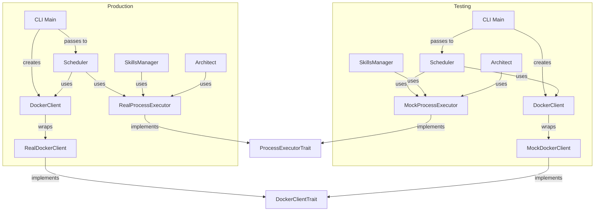

# Feature Requirements Document: Testability Enhancement for switchboard-rs

**Feature:** Trait-Based Dependency Injection for Testability  
**Status:** Draft  
**Version:** 0.1.0  
**Author:** TBD  
**Last Updated:** 2026-02-19

---

## 1. Overview

### 1.1 Summary

This document defines the requirements for implementing trait-based dependency injection to enhance the testability of the switchboard-rs CLI codebase. Currently, approximately 40% of the codebase has LOW or NO testability due to direct dependencies on external services and system processes. This feature introduces trait abstractions for Docker operations and process execution, enabling mock implementations that allow fast, deterministic unit tests without requiring Docker daemon, external command execution, or file system operations.

The enhancement follows a phased approach, prioritizing Docker abstraction (used in 3 core modules) and process execution abstraction (used in 4 modules), which will unlock testability for approximately 70% of the currently untestable code.

### 1.2 Background

The switchboard-rs CLI is a Rust-based tool for managing AI agents with Docker containers and cron-based scheduling. The codebase currently has significant testability limitations because core modules directly instantiate concrete types like `bollard::Docker` and `std::process::Command`. This makes unit testing impossible without running Docker daemon, executing external commands (git, npx, docker), or performing file system operations.

As a result:
- Current test coverage is approximately 35%
- Core modules like `docker/mod`, `docker/run`, `architect`, `skills`, `cli/mod`, and `scheduler/mod` are largely untestable
- Tests are slow, fragile, and CI-unfriendly when they do exist
- Refactoring is risky due to lack of test coverage
- Development velocity is limited by the inability to confidently make changes

### 1.3 Goals

- Enable full testability across all modules through trait-based dependency injection
- Achieve 80%+ test coverage across the entire codebase
- Enable fast, deterministic unit tests that run without Docker, external processes, or network access
- Maintain backward compatibility with existing production code
- Create comprehensive test suites for all core functionality
- Establish testing best practices and CI/CD integration

### 1.4 Non-Goals

- This feature will not change any production behavior or user-facing functionality
- Will not introduce breaking changes to the public API (backward compatibility maintained)
- Will not require changes to user configuration files or CLI commands
- Will not implement a full dependency injection framework (manual injection is sufficient)
- Will not replace integration tests with unit tests (both are needed)

---

## 2. User Stories

| ID | Role | Story | Priority |
|----|------|-------|----------|
| US-01 | Developer | I want to run unit tests without Docker so I can develop without Docker installed | High |
| US-02 | Developer | I want to test Docker operations with mocks so tests run fast and deterministically | High |
| US-03 | Developer | I want to test git operations without a real git repository | Medium |
| US-04 | Developer | I want to test skills management without npx installed | Medium |
| US-05 | Developer | I want to verify test coverage metrics automatically | High |
| US-06 | CI/CD | I want fast unit test suites to run on every PR | High |
| US-07 | CI/CD | I want integration tests to run separately, only when needed | Medium |
| US-08 | Maintainer | I want confidence to refactor code without breaking behavior | High |
| US-09 | Maintainer | I want to detect regressions quickly through automated testing | High |
| US-10 | Maintainer | I want to ensure new code includes tests via coverage gating | Medium |

---

## 3. Functional Requirements

### 3.1 Core Trait Abstractions

#### 3.1.1 DockerClientTrait

A trait abstracting all Docker operations used by the codebase.

**Required Methods:**
- `ping()` - Check if Docker daemon is available and responsive
- `image_exists(name, tag)` - Check if an image exists locally
- `build_image(options, context)` - Build a Docker image from build context
- `run_container(config)` - Create and run a container with the given configuration
- `stop_container(container_id, timeout)` - Stop a running container
- `container_logs(container_id, follow, tail)` - Get logs from a container
- `wait_container(container_id, timeout)` - Wait for a container to exit

**Acceptance Criteria:**
- Trait is defined in `src/traits/mod.rs` with full documentation
- All methods are async and return appropriate Result types
- Trait is thread-safe (Send + Sync bounds)
- `RealDockerClient` implements the trait using bollard::Docker
- Mock implementations can be created using mockall
- Type alias `DockerClient = RealDockerClient` maintains backward compatibility

---

#### 3.1.2 ProcessExecutorTrait

A trait abstracting external system command execution (git, npx, docker CLI commands).

**Required Methods:**
- `execute(program, args)` - Execute a command and return its output
- `execute_with_env(program, args, env, working_dir)` - Execute with custom environment and working directory

**Supporting Types:**
- `ProcessOutput` - Contains status, stdout, and stderr from command execution
- `ExitStatus` - Enum for process exit status (Code, Signal, Unknown)
- `ProcessError` - Error type for process execution failures

**Acceptance Criteria:**
- Trait is defined in `src/traits/mod.rs` with full documentation
- All methods are async and return appropriate Result types
- Trait is thread-safe (Send + Sync bounds)
- `RealProcessExecutor` implements the trait using std::process::Command
- Mock implementations can be created using mockall
- Handles cross-platform differences (Windows vs Unix)

---

### 3.2 Module Refactoring Requirements

#### 3.2.1 docker/mod.rs Refactoring

**Current Issues:**
- Directly instantiates `bollard::Docker`
- Uses `Command::new("docker")` for context operations
- Cannot be tested without running Docker daemon

**Required Changes:**
1. Create `RealDockerClient` struct implementing `DockerClientTrait`
2. Move existing `DockerClient` implementation to `RealDockerClient`
3. Update `DockerClient` to wrap `Arc<dyn DockerClientTrait>`
4. Add `new_with_client()` constructor accepting trait object
5. Keep `new()` constructor for backward compatibility (creates RealDockerClient)
6. Replace `Command::new("docker")` with `ProcessExecutorTrait`

**Acceptance Criteria:**
- All Docker operations go through `DockerClientTrait`
- Backward compatibility maintained via `DockerClient` type alias
- `new()` and `new_with_client()` constructors both available
- Docker context operations use injected `ProcessExecutorTrait`
- Can be tested with mock `DockerClientTrait` and mock `ProcessExecutorTrait`

---

#### 3.2.2 docker/run.rs Refactoring

**Current Issues:**
- `run_agent()` creates containers directly
- Uses Docker API calls throughout execution flow

**Required Changes:**
1. Update `run_agent()` signature to accept `Arc<dyn DockerClientTrait>`
2. Extract container creation logic into separate function
3. Extract log streaming logic into separate function
4. Ensure all container operations go through the trait
5. Update `ContainerConfig` to use trait-compatible types

**Acceptance Criteria:**
- `run_agent()` accepts injected `DockerClientTrait`
- Container lifecycle operations are extracted and testable
- All Docker calls go through trait interface
- Can test timeout handling, log streaming, and error scenarios with mocks

---

#### 3.2.3 scheduler/mod.rs Refactoring

**Current Issues:**
- Creates `DockerClient` in `execute_agent()`
- Cannot test scheduler logic without Docker

**Required Changes:**
1. Add `docker_client: Arc<dyn DockerClientTrait>` field to `Scheduler`
2. Update `Scheduler::new()` to accept optional `docker_client` parameter
3. Default to `RealDockerClient` if none provided
4. Update `execute_agent()` to use injected `docker_client`
5. Pass `docker_client` through scheduler lifecycle

**Acceptance Criteria:**
- `Scheduler` struct includes `docker_client` field
- Constructor accepts optional docker_client with sensible default
- Overlap detection, agent registration, and scheduling logic testable without Docker
- Scheduler lifecycle can be tested with mock Docker client

---

#### 3.2.4 architect/mod.rs & architect/state.rs Refactoring

**Current Issues:**
- Uses `Command::new("git")` for all git operations
- Cannot test without git repository

**Required Changes:**
1. Add optional `executor: Arc<dyn ProcessExecutorTrait>` parameter to functions
2. Replace `Command::new("git")` calls with `executor.execute("git", ...)`
3. Update `commit_progress()` to use injected executor
4. Update `save_state()` to optionally commit via executor
5. Add production wrapper functions with default executor

**Acceptance Criteria:**
- State persistence can be tested without git
- Git operations use injected `ProcessExecutorTrait`
- Both test (with mock) and production (with RealProcessExecutor) paths available
- Session lifecycle testable without repository

---

#### 3.2.5 skills/mod.rs Refactoring

**Current Issues:**
- Calls `npx skills` directly
- Cannot test without npx and skills CLI

**Required Changes:**
1. Add `executor: Arc<dyn ProcessExecutorTrait>` to `SkillsManager`
2. Replace npx calls with `executor.execute("npx", ...)`
3. Update constructor to accept optional executor
4. Default to `RealProcessExecutor` for production use

**Acceptance Criteria:**
- Skill listing, installation, and operations use injected executor
- Can test with mock npx output
- Error handling for missing npx testable
- Skill parsing logic testable independently

---

#### 3.2.6 cli/mod.rs Refactoring

**Current Issues:**
- Creates `DockerClient` in multiple functions
- Uses `Command::new` for process management

**Required Changes:**
1. Add optional `docker_client: Option<Arc<dyn DockerClientTrait>>` parameter to command handlers
2. Create Docker client once at top level in `run()`
3. Pass client to `run_up()`, `run_run()`, `run_build()`, `run_down()`
4. Replace process management with `ProcessExecutorTrait`
5. Update all command dispatch logic

**Acceptance Criteria:**
- Docker client created once and passed to all commands
- All command handlers accept optional Docker client
- CLI commands testable with mock Docker client
- Command parsing and dispatch testable independently

---

### 3.3 Testing Infrastructure

#### 3.3.1 Mock Implementation Pattern

Using `mockall` crate for generating mock implementations of traits.

**Required Dependencies:**
- `mockall = "0.12"` in dev-dependencies
- `async-trait = "0.1"` in dependencies

**Mock Setup Pattern:**
```rust
#[cfg(test)]
mod tests {
    use super::*;
    use mockall::mock;
    
    mock! {
        DockerClientMock {}
        
        #[async_trait]
        impl DockerClientTrait for DockerClientMock {
            async fn ping(&self) -> Result<(), DockerError>;
            // ... other methods
        }
    }
}
```

**Acceptance Criteria:**
- mockall added to Cargo.toml dev-dependencies
- async-trait added to Cargo.toml dependencies
- Mock generation pattern documented
- All traits have mock implementations available

---

#### 3.3.2 Test Suite Organization

**Required Directory Structure:**
```
tests/
├── common/
│   ├── mod.rs               # Shared test helpers
│   ├── fixtures.rs          # Test data fixtures
│   └── assertions.rs        # Custom assertion macros
├── unit/
│   ├── docker_unit.rs       # Docker operations
│   ├── scheduler_unit.rs    # Scheduler logic
│   ├── architect_unit.rs    # Architect workflow
│   ├── skills_unit.rs      # Skills management
│   ├── cli_unit.rs        # CLI commands
│   ├── config_unit.rs      # Config parsing
│   ├── logger_unit.rs     # Logger behavior
│   ├── metrics_unit.rs    # Metrics collection
│   └── mod.rs             # Unit test module
└── integration/
    ├── docker_integration.rs  # Real Docker tests
    ├── full_workflow.rs     # End-to-end tests
    └── mod.rs             # Integration test module
```

**Acceptance Criteria:**
- Directory structure created with all modules
- Common test utilities extracted to shared modules
- Unit tests separated from integration tests
- Integration tests feature-gated with `integration` feature flag

---

#### 3.3.3 Unit Test Requirements

**Principles:**
- **Fast**: Run in <100ms per test
- **Isolated**: No external dependencies (Docker, filesystem, network)
- **Deterministic**: Same inputs produce same outputs
- **Focused**: Test one unit of behavior per test

**Required Test Coverage:**
- Docker operations: 50 tests
- Scheduler logic: 60 tests
- Architect workflow: 40 tests
- Skills management: 30 tests
- CLI commands: 50 tests
- Config parsing: 40 tests
- Other modules: 30 tests
- **Total**: 300+ unit tests

**Acceptance Criteria:**
- Unit test suite runs in <30 seconds
- >80% code coverage across all modules
- All traits have mock implementations
- Tests follow AAA (Arrange, Act, Assert) pattern
- All tests have descriptive names and docstrings

---

#### 3.3.4 Integration Test Requirements

**Principles:**
- **Feature-gated**: Only run when `integration` feature is enabled
- **Real Dependencies**: Use actual Docker, filesystem, processes
- **Comprehensive**: Cover happy paths and error scenarios
- **Environment-specific**: Can be skipped in CI if Docker unavailable

**Required Integration Tests:**
- Docker operations: 15 tests
- Full workflow: 10 tests
- Error scenarios: 15 tests
- Concurrency: 10 tests
- **Total**: 50+ integration tests

**Feature Flag:**
```toml
[features]
integration = []
```

**Acceptance Criteria:**
- Integration tests run with `cargo test --features integration`
- Tests can be ignored by default and run explicitly
- Real Docker daemon required for integration tests
- Integration test suite runs in <5 minutes
- Full test suite (unit + integration) runs in <5.5 minutes

---

## 4. Non-Functional Requirements

### 4.1 Performance

- **Unit Test Suite**: Must complete within 30 seconds
- **Integration Test Suite**: Must complete within 5 minutes
- **Performance Impact**: Dynamic dispatch overhead must be <5% compared to current implementation
- **Memory Overhead**: Trait objects and Arc must not increase memory usage by >5%

### 4.2 Reliability

- **Backward Compatibility**: All existing code must compile without modification
- **No Behavior Changes**: Production behavior must remain identical
- **Test Stability**: Flaky test rate must be <1%
- **CI Consistency**: All tests must pass consistently on Windows, macOS, and Linux

### 4.3 Maintainability

- **Code Documentation**: All traits and public methods must have docstrings
- **Test Documentation**: All tests must have docstrings explaining their purpose
- **Mock Documentation**: Mock setup patterns must be documented
- **Migration Guide**: Documentation must cover migration path for existing code

### 4.4 Code Quality

- **Linting**: All code must pass clippy with zero warnings
- **Formatting**: All code must pass rustfmt
- **Type Safety**: No unsafe code introduced
- **Error Handling**: All Result types properly handled

---

## 5. Technical Approach

### 5.1 Trait-Based Dependency Injection

The core approach is to extract external dependencies behind well-defined traits:

```
┌─────────────────────────────────────────────────────────────┐
│                    Production Code                         │
├─────────────────────────────────────────────────────────────┤
│  Scheduler                                                  │
│    ├── docker_client: Arc<dyn DockerClientTrait>          │
│    └── executor: Arc<dyn ProcessExecutorTrait>             │
│                                                             │
│  DockerClient                                               │
│    └── docker: Arc<dyn DockerClientTrait>                  │
│                                                             │
│  SkillsManager                                              │
│    └── executor: Arc<dyn ProcessExecutorTrait>             │
└─────────────────────────────────────────────────────────────┘
                           │
                           │ uses
                           ▼
┌─────────────────────────────────────────────────────────────┐
│                    Trait Objects                           │
├─────────────────────────────────────────────────────────────┤
│  Arc<dyn DockerClientTrait>                                │
│    ├── RealDockerClient (production)                       │
│    └── MockDockerClient (tests)                            │
│                                                             │
│  Arc<dyn ProcessExecutorTrait>                             │
│    ├── RealProcessExecutor (production)                    │
│    └── MockProcessExecutor (tests)                         │
└─────────────────────────────────────────────────────────────┘
```

### 5.2 Dependency Flow Diagram



### 5.3 Backward Compatibility Strategy

**Type Aliases:**
```rust
pub type DockerClient = RealDockerClient;
pub type ProcessExecutor = RealProcessExecutor;
```

**Default Constructors:**
```rust
impl DockerClient {
    // Production: uses RealDockerClient
    pub async fn new(image_name: String, image_tag: String) -> Result<Self, DockerError> {
        Self::new_with_client(
            image_name,
            image_tag,
            Arc::new(RealDockerClient::new()?),
        ).await
    }
    
    // Testing: accepts mock
    pub async fn new_with_client(
        image_name: String,
        image_tag: String,
        client: Arc<dyn DockerClientTrait>,
    ) -> Result<Self, DockerError> {
        client.ping().await?;
        Ok(Self {
            docker: client,
            _image_name: image_name,
            _image_tag: image_tag,
        })
    }
}
```

**Optional Injection Pattern:**
```rust
pub async fn new(
    clock: Option<Arc<dyn Clock>>,
    log_dir: Option<PathBuf>,
    docker_client: Option<Arc<dyn DockerClientTrait>>,
) -> Result<Self, SchedulerError> {
    let docker = docker_client.unwrap_or_else(|| {
        Arc::new(RealDockerClient::new("switchboard-agent".to_string(), "latest".to_string())
            .expect("Failed to create Docker client")
    });
    
    Ok(Self {
        docker_client: docker,
        // ...
    })
}
```

---

## 6. Phases and Milestones

### Phase 1: Foundation (2-3 days)

**Objective**: Set up the infrastructure for trait-based dependency injection.

**Tasks:**
- Add `mockall = "0.12"` to dev-dependencies in Cargo.toml
- Add `async-trait = "0.1"` to dependencies
- Create `src/traits/mod.rs` with trait definitions
- Define `DockerClientTrait` with all Docker operations
- Define `ProcessExecutorTrait` with command execution methods
- Create `src/traits/errors.rs` with error types
- Document trait contracts with docstrings and examples

**Success Criteria:**
- Traits compile without errors
- All trait methods have documentation
- Error types are comprehensive and well-structured

**Deliverables:**
- `src/traits/mod.rs` containing `DockerClientTrait` and `ProcessExecutorTrait`
- `src/traits/errors.rs` containing `DockerError`, `ProcessError`, and supporting types
- Updated `Cargo.toml` with new dependencies

---

### Phase 2: Docker Abstraction (4-5 days)

**Objective**: Abstract all Docker operations behind `DockerClientTrait`.

**Impact**: Unlocks testability for `docker/mod`, `docker/run`, `scheduler/mod`, and `cli/mod`.

**Tasks:**
1. Refactor `src/docker/mod.rs`:
   - Create `RealDockerClient` implementing `DockerClientTrait`
   - Move existing implementation to `RealDockerClient`
   - Add `new_with_client()` constructor
   - Keep type alias for backward compatibility

2. Refactor `src/docker/run.rs`:
   - Update `run_agent()` to accept `Arc<dyn DockerClientTrait>`
   - Extract container creation and log streaming logic

3. Refactor `src/scheduler/mod.rs`:
   - Add `docker_client` field to `Scheduler`
   - Update constructor to accept optional client
   - Update `execute_agent()` to use injected client

4. Refactor `src/cli/mod.rs`:
   - Create Docker client once in `run()`
   - Pass to all command handlers

5. Create integration test for real Docker operations

**Success Criteria:**
- All Docker-dependent code uses `DockerClientTrait`
- `RealDockerClient` works identically to original
- Integration tests pass with real Docker
- Unit tests can be written with mocks

**Deliverables:**
- Refactored `src/docker/mod.rs` with trait injection
- Refactored `src/docker/run.rs` with trait injection
- Refactored `src/scheduler/mod.rs` with trait injection
- Refactored `src/cli/mod.rs` with trait injection
- `tests/integration/docker_integration.rs`

---

### Phase 3: Process Abstraction (3-4 days)

**Objective**: Abstract external command execution behind `ProcessExecutorTrait`.

**Impact**: Unlocks testability for `architect`, `skills`, `config/mod`, and `cli/mod`.

**Tasks:**
1. Create `src/process/executor.rs`:
   - Implement `RealProcessExecutor` using `std::process::Command`
   - Handle cross-platform differences

2. Refactor `src/architect/state.rs`:
   - Add executor parameter to functions
   - Replace git calls with executor
   - Add production wrapper functions

3. Refactor `src/skills/mod.rs`:
   - Add executor to `SkillsManager`
   - Replace npx calls with executor

4. Refactor `src/docker/mod.rs` (docker context):
   - Replace `Command::new("docker")` with executor

5. Create unit tests:
   - `tests/unit/architect_unit.rs`
   - `tests/unit/skills_unit.rs`

**Success Criteria:**
- All external command execution uses `ProcessExecutorTrait`
- Architect and skills operations testable without git/npx
- Cross-platform compatibility maintained

**Deliverables:**
- `src/process/executor.rs` with `RealProcessExecutor`
- Refactored `src/architect/state.rs` with executor injection
- Refactored `src/skills/mod.rs` with executor injection
- `tests/unit/architect_unit.rs`
- `tests/unit/skills_unit.rs`

---

### Phase 4: Logger/Metrics Injection (Optional, 2-3 days)

**Objective**: Abstract logging and metrics collection for enhanced testability.

**Impact**: Enables testing of logging behavior and metrics recording.

**Tasks:**
1. Create `src/logger/provider.rs`:
   - Define `LoggerProvider` trait
   - Implement `RealLoggerProvider` using existing `Logger`
   - Create `MockLogger` for testing

2. Create `src/metrics/provider.rs`:
   - Define `MetricsProvider` trait
   - Implement `RealMetricsProvider` using existing `MetricsStore`
   - Create `MockMetricsProvider` for testing

3. Refactor affected modules to accept providers

4. Create tests for logging and metrics behavior

**Success Criteria:**
- Logging and metrics can be mocked
- Tests verify log messages without writing files
- Production behavior unchanged

**Deliverables:**
- `src/logger/provider.rs` with trait and implementations
- `src/metrics/provider.rs` with trait and implementations
- Updated modules using provider traits
- Tests for logging and metrics behavior

---

### Phase 5: Test Suite Development (5-7 days)

**Objective**: Write comprehensive unit and integration tests.

**Tasks:**
1. Create unit tests for each module
2. Create integration tests (feature-gated)
3. Achieve coverage targets (>80%)
4. Add continuous integration
5. Document testing practices

**Success Criteria:**
- All modules have >80% unit test coverage
- Integration tests pass on real Docker
- CI runs tests automatically
- Coverage reports generated

**Deliverables:**
- Complete unit test suite (300+ tests)
- Integration test suite (50+ tests)
- CI/CD configuration
- Testing documentation

---

## 7. Acceptance Criteria

| ID | Criteria | Priority |
|----|----------|----------|
| AC-01 | `DockerClientTrait` defined with all required methods | High |
| AC-02 | `ProcessExecutorTrait` defined with all required methods | High |
| AC-03 | `RealDockerClient` implements `DockerClientTrait` | High |
| AC-04 | `RealProcessExecutor` implements `ProcessExecutorTrait` | High |
| AC-05 | `docker/mod.rs` uses trait injection with backward compatibility | High |
| AC-06 | `docker/run.rs` accepts injected `DockerClientTrait` | High |
| AC-07 | `scheduler/mod.rs` accepts optional `docker_client` | High |
| AC-08 | `architect/state.rs` accepts optional `ProcessExecutorTrait` | High |
| AC-09 | `skills/mod.rs` uses injected `ProcessExecutorTrait` | High |
| AC-10 | `cli/mod.rs` passes docker_client to command handlers | High |
| AC-11 | Mock implementations available for all traits | High |
| AC-12 | Unit test suite with 300+ tests | High |
| AC-13 | Integration test suite with 50+ tests | Medium |
| AC-14 | Overall code coverage >80% | High |
| AC-15 | Unit test suite runs in <30 seconds | High |
| AC-16 | Integration test suite runs in <5 minutes | Medium |
| AC-17 | All existing tests continue to pass | Critical |
| AC-18 | Backward compatibility maintained (no breaking API changes) | Critical |
| AC-19 | CI/CD runs tests automatically | Medium |
| AC-20 | Coverage reports generated | Medium |

---

## 8. Dependencies and Risks

### 8.1 Dependencies

**Internal Dependencies:**
- Requires understanding of existing module architecture
- Requires coordination with ongoing feature development
- Depends on completion of refactoring in each phase

**External Dependencies:**
- `mockall` crate for mock generation
- `async-trait` crate for async trait support
- `tokio` runtime for async testing
- `tempfile` crate for file system testing
- `cargo-llvm-cov` for coverage reporting

### 8.2 Risks

#### Breaking Changes Risk (MEDIUM)

**Description**: Introducing trait-based dependency injection requires changing function signatures across multiple modules. This is a breaking change for any external code that uses these modules directly.

**Mitigation Strategies:**
- Provide type aliases for backward compatibility
- Keep old constructors with deprecation warnings
- Allow gradual migration during transition period
- Document breaking changes in CHANGELOG.md
- Use semantic versioning (bump to 0.2.0)
- Provide migration guide in documentation

**Acceptance Criteria:**
- Existing code compiles without modification
- Type aliases preserve public API surface
- Deprecation warnings are clear and actionable
- Migration guide covers all breaking changes

---

#### Backward Compatibility Risk (MEDIUM)

**Description**: Changes to public APIs may break downstream projects that depend on switchboard-rs.

**Mitigation Strategies:**
- Type aliases: `pub type DockerClient = RealDockerClient`
- Default implementations that use real clients
- Optional injection with sensible defaults
- Feature flags for legacy support (if needed)

**Acceptance Criteria:**
- Existing code compiles without modification
- Type aliases preserve public API surface
- Documentation clearly indicates deprecation path

---

#### Performance Impact Risk (LOW)

**Description**: Adding trait-based abstractions and virtual dispatch may introduce a small performance overhead.

**Mitigation Strategies:**
- Profile before and after to verify no regression
- Use generics for compile-time polymorphism in hot paths
- Only use trait objects at module boundaries
- Benchmark critical operations with criterion crate

**Acceptance Criteria:**
- No measurable performance regression in benchmarks
- I/O-bound operations unchanged
- Memory usage within 5% of baseline

---

#### Testing Timeline Risk (MEDIUM)

**Description**: Writing comprehensive tests after refactoring takes significant time. Delays may impact feature delivery.

**Mitigation Strategies:**
- Write tests as modules are refactored
- Don't defer all testing to end
- Test each phase before moving to next
- Incremental coverage targets
- Parallel development (refactoring + testing)

**Acceptance Criteria:**
- Each phase passes tests before proceeding
- Code coverage measured and reported
- Testing debt tracked and prioritized

---

#### Mock Complexity Risk (LOW)

**Description**: Mocks become difficult to maintain as codebase evolves.

**Mitigation Strategies:**
- Keep mock setup close to test code
- Use helper functions for common mock patterns
- Document mock contracts thoroughly
- Regularly review and refactor mock code

**Acceptance Criteria:**
- Mock setup is clear and maintainable
- Documentation covers mock usage patterns
- Tests remain readable despite mocks

---

#### Over-Mocking Risk (LOW)

**Description**: Tests become brittle by mocking too much, leading to false positives.

**Mitigation Strategies:**
- Only mock external dependencies
- Test real business logic
- Use integration tests to catch mocking errors
- Use realistic test data in mocks

**Acceptance Criteria:**
- Mocks only external dependencies (Docker, processes)
- Business logic is tested, not mocked
- Integration tests validate end-to-end behavior

---

## 9. Success Metrics

### 9.1 Coverage Metrics

| Module | Current Coverage | Target Coverage | Priority |
|--------|-----------------|-----------------|----------|
| docker/mod.rs | 0% | 85% | CRITICAL |
| docker/run.rs | 0% | 85% | CRITICAL |
| scheduler/mod.rs | 30% | 80% | HIGH |
| architect/mod.rs | 0% | 85% | HIGH |
| architect/state.rs | 20% | 85% | HIGH |
| skills/mod.rs | 0% | 85% | HIGH |
| cli/mod.rs | 15% | 75% | MEDIUM |
| config/mod.rs | 70% | 80% | MEDIUM |
| logger/mod.rs | 60% | 75% | LOW |
| metrics/ | 50% | 75% | LOW |

**Overall Project Coverage:**
- **Current**: ~35%
- **Target (Phase 5)**: 80%+
- **Stretch Goal**: 85%

### 9.2 Test Count Goals

**Unit Tests:**
- **Current**: ~50 tests
- **Target (Phase 5)**: 300+ tests

**Integration Tests:**
- **Current**: ~20 tests
- **Target (Phase 5)**: 50+ tests

**Test Execution Time:**
- **Unit Test Suite**: <30 seconds
- **Integration Test Suite**: <5 minutes
- **Full Test Suite**: <5.5 minutes

### 9.3 Quality Metrics

- **Test-to-Code Ratio**: >1.5 lines of test per line of code
- **Flaky Test Rate**: <1% of tests
- **Test Execution Time**: <30s for unit suite
- **Mock Coverage**: All traits have mock implementations
- **Documentation Coverage**: All tests have docstrings
- **Lint Passes**: clippy warnings = 0
- **Format Passes**: rustfmt passes
- **Type Safety**: No unsafe code

---

## 10. Out of Scope

The following are acknowledged as desirable but deferred to future iterations:

- **Phase 4 Only**: Logger/Metrics injection is marked as optional and may be deferred
- **FileSystem Trait**: Optional abstraction for file system operations (currently uses tempfile)
- **CronSchedulerTrait**: Optional abstraction for time-based scheduling (currently uses MockClock)
- **Native fallback for environments without Node.js**: Not planned for this feature
- **Web UI dashboard for test results**: Not in scope
- **Performance benchmarking suite**: Not in scope (though recommended)
- **Property-based testing**: Not in scope (though valuable)
- **Fuzz testing**: Not in scope

---

## 11. References

### Detailed Technical Documentation

- **Testability Enhancement Plan**: `docs/TESTABILITY_ENHANCEMENT_PLAN.md`
  - Contains comprehensive phase-by-phase implementation details
  - Module-by-module refactoring guides with code examples
  - Testing strategy and mock usage patterns
  - Risk assessment and mitigation strategies
  - Success criteria and acceptance criteria

### Related Documentation

- **Architecture Document**: `ARCHITECTURE.md`
- **Project Requirements**: `PRD.md`
- **Backlog**: `BACKLOG.md`
- **Changelog**: `CHANGELOG.md`

### Crates and Libraries

- **mockall**: https://docs.rs/mockall
- **async-trait**: https://docs.rs/async-trait
- **bollard**: https://docs.rs/bollard
- **tokio**: https://docs.rs/tokio
- **tempfile**: https://docs.rs/tempfile

---

## 12. Open Questions

1. **Phase 4 Priority**: Should Logger/Metrics injection (Phase 4) be completed as part of this feature, or deferred to a future iteration?

2. **FileSystem Abstraction**: Should we add a FileSystem trait abstraction for file system operations, or continue using tempfile for testing?

3. **Coverage Gating**: Should CI enforce minimum coverage (e.g., 70%) before merging, or just report coverage?

4. **Test Execution in CI**: Should integration tests run on every PR, or only on merges to main branch?

5. **Benchmarking**: Should we add performance benchmarks to verify no regression from trait dispatch overhead?

6. **Legacy Support**: Do we need a feature flag to opt out of trait-based API for users who may be affected?

7. **Documentation**: Should this feature include a testing guide for contributors, or is inline documentation sufficient?

---

## Appendix: Quick Reference

### Trait Quick Reference

```rust
/// Trait for Docker client operations
#[async_trait]
pub trait DockerClientTrait: Send + Sync {
    async fn ping(&self) -> Result<(), DockerError>;
    async fn image_exists(&self, name: &str, tag: &str) -> Result<bool, DockerError>;
    async fn build_image(&self, options: &BuildImageOptions<str>, context: impl Into<Bytes> + Send) -> Result<(), DockerError>;
    async fn run_container(&self, config: &ContainerConfig) -> Result<AgentExecutionResult, DockerError>;
    async fn stop_container(&self, container_id: &str, timeout: Option<Duration>) -> Result<(), DockerError>;
    async fn container_logs(&self, container_id: &str, follow: bool, tail: Option<u64>) -> Result<impl Stream<Item = Result<bytes::Bytes, DockerError>> + Send, DockerError>;
    async fn wait_container(&self, container_id: &str, timeout: Option<Duration>) -> Result<ExitStatus, DockerError>;
}

/// Trait for executing external processes
#[async_trait]
pub trait ProcessExecutorTrait: Send + Sync {
    async fn execute(&self, program: &str, args: &[&str]) -> Result<ProcessOutput, ProcessError>;
    async fn execute_with_env(&self, program: &str, args: &[&str], env: &[(impl AsRef<str> + Send)], working_dir: Option<&Path>) -> Result<ProcessOutput, ProcessError>;
}
```

### Mock Setup Quick Reference

```rust
use mockall::mock;

mock! {
    DockerClientMock {}
    
    #[async_trait]
    impl DockerClientTrait for DockerClientMock {
        async fn ping(&self) -> Result<(), DockerError>;
        async fn image_exists(&self, name: &str, tag: &str) -> Result<bool, DockerError>;
        async fn run_container(&self, config: &ContainerConfig) -> Result<AgentExecutionResult, DockerError>;
    }
}

// Configure mock
let mut mock = DockerClientMock::new();
mock.expect_ping().returning(Ok(()));
mock.expect_image_exists()
    .with(eq("test-image"), eq("latest"))
    .returning(Ok(true));
```

### Phase Checklist Summary

- **Phase 1**: Foundation (2-3 days)
  - [ ] Add mockall and async-trait dependencies
  - [ ] Create `src/traits/mod.rs`
  - [ ] Define `DockerClientTrait`
  - [ ] Define `ProcessExecutorTrait`
  - [ ] Create error types
  - [ ] Document all traits

- **Phase 2**: Docker Abstraction (4-5 days)
  - [ ] Implement `RealDockerClient`
  - [ ] Refactor `docker/mod.rs`
  - [ ] Refactor `docker/run.rs`
  - [ ] Refactor `scheduler/mod.rs`
  - [ ] Refactor `cli/mod.rs`
  - [ ] Create integration tests

- **Phase 3**: Process Abstraction (3-4 days)
  - [ ] Implement `RealProcessExecutor`
  - [ ] Refactor `architect/state.rs`
  - [ ] Refactor `skills/mod.rs`
  - [ ] Refactor `docker/mod.rs` (context)
  - [ ] Create unit tests

- **Phase 4**: Logger/Metrics (Optional, 2-3 days)
  - [ ] Define `LoggerProvider` trait
  - [ ] Define `MetricsProvider` trait
  - [ ] Implement providers
  - [ ] Refactor modules to use providers
  - [ ] Create tests

- **Phase 5**: Test Suite (5-7 days)
  - [ ] Write unit tests for all modules
  - [ ] Write integration tests
  - [ ] Achieve coverage targets
  - [ ] Set up CI/CD
  - [ ] Document testing practices
