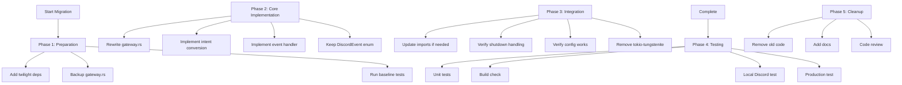

# Discord Gateway Migration Plan: tokio-tungstenite → twilight-gateway

## Executive Summary

This plan outlines migrating switchboard's Discord Gateway from tokio-tungstenite (manual WebSocket) to twilight-gateway (version 0.17), leveraging the same library that powers `../discli`. This migration will eliminate the "400 Bad Request" errors and significantly simplify the ~800 line custom WebSocket implementation.

**Goal:** Complete migration that fully leverages twilight-gateway features, rewriting gateway.rs substantially while maintaining backwards compatibility with the existing event handling and configuration.

---

## 1. Current State Analysis

### 1.1 Current Implementation (tokio-tungstenite)

| Aspect | Current Implementation |
|--------|----------------------|
| **WebSocket Library** | tokio-tungstenite 0.24 |
| **Lines of Code** | ~800 lines in gateway.rs |
| **Connection** | Manual WebSocket connect/identify/heartbeat |
| **Reconnection** | Custom exponential backoff implementation |
| **Event Types** | Custom `DiscordEvent` enum |
| **Event Processing** | Custom JSON parsing with manual dispatch |
| **Intents** | u32 (e.g., 21504 = 512+4096+16384) |

### 1.2 Reference Implementation (twilight-gateway in discli)

| Aspect | discli Implementation |
|--------|----------------------|
| **WebSocket Library** | twilight-gateway 0.17 |
| **Lines of Code** | ~200 lines |
| **Connection** | Shard::new with auto-connection |
| **Reconnection** | Built-in automatic reconnection |
| **Event Types** | twilight's native `Event` enum |
| **Event Processing** | StreamExt for event iteration |
| **Intents** | `Intents` bitflags type |

### 1.3 Root Cause of 400 Bad Request

The current tokio-tungstenite implementation has issues with:
1. **Identify payload format** - May not match Discord's exact expectations
2. **Gateway URL handling** - Manual URL construction can cause issues
3. **Connection lifecycle** - Improper state management during reconnect

twilight-gateway handles all of this correctly and is battle-tested by many Discord bots.

---

## 2. Dependencies Changes

### 2.1 Cargo.toml Modifications

**Current dependencies:**
```toml
tokio-tungstenite = { version = "0.24", features = ["native-tls"] }
futures-util = "0.3"

# Already present (twilight libraries already added)
twilight-gateway = "0.17"
twilight-model = "0.17"
twilight-http = "0.17"
```

**After migration:**
```toml
# REMOVE these:
tokio-tungstenite = { version = "0.24", features = ["native-tls"] }

# KEEP/modify:
twilight-gateway = "0.17"
twilight-model = "0.17"
twilight-http = "0.17"
futures-util = "0.3"  # Still needed for StreamExt
```

### 2.2 New Twilight Imports Required

```rust
use twilight_gateway::{CloseFrame, Event, EventTypeFlags, Intents, Shard, ShardId, StreamExt};
use twilight_model::gateway::payload::incoming::MessageCreate;
```

---

## 3. Code Changes: src/discord/gateway.rs

### 3.1 New Gateway Structure

```rust
//! Discord Gateway module using twilight-gateway
//!
//! This module provides WebSocket connectivity to Discord's Gateway using
//! twilight-gateway for automated connection management.

use std::sync::Arc;
use tokio::sync::mpsc;
use tracing::{info, warn, error};
use twilight_gateway::{Event, EventTypeFlags, Intents, Shard, ShardId, StreamExt};
use twilight_model::gateway::payload::incoming::MessageCreate;

/// Discord Gateway client using twilight-gateway
pub struct DiscordGateway {
    /// The shard for the gateway connection
    shard: Shard,
    /// Discord bot token
    token: String,
    /// Event sender channel
    event_sender: mpsc::Sender<DiscordEvent>,
    /// Shutdown flag
    shutdown: Arc<std::sync::atomic::AtomicBool>,
    /// Target channel ID for filtering messages
    target_channel_id: Option<String>,
    /// Bot user ID (set when ready)
    bot_user_id: Option<u64>,
}
```

### 3.2 New Constructor

```rust
impl DiscordGateway {
    /// Create a new Discord Gateway instance using twilight-gateway
    pub fn new(
        token: String,
        intents: u32,
        event_sender: mpsc::Sender<DiscordEvent>,
    ) -> Self {
        let shutdown = Arc::new(std::sync::atomic::AtomicBool::new(false));

        // Convert u32 intents to twilight Intents
        let twilight_intents = convert_intents(intents);

        // Create a shard with ID 0 (for small bots, one shard is sufficient)
        let shard = Shard::new(ShardId::ONE, token.clone(), twilight_intents);

        info!("Created twilight-gateway Discord Gateway with intents: {:?}", twilight_intents);

        Self {
            shard,
            token,
            event_sender,
            shutdown,
            target_channel_id: None,
            bot_user_id: None,
        }
    }
}
```

### 3.3 Intent Conversion Helper

```rust
/// Convert switchboard's u32 intents to twilight Intents type
fn convert_intents(intents: u32) -> Intents {
    let mut twilight_intents = Intents::empty();
    
    // GUILD_MESSAGES = 512
    if intents & 512 != 0 {
        twilight_intents |= Intents::GUILD_MESSAGES;
    }
    // DIRECT_MESSAGES = 4096
    if intents & 4096 != 0 {
        twilight_intents |= Intents::DIRECT_MESSAGES;
    }
    // MESSAGE_CONTENT = 16384
    if intents & 16384 != 0 {
        twilight_intents |= Intents::MESSAGE_CONTENT;
    }
    // GUILD_MESSAGE_REACTIONS = 1024
    if intents & 1024 != 0 {
        twilight_intents |= Intents::GUILD_MESSAGE_REACTIONS;
    }
    
    // Default to GUILD_MESSAGES | MESSAGE_CONTENT if nothing set
    if twilight_intents.is_empty() {
        twilight_intents = Intents::GUILD_MESSAGES | Intents::MESSAGE_CONTENT;
    }
    
    twilight_intents
}
```

### 3.4 Main Event Loop

```rust
impl DiscordGateway {
    /// Connect to Discord Gateway and run the event loop
    pub async fn connect_with_shutdown(
        &mut self,
        mut shutdown_rx: tokio::sync::oneshot::Receiver<()>,
    ) -> Result<(), GatewayError> {
        // Event types to listen for
        let event_flags = EventTypeFlags::MESSAGE_CREATE 
            | EventTypeFlags::READY 
            | EventTypeFlags::RESUMED
            | EventTypeFlags::MESSAGE_DELETE
            | EventTypeFlags::GUILD_CREATE;

        info!("Starting Discord Gateway event loop...");

        // Process events from the shard
        while let Some(item) = self.shard.next_event(event_flags).await {
            // Check shutdown flag
            if self.shutdown.load(std::sync::atomic::Ordering::Relaxed) {
                info!("Shutdown requested, stopping event loop");
                return Ok(());
            }

            // Check for external shutdown signal
            if let Ok(_) = shutdown_rx.try_recv() {
                info!("External shutdown signal received");
                return Ok(());
            }

            let event = match item {
                Ok(event) => event,
                Err(source) => {
                    warn!("Error receiving event: {:?}", source);
                    continue;
                }
            };

            // Convert twilight Event to DiscordEvent and send to processor
            if let Some(discord_event) = self.handle_twilight_event(event).await {
                let _ = self.event_sender.send(discord_event).await;
            }
        }

        info!("Gateway event loop ended");
        Ok(())
    }
}
```

### 3.5 Event Handler

```rust
impl DiscordGateway {
    /// Handle incoming twilight events and convert to DiscordEvent
    async fn handle_twilight_event(&mut self, event: Event) -> Option<DiscordEvent> {
        match event {
            Event::MessageCreate(msg) => {
                // Filter: ignore messages from bot itself
                if let Some(bot_id) = self.bot_user_id {
                    if msg.author.id.get() == bot_id {
                        info!("Discord Gateway: ignoring message from bot self");
                        return None;
                    }
                }

                // Filter: only process messages from target channel
                if let Some(target) = &self.target_channel_id {
                    if msg.channel_id.get().to_string() != *target {
                        info!(
                            "Discord Gateway: ignoring message from wrong channel {}",
                            msg.channel_id
                        );
                        return None;
                    }
                }

                info!(
                    "Discord Gateway: message from {} in channel {}",
                    msg.author.name, msg.channel_id
                );

                Some(DiscordEvent::MessageCreate {
                    channel_id: msg.channel_id.get().to_string(),
                    content: msg.content.clone(),
                    author_id: msg.author.id.get().to_string(),
                    message_id: msg.id.get().to_string(),
                    guild_id: msg.guild_id.map(|g| g.get().to_string()),
                })
            }
            Event::Ready(ready) => {
                self.bot_user_id = Some(ready.user.id.get());
                info!("Discord Gateway: ready - user_id: {}", ready.user.id);
                
                Some(DiscordEvent::Ready {
                    user_id: ready.user.id.get().to_string(),
                    session_id: ready.session_id.clone(),
                })
            }
            Event::Resumed => {
                info!("Discord Gateway: session resumed");
                Some(DiscordEvent::Resumed)
            }
            Event::MessageDelete(msg) => {
                Some(DiscordEvent::MessageDelete {
                    message_id: msg.message_id.get().to_string(),
                    channel_id: msg.channel_id.get().to_string(),
                    guild_id: msg.guild_id.map(|g| g.get().to_string()),
                })
            }
            Event::GuildCreate(guild) => {
                Some(DiscordEvent::GuildCreate {
                    guild_id: guild.id.get().to_string(),
                })
            }
            _ => None,
        }
    }
}
```

### 3.6 Keep Existing Types for Backwards Compatibility

The existing `DiscordEvent`, `GatewayError`, and `ConnectionState` types should be kept (possibly with minor modifications) to maintain API compatibility:

```rust
/// Discord events that can be sent to the event handler
#[derive(Debug, Clone)]
pub enum DiscordEvent {
    MessageCreate {
        channel_id: String,
        content: String,
        author_id: String,
        message_id: String,
        guild_id: Option<String>,
    },
    Ready { user_id: String, session_id: String },
    MessageDelete {
        message_id: String,
        channel_id: String,
        guild_id: Option<String>,
    },
    GuildCreate { guild_id: String },
    Resumed,
    InvalidSession,
    HeartbeatAck,
    Other(String),
}

/// Gateway connection state
#[derive(Debug, Clone, PartialEq)]
pub enum ConnectionState {
    Disconnected,
    Connecting,
    Connected,
    Reconnecting,
}

/// Errors that can occur in the Gateway
#[derive(Debug, thiserror::Error)]
pub enum GatewayError {
    #[error("Failed to connect: {0}")]
    ConnectionFailed(String),
    #[error("WebSocket error: {0}")]
    WebSocketError(String),
    #[error("Event processing error: {0}")]
    EventError(String),
    #[error("HTTP error: {0}")]
    HttpError(String),
    #[error("JSON parse error: {0}")]
    JsonError(String),
}
```

---

## 4. Integration Points: src/discord/mod.rs

### 4.1 Required Changes

The integration in `mod.rs` should remain largely unchanged since we're maintaining backwards compatibility. However, there are a few adjustments needed:

1. **No changes to DiscordEvent enum usage** - The events sent to the processor remain the same
2. **No changes to channel creation** - `event_sender` and `event_receiver` remain the same
3. **No changes to shutdown handling** - The shutdown mechanism remains the same
4. **Optional: Remove `get_gateway_url` function** - No longer needed as twilight handles this

### 4.2 Configuration Handling

The intents configuration in `mod.rs` (lines 353-373) should continue to work as-is:

```rust
// This code should remain unchanged - it passes u32 intents to the gateway
let gateway_intents = if let Some(ref toml_cfg) = toml_config {
    toml_cfg.intents.unwrap_or(DEFAULT_INTENTS)
} else {
    DEFAULT_INTENTS
};

// Create the gateway instance - same API
let mut gateway = DiscordGateway::new(gateway_token.clone(), gateway_intents, event_sender);
```

---

## 5. Testing Approach

### 5.1 Unit Tests

1. **Intent conversion test** - Verify `convert_intents()` correctly maps u32 to twilight Intents
2. **Event conversion tests** - Verify twilight events correctly convert to DiscordEvent
3. **Backwards compatibility test** - Verify existing DiscordEvent enum works unchanged

### 5.2 Integration Tests

1. **Local Discord test** - Connect to a test Discord server with a test bot
2. **Message receiving test** - Verify messages are received and processed correctly
3. **Shutdown test** - Verify graceful shutdown works
4. **Reconnection test** - (Optional) Force disconnect and verify reconnection

### 5.3 Test Configuration

```toml
# In switchboard.toml for testing
[discord]
enabled = true
token_env = "DISCORD_TOKEN"
channel_id = "YOUR_TEST_CHANNEL_ID"
intents = 21504  # GUILD_MESSAGES | DIRECT_MESSAGES | MESSAGE_CONTENT
```

---

## 6. Migration Steps (Execution Order)

### Phase 1: Preparation
- [ ] 1.1 Add new twilight dependencies to Cargo.toml (verify versions)
- [ ] 1.2 Create backup of current gateway.rs
- [ ] 1.3 Run existing tests to establish baseline

### Phase 2: Core Implementation
- [ ] 2.1 Rewrite gateway.rs with twilight-gateway implementation
- [ ] 2.2 Implement intent conversion helper
- [ ] 2.3 Implement event handler to convert twilight → DiscordEvent
- [ ] 2.4 Keep old DiscordEvent enum for backwards compatibility

### Phase 3: Integration
- [ ] 3.1 Update mod.rs imports (if needed)
- [ ] 3.2 Verify shutdown handling works
- [ ] 3.3 Verify intents configuration works
- [ ] 3.4 Remove old tokio-tungstenite dependency

### Phase 4: Testing
- [ ] 4.1 Run unit tests
- [ ] 4.2 Run cargo build to check for compilation errors
- [ ] 4.3 Test locally with Discord test bot
- [ ] 4.4 Test production scenarios

### Phase 5: Cleanup
- [ ] 5.1 Remove old unused code (get_gateway_url, manual heartbeat, etc.)
- [ ] 5.2 Add documentation comments
- [ ] 5.3 Final code review

---

## 7. Estimated Effort

| Phase | Description | Complexity |
|-------|-------------|-------------|
| **Phase 1** | Preparation | Low |
| **Phase 2** | Core Implementation (~300 lines new code) | Medium-High |
| **Phase 3** | Integration | Low |
| **Phase 4** | Testing | Medium |
| **Phase 5** | Cleanup | Low |

**Total Estimated Complexity:** Medium-High

The migration is primarily a rewrite of the gateway implementation (~500 lines changed/removed, ~300 lines added), but maintains API compatibility which reduces integration risk.

---

## 8. Key Benefits of Migration

1. **Fixes 400 Bad Request** - twilight-gateway handles protocol correctly
2. **Reduces Code** - ~800 lines → ~300 lines (60% reduction)
3. **Better Reliability** - Battle-tested library with automatic reconnection
4. **Easier Maintenance** - Less custom code to maintain
5. **Consistency** - Same library as discli (easier debugging across projects)

---

## 9. Risks and Mitigations

| Risk | Mitigation |
|------|------------|
| **Breaking API changes** | Maintain backwards-compatible DiscordEvent enum |
| **Runtime errors** | Extensive local testing before production |
| **Intents issues** | Keep intent conversion helper well-tested |
| **Event mapping issues** | Verify all event types correctly mapped |

---

## 10. Files to Modify

| File | Changes |
|------|---------|
| `Cargo.toml` | Remove tokio-tungstenite, keep twilight-gateway |
| `src/discord/gateway.rs` | Complete rewrite (~300 new lines) |
| `src/discord/mod.rs` | Likely no changes needed |
| `src/discord/config.rs` | No changes needed |

---

## Mermaid: Migration Workflow


