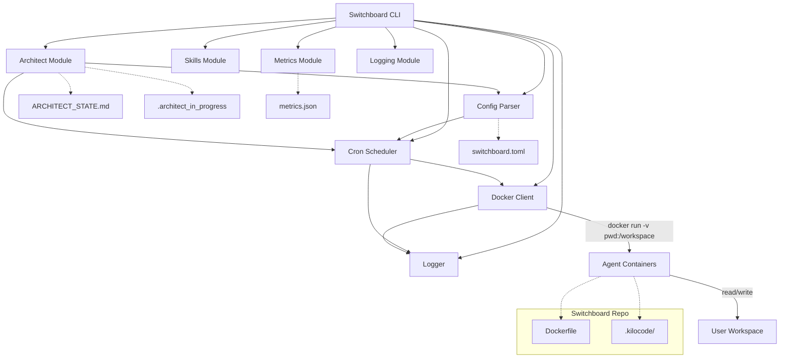
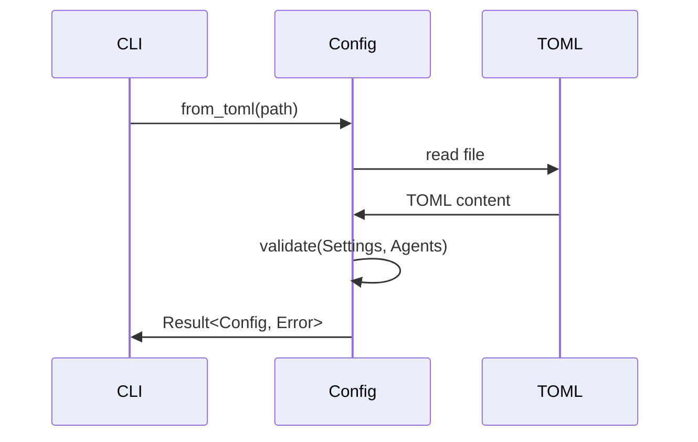
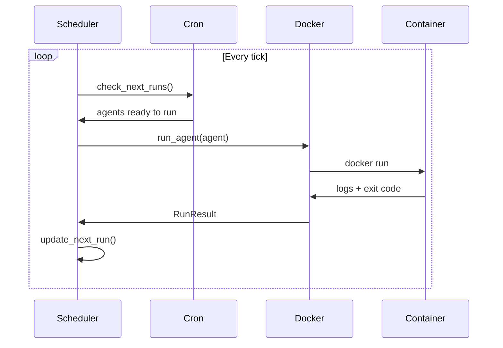
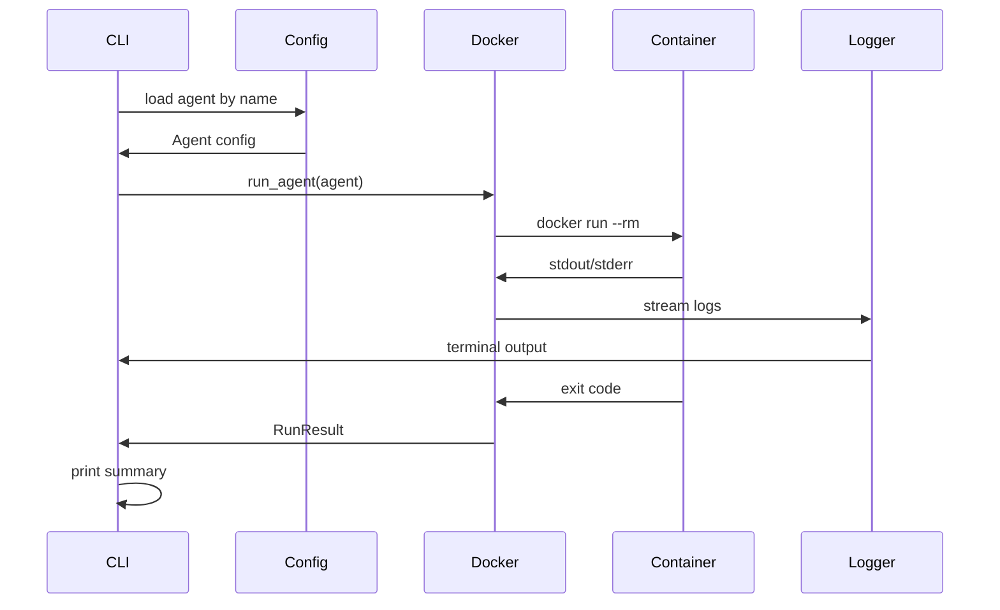
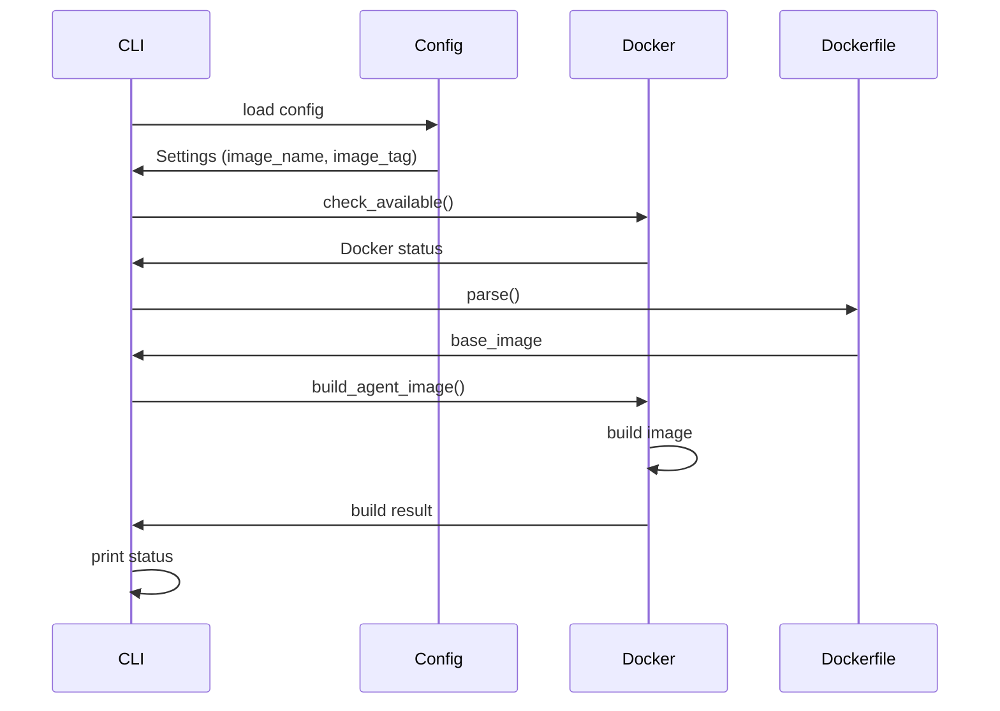
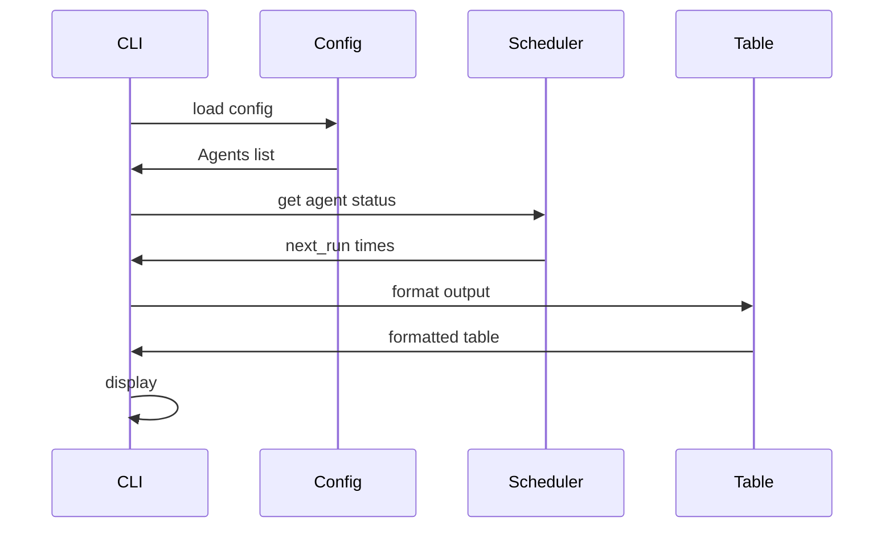
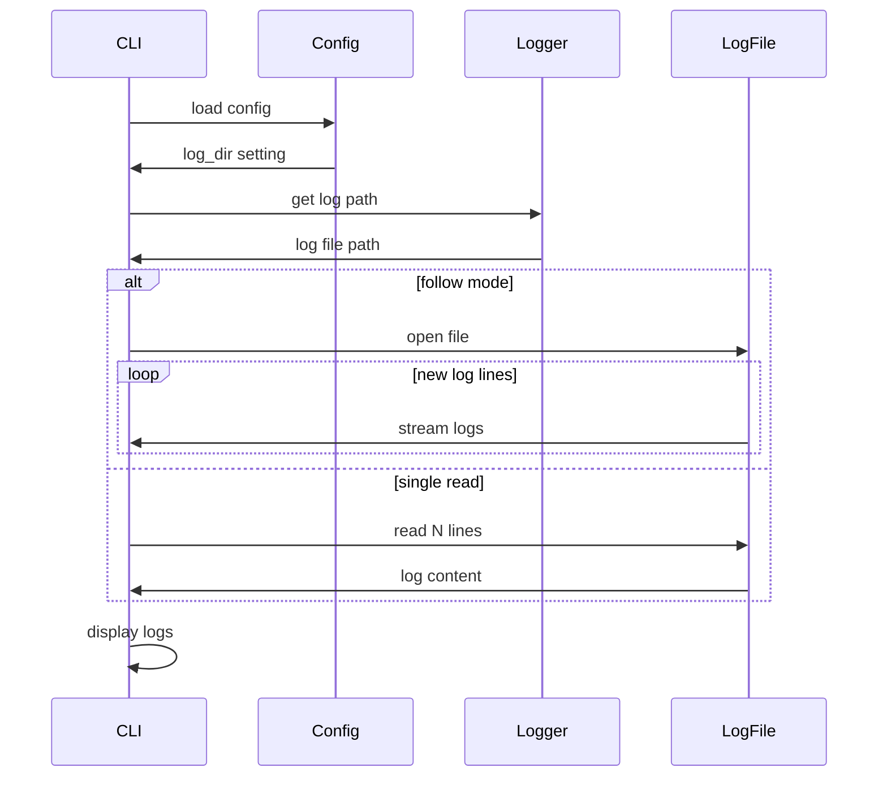
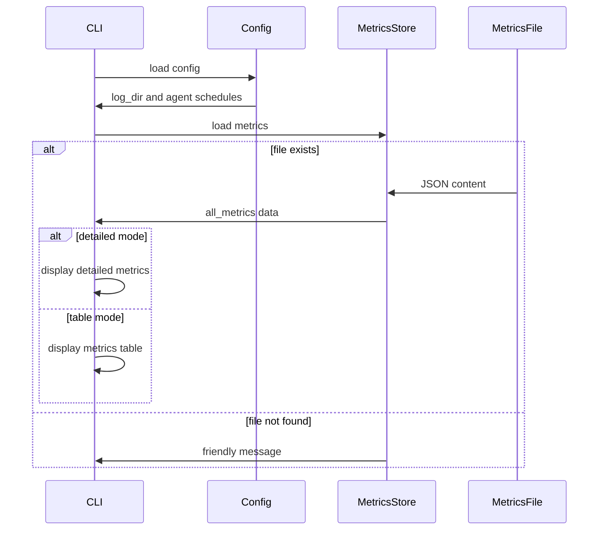
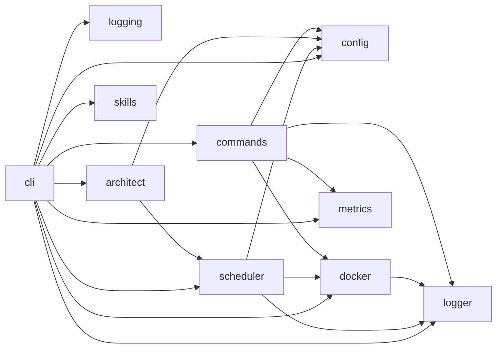

# Switchboard — Architecture Document

> Last Updated: 2026-02-19T19:09:00.000Z

## Current Implementation Status

**Phase: Config Module Complete, CLI Framework Complete, Scheduler Fully Implemented with tokio-cron-scheduler, Logger Module Fully Implemented, Docker connection, Dockerfile parsing, image building fully implemented, container creation/execution fully implemented, Commands module fully implemented with build, list, logs, metrics, and validate handlers, CLI run, up, build, list, metrics, down, and validate commands fully implemented with all requirements met, Metrics module implemented with storage and data structures, Architect module fully implemented with state management and session protocol, Logging module fully implemented for tracing initialization, Skills module implemented as wrapper for npx skills CLI**

This project is currently transitioning from early scaffolding to functional implementation. The architecture described below represents the planned/target design. Actual implementation status:

- **src/main.rs**: Functional entry point with CLI dispatch (14 lines)
- **src/lib.rs**: Library exports including module declarations (33 lines) with documented status for all modules
- **src/cli/mod.rs**: Fully implemented clap-based CLI framework (976 lines, all commands defined, run_up() fully implemented with scheduler initialization and execution, run_run() fully implemented with complete agent execution flow, run_validate() implemented, run_down() fully implemented with scheduler shutdown and container listing, run_build() fully implemented using commands module, run_list() fully implemented using commands module, run_logs() fully implemented using commands module, run_metrics() fully implemented using commands module). CLI commands refactored into separate modules in src/commands/. CLI run command is now fully implemented and tested with all requirements met, including exit code reporting via AgentExecutionResult struct.
- **src/commands/**: Fully implemented command handlers (mod.rs, build.rs, list.rs, logs.rs, metrics.rs, validate.rs)
  - `mod.rs`: Module exports
  - `build.rs`: Build command handler for Docker image building
  - `list.rs`: List command handler for displaying agents with next run times
  - `logs.rs`: Logs command handler with follow mode support
  - `metrics.rs`: Metrics command handler for displaying agent execution statistics
  - `validate.rs`: Validate command handler for configuration validation
- **src/config/mod.rs**: Fully implemented with comprehensive test coverage (1206 lines, 30 tests), Settings and Agent structures aligned with PRD §6.2, includes OverlapMode enum and overlap configuration
- **src/scheduler/mod.rs**: Fully implemented with tokio-cron-scheduler integration (647 lines, RunStatus enum, ScheduledAgent, Scheduler struct, cron job registration, agent execution orchestration, queue handling for overlap mode)
- **src/scheduler/clock.rs**: Clock trait for time abstraction and SystemClock implementation
- **src/docker/mod.rs**: Docker connection, Dockerfile parsing, image building, and container execution fully implemented (~1215 total lines):
- **src/metrics/mod.rs**: Fully implemented metrics data structures (291 lines, MetricsError, AgentRunResult, AgentMetrics, 8 tests)
- **src/metrics/store.rs**: Fully implemented metrics storage (584 lines, AllMetrics, AgentMetricsData, MetricsStore with load/save methods, 15 tests)
- **src/metrics/collector.rs**: Fully implemented metrics update logic (298 lines, update_all_metrics function, Default implementation for AllMetrics, 7 tests)
- **src/architect/**: Core state management system for multi-agent coordination workflow (~930 total lines)
  - `mod.rs`: Module exports with Result type alias and ArchitectError enum (85 lines)
  - `state.rs`: State persistence and data structures (812 lines) - ArchitectState, SessionStatus, CurrentTask, QueueStatus, AgentStatus structs with load_state(), save_state(), and helper functions
  - `session.rs`: Session protocol implementation with idempotency support (646 lines) - SessionHandle, start_session(), end_session(), update_session_progress(), update_agent_status(), add_remaining_task()
- **src/logging.rs**: Tracing initialization for scheduler logging (148 lines) - init_logging() function with file appender for switchboard.log, 3 tests
- **src/skills/mod.rs**: Skills module managing skill discovery and installation via npx skills CLI (50+ lines) - SkillsManager struct with skills_dir, global_skills_dir, and npx_available fields
  - `mod.rs`: 697 lines - Docker connection, Dockerfile parsing, DockerError enum, Dockerfile struct, DockerClient with Clone implementation, new(), check_available(), build_agent_image() (fully implemented, lines 407-474), docker() accessor
  - `run.rs`: 21 lines - Module exports for container execution functionality
  - `run/run.rs`: 308 lines - Full container creation and execution (run_agent function with bind mounts, env injection, labeling, and AgentExecutionResult struct containing container_id and exit_code)
  - `run/types.rs`: 74 lines - ContainerConfig struct, ContainerError enum, Error conversion
  - `run/streams.rs`: 166 lines - Log streaming (attach_and_stream_logs, StreamConfig, StreamError)
  - `run/wait/timeout.rs`: 164 lines - Container exit waiting (wait_for_exit, wait_with_timeout, parse_timeout)
  - `run/wait/types.rs`: 46 lines - ExitStatus struct with timed_out field
- **src/logger/mod.rs**: Logger module with sub-modules fully implemented (970 total lines):
  - `mod.rs`: 153 lines - Logger struct with terminal writer integration
  - `file.rs`: 430 lines - FileWriter with path construction, log writing, rotation, and 13 tests
  - `terminal.rs`: 387 lines - TerminalWriter with foreground/background mode output

### Progress Tracking

| Module | Status | % Complete |
|--------|--------|------------|
| CLI | Framework complete, all command handlers fully implemented (976 lines) | 100% |
| Commands | Fully implemented with build, list, logs, metrics, and validate command modules | 100% |
| Config | Fully implemented with comprehensive tests (1206 lines, 30 tests), includes OverlapMode enum and overlap configuration | 95% |
| Scheduler | Fully implemented with tokio-cron-scheduler integration, cron job registration, agent execution orchestration, and queue handling (647 lines) | 75% |
| Docker | Connection, Dockerfile parsing, image building, and container execution fully implemented with AgentExecutionResult struct (mod.rs 459 lines, run/ ~764 lines, 8 tests) | 85% |
| Logger | Fully implemented with file and terminal writers (970 total lines, 13 tests) | 100% |
| Metrics | Fully implemented with data structures, storage, collector, and command handler (mod.rs 291 lines, store.rs 584 lines, collector.rs 298 lines, 30 total tests) | 100% |
| Architect | Fully implemented state management system for multi-agent coordination workflow (mod.rs 85 lines, state.rs 812 lines, session.rs 646 lines, session protocol with idempotency support) | 100% |
| Logging | Fully implemented tracing initialization for scheduler logging (148 lines, 3 tests) | 100% |
| Skills | Implemented as thin ergonomic wrapper around npx skills CLI for skill discovery and installation (50+ lines) | 100% |

---

## Sprint Completion Status

### Sprint 3 (2026-02-13) ✅
**Commands Implemented:**
- `switchboard logs` - Complete implementation with agent filtering, --follow, --tail, log rotation
- `switchboard build` - Complete implementation with Docker image building, real-time output, --no-cache
- `switchboard list` - Complete implementation with table output showing agent details
- `switchboard metrics` - Complete implementation with table/detailed views, agent filtering
- `switchboard validate` - Complete implementation with config validation

**Drift Fixes:**
- CLI command implementations for build/list/logs/metrics/validate
- Docker image building implementation
- Workspace path existence check
- Metrics command implementation with table and detailed views

### Sprint 2 (2026-02-12) ✅
- `up` command implementation
- `run` command implementation
- Docker container execution
- Logger module completion

### Sprint 1 (2026-02-11) ✅
- Config parser implementation
- Docker client implementation
- Cron scheduler implementation
- `down` command implementation

## Overview

Switchboard is a Rust-based CLI tool that orchestrates scheduled AI coding agent execution via Docker containers. It provides a cron scheduler interface for running Kilo Code CLI prompts at defined intervals.

---

## System Architecture

**Current Status:** System architecture substantially implemented with all core modules functional.

**Current System Architecture:**



---

## Component Architecture

> **Note:** The following component descriptions represent the planned/target architecture. Actual implementation is in early scaffolding phase with empty module stubs only.

### 0. CLI (`src/cli/`)

**Responsibility:** Parse CLI commands and dispatch to appropriate modules.

**Current Status:** Fully implemented clap-based CLI framework (681 lines) with all commands defined. `run_up()` is now fully complete with scheduler initialization, agent registration, Docker check, and foreground/detached mode execution. `run_run()` is fully complete with complete agent execution flow including exit code reporting (config loading, agent resolution, prompt handling, Docker client creation, logger creation, `run_agent()` call, and `AgentExecutionResult` handling). `run_validate()` is fully implemented with config validation logic. `run_down()` is fully implemented with scheduler shutdown via PID file and Docker container listing. `run_build()` is fully implemented with Docker image building logic. `run_list()` is fully implemented with agent listing and next run time display. `run_logs()` is fully implemented with log viewing and follow mode support.

**Implementation Details:**

**Modules:**
- `mod.rs` - Complete implementation including CLI structs, command definitions, and handlers

**Implemented Data Structures:**

```rust
/// Main CLI structure parsed by clap
#[derive(Parser)]
#[command(name = "switchboard")]
#[command(version = env!("CARGO_PKG_VERSION"))]
pub struct Cli {
    /// Path to the configuration file (default: ./switchboard.toml)
    #[arg(short, long, value_name = "PATH")]
    pub config: Option<String>,

    #[command(subcommand)]
    pub command: Commands,
}

/// CLI subcommands
#[derive(Subcommand)]
pub enum Commands {
    /// Build agent image and start scheduler
    Up(UpCommand),
    /// Immediately execute a single agent
    Run(RunCommand),
    /// Build or rebuild agent Docker image
    Build(BuildCommand),
    /// Print all configured agents, their schedules, and prompts
    List,
    /// View logs from agent runs
    Logs(LogsCommand),
    /// Display agent execution metrics
    Metrics(MetricsCommand),
    /// Stop scheduler and any running agent containers
    Down(DownCommand),
    /// Parse and validate config file
    Validate(ValidateCommand),
}

/// Command: Build agent image and start scheduler
#[derive(Parser)]
pub struct UpCommand {
    /// Run in background
    #[arg(short, long)]
    pub detach: bool,
}

/// Command: Immediately execute a single agent
#[derive(Parser)]
pub struct RunCommand {
    /// Name of the agent to execute
    #[arg(value_name = "AGENT_NAME")]
    pub agent_name: String,

    /// Path to configuration file
    #[arg(long, short = 'c', value_name = "PATH")]
    pub config: Option<String>,
}

/// Command: Build or rebuild agent Docker image
#[derive(Parser)]
pub struct BuildCommand {
    /// Path to config file (default: ./switchboard.toml)
    #[arg(short, long, default_value = "./switchboard.toml")]
    pub config: PathBuf,

    /// Force rebuild without cache
    #[arg(long)]
    pub no_cache: bool,
}

/// Command: View logs from agent runs
#[derive(Parser)]
pub struct LogsCommand {
    /// Name of the agent to view logs for (optional)
    #[arg(value_name = "AGENT_NAME")]
    pub agent_name: Option<String>,
    /// Stream logs as they are generated
    #[arg(short, long)]
    pub follow: bool,
    /// Show the last N lines (default: 50)
    #[arg(short, long, value_name = "N", default_value_t = 50)]
    pub tail: usize,

    /// Path to configuration file
    #[arg(long, short = 'c', value_name = "PATH")]
    pub config: Option<String>,
}

/// Command: Display agent execution metrics
#[derive(Parser)]
pub struct MetricsCommand {
    /// Show detailed metrics view
    #[arg(short, long)]
    pub detailed: bool,

    /// Show detailed metrics for a specific agent
    #[arg(long, value_name = "NAME")]
    pub agent: Option<String>,

    /// Path to configuration file
    #[arg(long, short = 'c', value_name = "PATH")]
    pub config: Option<String>,
}

/// Command: Stop scheduler and any running agent containers
#[derive(Parser)]
pub struct DownCommand {
    /// Clean up .switchboard directory (logs, PID files, etc.)
    #[arg(short = 'c', long)]
    pub cleanup: bool,
}
```

**Note:** The `ValidateCommand` struct is defined in `src/commands/validate.rs`, and the `MetricsCommand` struct is defined in `src/cli/mod.rs`.

**Implemented Functions:**

**CLI and Commands:**
- `Cli::parse()` - Parse CLI arguments using clap
- `run()` - Main CLI dispatch function that routes to command handlers
- `check_image_exists(client, image_name, image_tag)` - Helper function to check if a Docker image exists locally using bollard API

**Command Handlers:**
- `run_up(args: UpCommand, config: Option<String>)` - Fully implemented handler for 'up' command including config loading, scheduler initialization, agent registration, Docker check, image availability checking, and foreground/detached mode execution
- `run_run(args: RunCommand, config: Option<String>)` - Fully implemented handler for 'run' command including config loading, agent resolution, prompt resolution, Docker client creation, logger creation, agent execution, and exit code reporting via AgentExecutionResult
- `run_build(args: BuildCommand, config: Option<String>)` - Fully implemented handler for 'build' command using commands::build module
- `run_list(config: Option<String>)` - Fully implemented handler for 'list' command using commands::list module
- `run_logs(args: LogsCommand, config: Option<String>)` - Fully implemented handler for 'logs' command using commands::logs module
- `run_metrics(args: MetricsCommand, config: Option<String>)` - Fully implemented handler for 'metrics' command using commands::metrics module with optional agent filter and detailed view
- `run_down(args: DownCommand, config: Option<String>)` - Fully implemented handler for 'down' command including scheduler shutdown via PID file, Docker container listing, and optional cleanup of .switchboard directory
- `run_validate(args: ValidateCommand, config: Option<String>)` - Fully implemented handler that validates config using `Config::from_toml()` and validates cron schedules

**Dependencies:** `clap`

**Integration:**
- [`src/main.rs`](src/main.rs:9-13) calls `cli::run()` as the entry point
- Uses `crate::config::{Config, ConfigError}` for validation command

---

### 1. Config Parser (`src/config/`)

**Responsibility:** Parse and validate `switchboard.toml` configuration files.

**Current Status:** Fully implemented (838 lines) with comprehensive test coverage (30 tests).

**Implementation Details:**

**Modules:**
- `mod.rs` - Complete implementation including parsing, validation, and tests

**Implemented Data Structures:**

```rust
/// Configuration parsing and validation errors
pub enum ConfigError {
    ParseError(String),
    ValidationError(String),
    PromptFileNotFound { agent_name: String, prompt_file: String },
}

/// How to handle overlapping agent executions
#[derive(Debug, Clone, Copy, PartialEq, Eq, Deserialize, Serialize)]
pub enum OverlapMode {
    /// When agent is running, skip new run and log warning
    Skip,
    /// Add new runs to queue, execute sequentially after current run completes
    Queue,
}

impl Default for OverlapMode {
    fn default() -> Self {
        OverlapMode::Skip  // PRD §9 default behavior
    }
}

/// Global settings that apply to all agents
#[derive(Debug, Clone, Deserialize, Serialize, PartialEq)]
pub struct Settings {
    pub image_name: String,
    pub image_tag: String,
    pub log_dir: String,
    pub workspace_path: String,
    pub timezone: String,
    /// How to handle overlapping executions: "skip" (default) or "queue"
    pub overlap_mode_str: String,
    /// Global default overlap mode
    pub overlap_mode: Option<OverlapMode>,
}

/// Agent configuration
#[derive(Debug, Clone, Deserialize, Serialize)]
pub struct Agent {
    pub name: String,
    pub prompt: Option<String>,           // Inline prompt text
    pub prompt_file: Option<String>,       // Path to prompt file
    pub schedule: String,                 // Cron schedule (required field)
    pub env: Option<HashMap<String, String>>, // Environment variables
    pub readonly: Option<bool>,           // Whether agent runs in read-only mode
    pub timeout: Option<String>,           // Maximum execution duration (e.g., "30m", "2h")
    /// Agent-level override for overlap mode
    pub overlap_mode: Option<OverlapMode>,
    /// Queue size override for Queue mode
    pub max_queue_size: Option<usize>,
}

/// Top-level configuration structure
#[derive(Debug, Clone, Deserialize, Serialize)]
pub struct Config {
    pub settings: Option<Settings>,
    pub agents: Vec<Agent>,
    #[serde(skip)]
    config_path: PathBuf,
}
```

**Implemented Functions:**

**ConfigError:**
- `fmt::Display` implementation for error formatting
- `std::error::Error` implementation

**Settings:**
- `Default` implementation with:
  - `image_name`: "switchboard-agent"
  - `image_tag`: "latest"
  - `log_dir`: ".switchboard/logs"
  - `workspace_path`: "."
  - `timezone`: "system" (IANA timezone for cron evaluation)

**Agent Methods:**
- `schedule<'a>()` - Returns agent schedule (required field)
- `env(&self, global: Option<&Settings>) -> Vec<String>` - Returns agent env as "KEY=value" strings (Settings does not have env field)
- `resolve_prompt_file(&self, config_dir: &Path) -> Option<PathBuf>` - Resolves prompt_file to absolute path
- `read_prompt_file(&self, config_dir: &Path) -> Result<Option<String>, ConfigError>` - Returns Ok(None) if no prompt_file is set, or Ok(Some(contents)) on success
- `effective_overlap_mode(&self, global_settings: &Option<Settings>) -> OverlapMode` - Returns agent's overlap_mode if set, otherwise returns global setting if set, otherwise returns OverlapMode::Skip (PRD §9 default)
- `effective_max_queue_size(&self) -> usize` - Returns agent's max_queue_size if set, otherwise returns 3 (the default queue size)

**Config Methods:**
- `from_toml(path: &Path) -> Result<Self, ConfigError>` - Parse and validate TOML config
- `config_dir(&self) -> &Path` - Returns directory containing config file

**Validation Logic:**
- At least one agent must be defined
- Agent name cannot be empty
- Schedule is required for each agent
- Exactly one of `prompt` or `prompt_file` must be provided (mutual exclusivity)
- Prompt file must exist on disk (when prompt_file is set)

**Test Coverage:**
- `test_basic_toml_parsing` - Tests basic config parsing
- `test_settings` - Tests Settings deserialization
- `test_multiple_agents` - Tests multiple agent configuration
- `test_optional_fields_can_be_omitted` - Tests optional field handling
- `test_empty_agents_fails_validation` - Tests empty agents validation
- `test_empty_agent_name_fails_validation` - Tests empty agent name validation
- `test_file_not_found` - Tests missing config file handling
- `test_invalid_toml` - Tests invalid TOML syntax handling
- `test_config_clone` - Tests config cloning
- `test_agent_env_vec` - Tests environment variable handling (HashMap type)
- `test_default_settings` - Tests Settings::default()
- `test_default_agent` - Tests Agent::default()
- `test_default_config` - Tests Config::default()
- `test_config_dir` - Tests config_dir() method
- `test_resolve_prompt_file_*` - Tests prompt file path resolution (relative, absolute, nested)
- `test_read_prompt_file_*` - Tests prompt file reading
- `test_inline_prompt` - Tests inline prompt configuration
- `test_both_prompt_and_prompt_file_fails` - Tests mutual exclusivity validation
- `test_neither_prompt_nor_prompt_file_fails` - Tests required prompt validation
- `test_agent_env_resolution_*` - Tests environment variable resolution
- `test_agent_schedule_required` - Tests schedule field is required
- And additional tests for prompt file resolution and agent field validation

**CLI Integration Tests (tests/cli_validate.rs):**
- `test_validate_with_valid_config` - Tests validation command with valid config
- `test_validate_with_missing_file` - Tests validation command with missing config file
- `test_validate_with_invalid_toml` - Tests validation command with invalid TOML syntax
- `test_validate_default_path` - Tests validation command using default config path

**Dependencies:** `toml`, `serde`, `serde_derive`, `tempfile` (tests only)

---

**Open Questions Requiring User Clarification:**
- See `comms/outbox/` directory for outstanding questions:
  - q002: .kilocode directory configuration format (external to Switchboard)
  - q003: Overlap mode configuration location and modes
  - q004: Kilo Code CLI argument format for AGENT_NAME and PROMPT
  - q005: Timeout format support (seconds vs. minutes/hours only)

---

### 2. Commands Module (`src/commands/`)

**Responsibility:** Implements the core CLI command handlers. Each command has its own module file.

**Current Status:** Fully implemented.

**Modules:**
- `mod.rs` - Module exports
- `build.rs` - Handles `switchboard build` command to build/rebuild Docker images
- `list.rs` - Handles `switchboard list` command to display configured agents with next run times
- `logs.rs` - Handles `switchboard logs` command to view agent logs with follow mode
- `metrics.rs` - Handles `switchboard metrics` command to display agent execution statistics
- `validate.rs` - Handles `switchboard validate` command to validate switchboard.toml configuration

**Implemented Behavior:**
- Build command builds or rebuilds agent Docker images using `DockerClient::build_agent_image()`
- List command displays configured agents in a formatted table with next execution times
- Logs command supports `--follow` flag for real-time log streaming and `--tail` for specifying number of lines
- Metrics command displays agent execution statistics with `--detailed` flag for extended output and `--agent` filter for specific agents
- Validate command validates configuration file and cron schedules

All commands are fully implemented and functional.

---

### 3. Scheduler (`src/scheduler/`)

**Responsibility:** Evaluate cron expressions and trigger agent executions.

**Current Status:** Fully implemented with tokio-cron-scheduler integration (296 lines)

**Implemented Modules:**
- `mod.rs` - Complete implementation including RunStatus, ScheduledAgent, Scheduler structs, tokio-cron-scheduler integration, cron job registration, and agent execution orchestration
- `clock.rs` - Clock trait for time abstraction and SystemClock implementation

**Implemented Data Structures:**
```rust
/// Status of a scheduled agent run
pub enum RunStatus {
    /// A run is currently executing
    Running { container_id: String },
    /// A run was skipped (e.g., due to overlap)
    Skipped { reason: String },
    /// A run is scheduled for future execution
    Scheduled { next_run: DateTime<Tz> },
}

/// A queued agent run for queue mode overlap handling
#[derive(Debug, Clone)]
pub struct QueuedRun {
    /// The name of the agent to run
    pub agent_name: String,
    /// When the run was queued
    pub scheduled_time: Instant,
    /// Unique identifier for the job
    pub uuid: Uuid,
}

/// A scheduled agent with runtime state
pub struct ScheduledAgent {
    pub config: Agent,
    pub next_run: Option<DateTime<Tz>>,
    pub current_run: Option<String>,
    /// How to handle overlapping executions
    pub overlap_mode: OverlapMode,
}

/// Scheduler for managing agent executions
pub struct Scheduler {
    pub agents: Vec<ScheduledAgent>,
    pub running: Arc<AtomicBool>,
    scheduler: JobScheduler,
    /// Clock for time operations (injectable for testing)
    clock: Arc<dyn Clock + Send>,
    /// Global settings configuration
    settings: Option<crate::config::Settings>,
    /// Queue for queue mode overlap handling
    pub queue: Arc<Mutex<Vec<QueuedRun>>>,
    /// Total cumulative queue wait time in seconds across all processed queued runs
    queue_wait_time_seconds: Arc<Mutex<u64>>,
    /// Individual queue wait times in seconds for all processed queued runs
    queue_wait_times: Arc<Mutex<Vec<u64>>>,
}
```

**Dependencies:** `chrono`, `chrono-tz`, `tokio`, `tokio-cron-scheduler`

**Implemented Behavior:**
- Evaluates cron expressions using tokio-cron-scheduler with timezone-aware datetime
- Registers agents with their cron schedules
- Triggers `execute_agent()` at scheduled times which calls `DockerClient::run_agent()`
- Supports graceful shutdown via `start()` and `stop()` methods
- Provides both async `new()` and synchronous `new_sync()` constructors
- Handles overlapping executions based on `OverlapMode` (Skip or Queue)
- Queues runs in Queue mode, tracks wait times, and executes sequentially

**Implemented Data Structures and Methods:**
- `RunStatus` enum with Running, Skipped, and Scheduled variants
- `QueuedRun` struct for tracking jobs waiting to be executed
- `ScheduledAgent` struct with config, next_run, current_run, and overlap_mode fields
- `Scheduler` struct with agents, running, scheduler, clock, settings, queue, and queue tracking fields
- `Scheduler::new()` - Async constructor that initializes JobScheduler
- `Scheduler::new_sync()` - Synchronous convenience constructor
- `Scheduler::register_agent()` - Registers an agent with its cron schedule
- `Scheduler::start()` - Starts the underlying tokio-cron-scheduler
- `Scheduler::stop()` - Stops the scheduler gracefully
- `execute_agent()` - Helper function for executing agents with Docker client integration
- `process_queued_run()` - Processes a queued run by calculating wait time and updating metrics

### Clock Abstraction

**Location:** `src/scheduler/clock.rs`

The scheduler includes a clock abstraction for time mocking in testing:

```rust
/// Trait for getting current time
pub trait Clock: Send + Sync {
    fn now(&self) -> DateTime<Tz>;
}

/// System clock using actual time
pub struct SystemClock;

impl Clock for SystemClock {
    fn now(&self) -> DateTime<Tz> {
        // Returns actual system time
    }
}
```

**Purpose:** Allows time-dependent scheduler code to be testable by providing mock clock implementations.

### Overlap Detection

The scheduler tracks running agents and prevents overlapping executions with configurable behavior:

- `current_run` field in `ScheduledAgent` holds the container ID of any currently running agent
- `overlap_mode` field in `ScheduledAgent` determines how overlapping executions are handled
- `QueuedRun` struct tracks jobs waiting to be executed in Queue mode
- Queue tracking fields in `Scheduler`: `queue`, `queue_wait_time_seconds`, `queue_wait_times`

**Skip Mode (default):**
- When an agent is already running (`current_run` is `Some(_)`), new runs are skipped
- The scheduler logs a warning when a run is skipped due to overlap

**Queue Mode:**
- When an agent is already running, new runs are added to a queue
- Maximum queue size is configurable per-agent via `max_queue_size` (default: 3)
- When queue is full, new runs are skipped and a warning is logged
- Queued runs are executed sequentially after the current run completes
- Wait time is tracked for each queued run for metrics reporting
- `process_queued_run()` calculates wait time and updates metrics

---

### 3. Docker Client (`src/docker/`)

**Responsibility:** Build images and manage container lifecycle via Docker Engine API.

**Current Status:** Docker connection, Dockerfile parsing, **container creation/execution** implemented with AgentExecutionResult struct for exit code reporting (mod.rs 510 lines, run/ ~719 lines, 8 tests)

**Implemented Modules:**
- `mod.rs` - Docker connection, Dockerfile parsing, DockerClient with Clone implementation, new(), check_available(), and fully implemented build_agent_image() (459 lines, 8 tests)
- `run.rs` - Module exports for container execution (21 lines)
- `run/run.rs` - Container creation and execution (287 lines)
- `run/types.rs` - Container configuration types (65 lines)
- `run/streams.rs` - Log streaming from containers (163 lines)
- `run/wait/timeout.rs` - Container exit waiting with timeout support (147 lines)
- `run/wait/types.rs` - Exit status type (36 lines)

**Note:** There is NO `docker/build/` submodule. Build logic is fully implemented in `docker/mod.rs` via the `build_agent_image()` function (lines 407-474).

**Implemented Data Structures:**
```rust
pub struct DockerClient {
    docker: Docker,
    _image_name: String,
    _image_tag: String,
}

/// Clone implementation for DockerClient
impl Clone for DockerClient {
    fn clone(&self) -> Self {
        DockerClient {
            docker: self.docker.clone(),
            _image_name: self._image_name.clone(),
            _image_tag: self._image_tag.clone(),
        }
    }
}

/// Result of running an agent in a Docker container
#[derive(Debug, Clone)]
pub struct AgentExecutionResult {
    /// The container ID that was created and run
    pub container_id: String,
    /// The exit code from the container execution
    pub exit_code: i64,
}

/// Errors that can occur when interacting with Docker
#[derive(Debug, thiserror::Error)]
pub enum DockerError {
    /// Docker daemon connection failed
    #[error("Docker connection error: {0}")]
    ConnectionError(String),

    /// Docker not available
    #[error("Docker unavailable: {0}")]
    DockerUnavailable(String),

    /// Dockerfile not found at the specified path
    #[error("Dockerfile not found: {0}")]
    DockerfileNotFound(String),

    /// I/O error reading Dockerfile
    #[error("I/O error reading Dockerfile: {0}")]
    IoError(String),

    /// Feature not yet implemented
    #[error("Not implemented: {0}")]
    NotImplemented(String),
}

/// Represents a parsed Dockerfile with basic information extracted
pub struct Dockerfile {
    pub path: PathBuf,
    pub base_image: Option<String>,
    pub raw_content: String,
}
```

**Planned Data Structures:**
```rust
pub struct ContainerRunConfig {
    agent_name: String,
    prompt: String,
    workspace_path: PathBuf,
    readonly: bool,
    timeout: Duration,
    env: HashMap<String, String>,
}
```

**Planned Dependencies:** `bollard`, `tokio`

**Implemented Container Execution Model:**
```bash
docker run --rm \
  -v /path/to/user/project:/workspace \
  -e AGENT_NAME=<name> \
  -e PROMPT="<prompt>" \
  switchboard-agent:latest \
  kilo --prompt "<prompt>"
```

**Implemented Behavior:**
- Creates containers with workspace bind mount
- Injects environment variables (AGENT_NAME, PROMPT, and custom env vars)
- Enforces timeout (kills container if exceeded)
- Streams container logs to Logger
- Auto-cleanup with `--rm` flag
- Returns AgentExecutionResult with container_id and exit_code

**Implemented Methods:**
- `Dockerfile::parse(path: &Path)` - Parse Dockerfile and extract base image (implemented)
- `new(image_name: String, image_tag: String)` - Creates a new DockerClient instance and verifies Docker is available via ping (async)
- `check_available()` - Checks if Docker is available by pinging the daemon (async)
- `build_agent_image(&self, dockerfile: &Dockerfile)` - Fully implemented image building (lines 407-474 in mod.rs)
- `build_agent_image_with_tag(&self, dockerfile: &Dockerfile, tag: &str)` - Fully implemented image building with custom tag
- `run_agent(...)` - Returns `AgentExecutionResult` containing container_id and exit_code on success

**ExitStatus Type:**
```rust
/// Represents the exit status of a container
#[derive(Debug, Clone, PartialEq, Eq)]
pub struct ExitStatus {
    /// Container exit code
    pub exit_code: i64,
    /// Whether to container was killed due to timeout
    pub timed_out: bool,
}
```

---

### 4. Logger (`src/logger/`)

**Responsibility:** Capture and aggregate logs from all agent runs.

**Current Status:** Sub-modules substantially implemented (928 total lines with 13 tests)

**Modules:**
- `mod.rs` - Module exports and Logger type (136 lines - Logger struct with terminal writer integration) - Implemented
- `file.rs` - Log file management (406 lines, 13 tests) - Implemented
- `terminal.rs` - Interleaved terminal output (386 lines - TerminalWriter with foreground/background mode output) - Implemented

**Implemented Data Structures:**

**mod.rs - Logger:**
```rust
/// Logger struct for capturing and aggregating logs from agent runs
#[derive(Debug, Clone)]
pub struct Logger {
    /// The base directory where logs should be written
    pub log_dir: PathBuf,
    /// The name of the agent (None for scheduler logs)
    pub agent_name: Option<String>,
    /// Whether to output to terminal in real-time
    pub foreground_mode: bool,
}
```

**file.rs - FileWriter:**
```rust
/// FileWriter handles log file path construction and file operations
#[derive(Debug, Clone)]
pub struct FileWriter {
    /// The base directory where logs should be written (e.g., ".switchboard/logs")
    log_dir: PathBuf,
}

/// Error that occurs when writing to a log file
#[derive(Debug, Error)]
pub struct FileWriteError(#[from] io::Error);

/// Error that occurs during path construction
#[derive(Debug, Error)]
pub enum PathConstructionError {
    #[error("Invalid agent name: '{0}'")]
    InvalidAgentName(String),
    #[error("Failed to construct path: {0}")]
    PathConstructionFailed(String),
}
```

**terminal.rs - TerminalWriter:**
```rust
/// TerminalWriter handles writing output to terminal with optional agent-name prefix
#[derive(Debug)]
pub struct TerminalWriter {
    /// The name of the agent (for prefixing output in foreground mode)
    agent_name: String,
    /// Whether to prefix output with agent name (foreground mode)
    foreground_mode: bool,
    /// Thread-safe writer for stdout/stderr
    writer: Mutex<Box<dyn Write + Send>>,
}

/// Error that occurs when writing to terminal
#[derive(Debug, Error)]
pub enum TerminalError {
    #[error("I/O error while writing to terminal: {0}")]
    IoError(#[from] io::Error),
    #[error("Failed to format output message: {0}")]
    FormatError(String),
}
```

**streams.rs - StreamConfig:**
```rust
/// Configuration for streaming container logs
#[derive(Clone)]
pub struct StreamConfig {
    /// The container ID to attach to
    pub container_id: String,
    /// The name of the agent (for logging purposes)
    pub agent_name: String,
    /// Optional logger for writing terminal output and agent logs
    pub logger: Option<Arc<Mutex<Logger>>>,
    /// Whether to follow logs (true) or get existing logs (false)
    pub follow: bool,
}

/// Errors that can occur during log streaming
#[derive(Debug, thiserror::Error)]
pub enum StreamError {
    /// Failed to attach to container
    #[error("Failed to attach to container '{0}': {1}")]
    AttachError(String, String),

    /// Failed to read from stream
    #[error("Failed to read from stream: {0}")]
    ReadError(String),

    /// Logger error occurred
    #[error("Logger error: {0}")]
    LoggerError(String),

    /// Stream ended unexpectedly
    #[error("Stream ended unexpectedly: {0}")]
    StreamEndedError(String),
}
```

**Implemented Methods:**

**Logger (mod.rs):**
- `Logger::new(log_dir: PathBuf, agent_name: Option<String>, foreground_mode: bool)` - Creates a new Logger instance

**FileWriter (file.rs):**
- `FileWriter::new(log_dir: impl AsRef<Path>)` - Creates a new FileWriter instance
- `create_agent_log_directory(&self, agent_name: &str)` - Creates the agent log directory if it doesn't exist
- `get_agent_log_path(&self, agent_name: &str)` - Gets the path to an agent's log file with timestamp
- `write_scheduler_log(&self, message: &str)` - Writes a message to the scheduler log file with rotation support
- `write_agent_log(&self, agent_name: &str, message: &str)` - Writes a message to an agent's log file with rotation support
- `generate_timestamp()` - Generates an ISO 8601 timestamp for log file naming
- Internal: `get_scheduler_log_path()`, `get_agent_log_dir()`, `open_or_append_file()`, `should_rotate_file()`, `rotate_log_file()`

**TerminalWriter (terminal.rs):**
- `TerminalWriter::new(agent_name: String, foreground_mode: bool)` - Creates a new TerminalWriter instance
- `write_output(&self, message: &str)` - Writes output to the terminal with optional agent-name prefix (thread-safe)
- Internal: `get_agent_name()`, `is_foreground_mode()`, `format_message()`

**Planned Dependencies:** `chrono` (used), `thiserror` (used), `comfy_table` (formatted table output for list command), `fflate2` (compression for tarballs), `tar` (tar archive creation), `chrono-tz` (timezone handling for scheduler), `tokio-cron-scheduler` (cron scheduling), `bytes` (byte buffer handling for log streaming), `futures` (async utilities)

**Implemented Behavior:**
- Writes agent logs to `<log_dir>/<agent-name>/<timestamp>.log` (implemented)
- Writes scheduler logs to `<log_dir>/switchboard.log` (implemented)
- Interleaves terminal output with `[agent-name]` prefixes in foreground mode (implemented)
- Supports log rotation at 10MB threshold (implemented)
- Agent name validation (rejects empty names and names with path separators) (implemented)
- Thread-safe terminal output via Mutex (implemented)
- ISO 8601 timestamps with microsecond precision for log file naming (implemented)

### Log Follow Mode
The logs command supports `--follow` flag to tail log files in real-time. When enabled, the command streams new log lines as they are written to the file.

### Rotation Detection
Log rotation is detected via inode monitoring. When log files are rotated (moved or renamed), the logger automatically reopens the new file to continue streaming. This ensures that log streaming continues seamlessly even when log rotation occurs during `--follow` mode.

### Agent Name Validation
Agent names are validated to be safe for filesystem use. The validation ensures:
- Agent names are not empty
- Agent names do not contain path separators (`/`, `\`, etc.)
- Agent names do not contain other special characters that could cause filesystem issues

---

### 5. Metrics Module (`src/metrics/`)

**Responsibility:** Collect, store, and display metrics about agent execution statistics.

**Current Status:** Fully implemented with data structures, storage, and collector (1173 total lines).

**Modules:**
- `mod.rs` - Metrics data structures and error types (291 lines, 8 tests)
- `store.rs` - Metrics storage with JSON persistence (584 lines, 15 tests)
- `collector.rs` - Metrics update logic for processing AgentRunResult (298 lines, 7 tests)

**Implemented Data Structures:**

**mod.rs:**
```rust
/// Error types for metrics operations.
#[derive(Debug, Clone, thiserror::Error)]
pub enum MetricsError {
    /// Error when reading metrics from storage.
    #[error("Failed to read metrics: {0}")]
    ReadError(String),

    /// Error when writing metrics to storage.
    #[error("Failed to write metrics: {0}")]
    WriteError(String),

    /// Error when serializing metrics.
    #[error("Serialization error: {0}")]
    SerializationError(String),

    /// Error when deserializing metrics.
    #[error("Deserialization error: {0}")]
    DeserializationError(String),

    /// Error when metrics file is not found.
    #[error("Metrics file not found: {0}")]
    FileNotFound(String),

    /// Error when metrics file is corrupted. Contains the backup file path.
    #[error("Metrics file is corrupted. Backup saved to: {0}")]
    CorruptedFile(String),
}

/// Result of a single agent run, used to update metrics.
#[derive(Debug, Clone)]
pub struct AgentRunResult {
    /// Name of the agent that ran.
    pub agent_name: String,
    /// Docker container ID for the run.
    pub container_id: String,
    /// When the run started.
    pub start_time: chrono::DateTime<chrono::Utc>,
    /// When the run ended.
    pub end_time: chrono::DateTime<chrono::Utc>,
    /// Exit code from the container (0 = success).
    pub exit_code: i64,
    /// Whether the run was terminated due to timeout.
    pub timed_out: bool,
    /// When the job was added to the queue (for overlap_mode:queue).
    pub queued_start_time: Option<chrono::DateTime<chrono::Utc>>,
}

/// Metrics collected for a single agent over time.
#[derive(Debug, Clone)]
pub struct AgentMetrics {
    /// Total number of executions.
    pub run_count: u64,
    /// Number of successful runs (exit code 0).
    pub success_count: u64,
    /// Number of failed runs (non-zero exit).
    pub failure_count: u64,
    /// Cumulative execution time in seconds.
    pub total_runtime_seconds: f64,
    /// First recorded run timestamp.
    pub first_run_timestamp: Option<chrono::DateTime<chrono::Utc>>,
    /// Most recent run timestamp.
    pub last_run_timestamp: Option<chrono::DateTime<chrono::Utc>>,
    /// Duration of the last run in seconds.
    pub last_run_duration_seconds: Option<f64>,
    /// Average duration of all runs in seconds.
    pub average_run_duration_seconds: f64,
    /// Time the last run waited in queue (for overlap_mode:queue).
    pub queue_wait_time_seconds: Option<f64>,
    /// Number of runs that exceeded timeout.
    pub timeout_count: u64,
    /// Container ID for the current concurrent execution.
    pub concurrent_run_id: Option<String>,
}
```

**store.rs:**
```rust
/// Top-level JSON structure for all metrics
#[derive(Debug, Clone, Serialize, Deserialize, PartialEq)]
pub struct AllMetrics {
    pub agents: HashMap<String, AgentMetricsData>,
}

/// Serialized representation of AgentMetrics for JSON
#[derive(Debug, Clone, Serialize, Deserialize, PartialEq)]
pub struct AgentMetricsData {
    pub total_runs: u64,
    pub successful_runs: u64,
    pub failed_runs: u64,
    pub total_duration_ms: u64,
    pub runs: Vec<AgentRunResultData>,
    /// Cumulative queue wait time in seconds for averaging later
    pub queue_wait_time_seconds: Option<u64>,
}

#[derive(Debug, Clone, Serialize, Deserialize, PartialEq)]
pub struct AgentRunResultData {
    pub run_id: String,
    pub timestamp: u64,
    pub duration_ms: u64,
    pub status: String, // "success" or "failure"
    pub error_message: Option<String>,
}

/// Store for managing persistence of metrics data.
pub struct MetricsStore {
    log_dir: PathBuf,
}
```

**collector.rs:**
```rust
/// Update all metrics with the result of an agent run.
///
/// This function processes an AgentRunResult and updates the corresponding
/// agent's metrics in the AllMetrics structure. If the agent doesn't exist,
/// a new entry is created.
pub fn update_all_metrics(
    all_metrics: &mut AllMetrics,
    run_result: &AgentRunResult,
) -> Result<(), MetricsError>
```

**Implemented Methods:**

**MetricsStore:**
- `new(log_dir: PathBuf)` - Creates a new MetricsStore instance
- `load(&self) -> Result<AllMetrics, MetricsError>` - Loads metrics from metrics.json, returns empty AllMetrics if file doesn't exist or is corrupted (backs up corrupted files)
- `save(&self, metrics: &AllMetrics) -> Result<(), MetricsError>` - Saves metrics atomically to metrics.json using temp file + rename pattern

**Collector:**
- `update_all_metrics(all_metrics: &mut AllMetrics, run_result: &AgentRunResult)` - Updates all metrics from an agent run result, creating new agent entries as needed, incrementing counters, calculating duration and queue wait time, and appending run result data

**Dependencies:** `chrono`, `serde`, `serde_derive`, `thiserror`, `tokio` (for async operations in other modules)

---

### 6. Architect Module (`src/architect/`)

**Responsibility:** Core state management system for multi-agent coordination workflow with session protocol support.

**Current Status:** Fully implemented (~930 total lines).

**Modules:**
- `mod.rs` - Module exports, Result type alias, and ArchitectError enum (85 lines)
- `state.rs` - State persistence and data structures (812 lines)
- `session.rs` - Session protocol implementation with idempotency support (646 lines)

**Implemented Data Structures:**

**mod.rs - Result and ArchitectError:**
```rust
/// Type alias for the result of architect operations
pub type Result<T> = std::result::Result<T, ArchitectError>;

/// Errors that can occur in architect operations
#[derive(Debug, thiserror::Error)]
pub enum ArchitectError {
    /// IO error occurred
    #[error("IO error: {0}")]
    Io(#[from] std::io::Error),
    /// Git command failed
    #[error("Git command failed: {0}")]
    Git(String),
    /// State file parsing error
    #[error("Failed to parse state file: {0}")]
    ParseError(String),
    /// Invalid state format
    #[error("Invalid state format: {0}")]
    InvalidState(String),
}
```

**state.rs - State Structures:**
```rust
/// Architect state representing the current workflow status
pub struct ArchitectState {
    pub last_updated: chrono::DateTime<Utc>,
    pub status: SessionStatus,
    pub current_sprint: u32,
    pub completed_tasks: Vec<String>,
    pub current_task: Option<CurrentTask>,
    pub remaining_tasks: Vec<String>,
    pub agent_status: HashMap<u32, AgentStatus>,
}

/// Status of the current session
pub enum SessionStatus {
    InProgress,
    Complete,
}

/// Task currently being worked on
pub struct CurrentTask {
    pub description: String,
    pub context: String,
}

/// Status of an agent's work queue
pub enum QueueStatus {
    Working,
    Done,
    Idle,
}

/// Status of an agent
pub struct AgentStatus {
    pub queue_status: QueueStatus,
    pub tasks_remaining: u32,
    pub blocked: bool,
}
```

**session.rs - Session Management:**
```rust
/// Handle for managing an architect session
pub struct SessionHandle {
    state: ArchitectState,
    is_continuation: bool,
}
```

**Implemented Methods:**

**ArchitectState (state.rs):**
- `new(current_sprint: u32)` - Creates a new empty state with the given sprint number
- `complete_task(&mut self, task: String)` - Marks a task as completed
- `set_current_task(&mut self, task: Option<CurrentTask>)` - Sets the current task being worked on
- `update_agent_status(&mut self, agent_id: u32, status: AgentStatus)` - Updates agent status

**State Persistence (state.rs):**
- `load_state() -> Result<Option<ArchitectState>>` - Loads architect state from ARCHITECT_STATE.md if it exists
- `save_state(state: &ArchitectState) -> Result<()>` - Saves architect state to ARCHITECT_STATE.md
- `create_in_progress_marker() -> Result<()>` - Creates .architect_in_progress marker file
- `delete_in_progress_marker() -> Result<()>` - Deletes .architect_in_progress marker file
- `in_progress_marker_exists() -> bool` - Checks if .architect_in_progress marker exists
- `cleanup_on_complete() -> Result<()>` - Removes marker and state files on session completion
- `commit_progress(message: &str) -> Result<()>` - Commits progress to git

**Session Management (session.rs):**
- `start_session(current_sprint: u32) -> Result<SessionHandle>` - Starts a new architect session or resumes an existing one
- `end_session(handle: SessionHandle, all_complete: bool) -> Result<()>` - Ends the architect session
- `update_session_progress(handle: &mut SessionHandle, task: &str, completed: bool)` - Updates session progress and commits to git
- `update_session_progress_with_context(handle: &mut SessionHandle, task: &str, context: &str, completed: bool)` - Updates session progress with additional context
- `update_agent_status(handle: &mut SessionHandle, agent_id: u32, queue_status: QueueStatus, tasks_remaining: u32, blocked: bool)` - Updates agent status for the current session
- `add_remaining_task(handle: &mut SessionHandle, task: String)` - Adds a remaining task to the session

**Session Protocol:**

**On Session Start:**
1. Check for `.architect_in_progress` marker file
2. If marker exists: Read `ARCHITECT_STATE.md` to see what was completed and resume from there
3. If no marker: Create `.architect_in_progress` and start fresh

**During Session:**
- After completing each major task, update `ARCHITECT_STATE.md` with progress
- Commit progress incrementally: `git commit -m "chore(architect): completed [task name]"`

**On Session End - All Tasks Complete:**
1. Delete `.architect_in_progress` marker
2. Delete `ARCHITECT_STATE.md`
3. Commit: `chore(architect): session complete`

**On Session End - Work Remaining (timeout/interrupt):**
1. Keep `.architect_in_progress` marker (do NOT delete)
2. Update `ARCHITECT_STATE.md` with current state
3. Commit: `chore(architect): session partial - will continue`

**Dependencies:** `chrono`, `thiserror`, `tracing`

---

### 7. Logging Module (`src/logging.rs`)

**Responsibility:** Tracing initialization for scheduler logging with file appender.

**Current Status:** Fully implemented (148 lines, 3 tests).

**Implemented Data Structures:**
None - this module provides initialization functions only.

**Implemented Functions:**

**Main Function:**
- `init_logging(log_dir: PathBuf) -> WorkerGuard` - Initializes tracing subscriber with file appender for writing scheduler logs to `<log_dir>/switchboard.log`

**Helper Functions (internal):**
- `get_test_log_dir() -> &'static Path` - Helper function for tests to get a shared log directory

**Implementation Details:**

The logging module sets up tracing with the following features:
- Creates the log directory if it doesn't exist
- Uses `tracing_appender::rolling::never` for non-rotating log files
- Creates a non-blocking writer for performance
- Configures environment filter from `RUST_LOG` or defaults to "info"
- Returns a `WorkerGuard` that must be kept alive for logs to flush properly

**Testing:**
- `test_init_logging_creates_directory()` - Verifies log directory is created
- `test_init_logging_creates_log_file()` - Verifies log file is created
- `test_logging_writes_to_file()` - Verifies log messages are written to file

**Dependencies:** `tracing`, `tracing-subscriber`, `tracing-appender`, `tempfile` (tests only)

---

### 8. Skills Module (`src/skills/`)

**Responsibility:** Manages skill discovery and installation via npx skills CLI.

**Current Status:** Implemented as thin ergonomic wrapper (50+ lines).

**Implemented Data Structures:**

```rust
/// SkillsManager manages skill operations by delegating to npx skills CLI
pub struct SkillsManager {
    /// Project-level skills directory (typically .kilocode/skills/)
    pub skills_dir: PathBuf,
    /// Global skills directory (typically ~/.kilocode/skills/)
    pub global_skills_dir: PathBuf,
    /// Whether npx is available on the host system
    pub npx_available: bool,
}
```

**Implemented Methods:**
- `new() -> Self` - Creates a new SkillsManager with default paths
- `with_skills_dir(skills_dir: PathBuf) -> Self` - Creates a new SkillsManager with specified project skills directory
- `skills_dir(&self) -> &PathBuf` - Gets the project skills directory
- `global_skills_dir(&self) -> &PathBuf` - Gets the global skills directory

**Design Notes:**
- This module acts as a thin ergonomic wrapper around npx skills CLI
- All skill discovery and installation operations are delegated to npx skills
- Switchboard does not implement HTTP/GitHub API code directly

**Dependencies:** `std` (standard library only)

---

### Overlapping Runs Configuration

**Status:** Implemented with OverlapMode enum supporting both Skip and Queue modes.

**Background:**
The scheduler supports configurable overlap handling via `OverlapMode` enum with two variants: `Skip` and `Queue`. This is implemented in both global settings and per-agent configuration, with agent-level override capability.

**PRD §9.4 Reference:**
> **Overlapping runs:** If an agent is still running when its next scheduled execution fires, skip the new run and log a warning (configurable: skip or queue).

**Current Implementation:**
- The scheduler tracks running agents via the `current_run` field in `ScheduledAgent`
- Both `OverlapMode::Skip` and `OverlapMode::Queue` modes are supported
- Global `settings.overlap_mode` can be configured for all agents
- Per-agent `overlap_mode` and `max_queue_size` override global settings
- Queue mode tracks wait times via `queue_wait_time_seconds` and `queue_wait_times` in Scheduler
- QueuedRun struct tracks jobs waiting to be executed

**Implementation Details:**
The scheduler uses the `current_run: Option<String>` field in `ScheduledAgent` to track whether an agent is currently running. When triggering execution, this field is checked:
- If Skip mode: Skip new run if agent is running, log warning
- If Queue mode: Add new run to queue if not full, execute sequentially after current run completes

---

## Project Structure

```
switchboard/
├── Cargo.toml                    # Project manifest with dependencies
├── .gitignore                    # Git ignore patterns
├── README.md                     # Project documentation
├── ARCHITECTURE.md               # This file
├── PRD.md                        # Product Requirements Document
├── TODO.md                       # Current sprint tasks
├── COMPLETED.md                  # Completed work
├── BACKLOG.md                    # Future work
├── BLOCKERS.md                   # Active blockers
├── Dockerfile                    # Dockerfile for agent containers
├── .kilocode/                    # Kilo Code CLI configuration
│   ├── api-keys.json
│   ├── config.json
│   └── mcp-servers/
├── src/
│   ├── main.rs                   # Binary entry point (functional, 14 lines)
│   ├── lib.rs                    # Library exports (module declarations, 33 lines)
│   ├── architect/                # Core state management system for multi-agent coordination workflow (~930 total lines)
│   │   ├── mod.rs                # Module exports, Result type alias, ArchitectError enum (85 lines)
│   │   ├── state.rs              # State persistence and data structures (812 lines)
│   │   └── session.rs            # Session protocol implementation with idempotency support (646 lines)
│   ├── cli/                      # CLI Layer - Parse CLI commands and dispatch to appropriate modules
│   │   └── mod.rs                # Fully implemented CLI framework (976 lines)
│   ├── commands/                 # Individual command implementations
│   │   ├── mod.rs                # Module exports
│   │   ├── build.rs              # Build command handler
│   │   ├── list.rs               # List command handler
│   │   ├── logs.rs               # Logs command handler with follow mode
│   │   ├── metrics.rs            # Metrics command handler
│   │   └── validate.rs          # Validate command handler
│   ├── config/
│   │   └── mod.rs                # Fully implemented with comprehensive tests (1206 lines, 30 tests)
│   ├── scheduler/
│   │   ├── mod.rs                # Fully implemented with tokio-cron-scheduler integration (294 lines)
│   │   └── clock.rs              # Clock trait for time abstraction and SystemClock implementation
│   ├── docker/
│   │   ├── mod.rs                # Connection, Dockerfile parsing, build_agent_image(), DockerClient (510 lines, 8 tests)
│   │   ├── run.rs                # Module exports for container execution (21 lines)
│   │   ├── run/
│   │   │   ├── run.rs            # Container creation and execution (287 lines)
│   │   │   ├── types.rs          # Container configuration types (65 lines)
│   │   │   ├── streams.rs        # Log streaming from containers (163 lines)
│   │   │   └── wait/
│   │   │       ├── timeout.rs    # Container exit waiting with timeout (147 lines)
│   │   │       └── types.rs      # Exit status type (36 lines)
│   ├── logger/
│   │   ├── mod.rs                # Logger struct with terminal writer integration (136 lines)
│   │   ├── file.rs               # FileWriter with path construction, log writing, rotation (406 lines, 13 tests)
│   │   └── terminal.rs           # TerminalWriter with foreground/background mode output (386 lines)
│   ├── logging.rs                # Tracing initialization for scheduler logging (148 lines, 3 tests)
│   ├── metrics/
│   │   ├── mod.rs                # Metrics data structures and error types (291 lines, 8 tests)
│   │   ├── store.rs             # Metrics storage with JSON persistence (584 lines, 15 tests)
│   │   └── collector.rs         # Metrics update logic for processing AgentRunResult (298 lines, 7 tests)
│   └── skills/                  # Skills module - manages skill discovery and installation via npx skills CLI
│       └── mod.rs                # SkillsManager struct (50+ lines)
├── tests/
│   ├── cli_validate.rs          # CLI integration tests for validate command
│   ├── build_command.rs         # Build command tests
│   ├── down_command.rs          # Down command tests
│   ├── list_command.rs          # List command tests
│   ├── logs_command.rs          # Logs command tests
│   ├── metrics_command.rs       # Metrics command tests
│   ├── timeout_parsing.rs       # Timeout parsing tests
│   ├── scheduler_tests.rs       # Scheduler tests
│   ├── integration/
│   │   └── timeout_monitoring.rs # Integration tests for timeout monitoring
│   └── common.rs                # Common test utilities
├── comms/
│   ├── outbox/                   # Open communications
│   │   ├── 004-overlap-mode-clarification.md
│   │   └── ...
│   └── archive/                  # Archived communications
│       ├── 001-overlapping-runs-response.md
│       ├── 002-prd-clarifications-resolved.md
│       ├── 003-prd-ambiguities-resolved.md
│       └── ...
└── .state/                       # State directory
```

---

## Data Flow

**Current Status:** Config parsing and single agent run data flow implemented.

**Implemented and Planned Data Flows:**

### 1. Config Parsing Flow (Implemented)



### 2. Scheduler Flow (Planned)



### 3. Single Agent Run Flow (`switchboard run`) (Implemented)



### 4. Build Command Flow (`switchboard build`) (Implemented)



### 5. List Command Flow (`switchboard list`) (Implemented)



### 6. Logs Command Flow (`switchboard logs`) (Implemented)



### 7. Metrics Command Flow (`switchboard metrics`) (Implemented)



---

## Dependency Graph

**Current Status:** Dependency relationships partially implemented (CLI depends on config, docker, logger, logging, and other modules).

**Implemented Dependency Graph:**



---

## Testing Strategy

**Current Status:** Tests implemented for config module, Docker module, logger module, logging module, and CLI validation command.

**Implemented Testing:**

### Unit Tests
- Located in `src/config/mod.rs` in `#[cfg(test)]` modules
- Cover config parsing, validation, and field resolution logic
- Use `tempfile` for temporary file creation in tests

### CLI Integration Tests
- Located in `tests/cli_validate.rs`, `tests/build_command.rs`, `tests/down_command.rs`, `tests/list_command.rs`, `tests/logs_command.rs`, `tests/metrics_command.rs`
- Use `assert_cmd` crate for CLI testing
- Test validate, build, down, list, logs, and metrics command parsing and execution
- Test timeout parsing in `tests/timeout_parsing.rs`
- Verify output format and exit codes

### Logger Module Tests
- Located in `src/logger/file.rs` in `#[cfg(test)]` modules
- Test path construction, directory creation, and log writing
- Test timestamp generation and file operations
- 13 tests covering all FileWriter functionality

### Logger Mod Tests
- Located in `src/logger/mod.rs` in `#[cfg(test)]` modules
- Test Logger struct creation and agent log writing

### Logging Module Tests
- Located in `src/logging.rs` in `#[cfg(test)]` modules
- Test log directory creation
- Test log file creation
- Test log message writing to file
- 3 tests covering init_logging functionality

### Architect Module Tests
- Located in `src/architect/session.rs` in `#[cfg(test)]` modules
- Test session initialization and resumption
- Test progress updates
- Test agent status updates

### Docker Module Tests
- Located in `src/docker/mod.rs` in `#[cfg(test)]` modules
- Test Dockerfile parsing and base image extraction
- 8 tests covering Dockerfile parsing edge cases

### Scheduler Tests
- Located in `tests/scheduler_tests.rs`
- Test scheduler initialization, agent registration, and cron job scheduling

**Planned Testing:**
- Integration tests for Docker operations (timeout monitoring tests exist in `tests/integration/timeout_monitoring.rs`)
- Unit tests for scheduler cron calculation
- Additional command tests (build, down, list, logs)

---

## Error Handling

**Current Status:** Error handling implemented in Config, Docker, Logger, Terminal, Metrics, Architect, and Logging modules. Also includes PathConstructionError and FileWriteError for path validation and file operations.

**Implemented Error Handling:**

```rust
/// Architect operations errors (implemented)
#[derive(Debug, thiserror::Error)]
pub enum ArchitectError {
    /// IO error occurred
    #[error("IO error: {0}")]
    Io(#[from] std::io::Error),
    /// Git command failed
    #[error("Git command failed: {0}")]
    Git(String),
    /// State file parsing error
    #[error("Failed to parse state file: {0}")]
    ParseError(String),
    /// Invalid state format
    #[error("Invalid state format: {0}")]
    InvalidState(String),
}
```

```rust
/// Configuration parsing and validation errors (implemented)
#[derive(Debug, Clone)]
pub enum ConfigError {
    ParseError(String),
    ValidationError(String),
    PromptFileNotFound { agent_name: String, prompt_file: String },
}
```

```rust
/// Docker interaction errors (implemented)
#[derive(Debug, thiserror::Error)]
pub enum DockerError {
    #[error("Docker connection error: {0}")]
    ConnectionError(String),
    #[error("Docker unavailable: {0}")]
    DockerUnavailable(String),
    #[error("Dockerfile not found: {0}")]
    DockerfileNotFound(String),
    #[error("I/O error reading Dockerfile: {0}")]
    IoError(String),
    #[error("Not implemented: {0}")]
    NotImplemented(String),
}
```

```rust
/// Path construction errors (implemented)
#[derive(Debug, Error)]
pub enum PathConstructionError {
    #[error("Invalid agent name: '{0}'")]
    InvalidAgentName(String),
    #[error("Failed to construct path: {0}")]
    PathConstructionFailed(String),
}

/// File write errors (implemented)
#[derive(Debug, Error)]
pub struct FileWriteError(#[from] io::Error);
```

```rust
/// Terminal writer errors (implemented)
#[derive(Debug, thiserror::Error)]
pub enum TerminalError {
    #[error("I/O error while writing to terminal: {0}")]
    IoError(#[from] io::Error),
    #[error("Failed to format output message: {0}")]
    FormatError(String),
}
```

```rust
/// Log streaming errors (implemented)
#[derive(Debug, thiserror::Error)]
pub enum StreamError {
    #[error("Failed to attach to container '{0}': {1}")]
    AttachError(String, String),
    #[error("Failed to read from stream: {0}")]
    ReadError(String),
    #[error("Logger error: {0}")]
    LoggerError(String),
    #[error("Stream ended unexpectedly: {0}")]
    StreamEndedError(String),
}
```

```rust
/// Metrics errors (implemented)
#[derive(Debug, Clone, thiserror::Error)]
pub enum MetricsError {
    /// Error when reading metrics from storage.
    #[error("Failed to read metrics: {0}")]
    ReadError(String),

    /// Error when writing metrics to storage.
    #[error("Failed to write metrics: {0}")]
    WriteError(String),

    /// Error when serializing metrics.
    #[error("Serialization error: {0}")]
    SerializationError(String),

    /// Error when deserializing metrics.
    #[error("Deserialization error: {0}")]
    DeserializationError(String),

    /// Error when metrics file is not found.
    #[error("Metrics file not found: {0}")]
    FileNotFound(String),

    /// Error when metrics file is corrupted. Contains the backup file path.
    #[error("Metrics file is corrupted. Backup saved to: {0}")]
    CorruptedFile(String),
}
```

**Planned Error Handling:**

Application-wide error handling will use `anyhow` for application errors and `thiserror` for custom error types:

```rust
#[derive(Debug, thiserror::Error)]
pub enum SwitchboardError {
    #[error("Config file not found: {0}")]
    ConfigNotFound(PathBuf),
    
    #[error("Invalid TOML: {0}")]
    InvalidToml(String),
    
    #[error("Docker error: {0}")]
    Docker(#[from] bollard::errors::Error),
    
    #[error("Invalid cron expression: {0}")]
    InvalidCron(String),
    
    #[error("Logger error: {0}")]
    Logger(String),
    
    #[error("Scheduler error: {0}")]
    Scheduler(String),
}
```

---

## Unrequested Features

The following features were implemented beyond the original PRD scope:

1. **Exponential Backoff** - Container polling uses exponential backoff (100ms → 5s max) for efficiency
2. **Container Labels** - Docker containers are labeled with `switchboard.agent` for identification
3. **Build Context Tarball** - Helper functions create tarballs for Docker build context
4. **PID File Management** - `.switchboard/scheduler.pid` tracks the scheduler daemon process
5. **Graceful Shutdown** - Scheduler handles signals for clean shutdown
6. **Custom Error Messages** - Detailed Docker connection error messages for common issues
7. **ISO 8601 Timestamps** - Microsecond-precision timestamps for all log entries
8. **Comfy Table Formatting** - Formatted table output for `switchboard list` and `switchboard metrics` commands
9. **Log Streaming** - Real-time log streaming with `StreamConfig` and async attachment
10. **Next Run Calculation** - List command shows when each agent will next execute
11. **Dockerfile Parsing** - Basic Dockerfile parsing for base image extraction
12. **Clock Trait** - Time abstraction for testability of scheduler code
13. **Metrics Command** - Display agent execution statistics with table and detailed views, including success rates, average run times, timeout counts, and queue wait times

---

## Future Considerations

See PRD §11 for items out of scope for v0.1:
- Web UI / dashboard
- Webhook triggers
- Agent chaining
- Remote execution
- Secret management
- Config hot-reload
- Notifications
- Per-agent Dockerfile overrides

---

## Open Design Questions

No open design questions at this time. The overlap mode configuration has been implemented with Skip and Queue modes as documented in ARCHITECT_DECISION_overlap_mode.md.

---

## Platform Testing Limitations

### v0.1.0 Release Scope
- **Linux (x86_64):** ✅ Fully tested and supported
- **macOS (x86_64):** ⚠️ Documented limitation - testing procedure exists but cannot be verified in current Linux WSL2 development environment
- **macOS (aarch64/Apple Silicon):** ⚠️ Documented limitation - testing procedure exists but cannot be verified in current Linux WSL2 development environment

### Documentation References
- Testing procedure: `docs/MACOS_TESTING_PROCEDURE.md`
- Platform requirements: `docs/PLATFORM_COMPATIBILITY.md`

### Resolution Path
1. Document limitation in installation docs for v0.1.0 release
2. Provide testing procedure for manual verification by users
3. Post-v0.1.0: Add macOS CI/CD pipeline using GitHub Actions or similar
4. Post-v0.1.0: Execute manual testing on macOS hardware and report results

### Architectural Decision
> Decision Date: 2026-02-20
> Status: Documented limitation for v0.1.0
> 
> v0.1.0 will be released with documented limitations for macOS (x86_64 and aarch64) installation testing. 
> Testing procedures are fully documented but cannot be verified in the current Linux WSL2 development environment.
> This is an acceptable constraint for the v0.1.0 release as the skills feature primarily targets containerized 
> environments where Linux is the primary platform. macOS support will be addressed post-v0.1.0.

---

## QA and Completion Protocol

### .qa_in_progress File Protocol
- Only the agent performing their own QA should create this file
- Purpose: Prevent concurrent QA operations from conflicting
- Must be removed immediately upon QA completion
- No agent should create `.qa_in_progress` to block other agents

### .agent_done_* Files Protocol
- Must be created AFTER all QA tasks are complete and verified
- Signals to dependent agents that work is ready for use
- Creating this file before QA completion is a protocol violation
- Date format: ISO 8601 (e.g., `2026-02-20T02:45:00Z`)

### Dependency Protocol
- Dependent agents should wait for `.agent_done_*` files, not task completion status in TODO files
- Architect should verify both code completion AND proper protocol adherence before marking tasks complete
- TODO file task completion is informational only; `.agent_done_*` is the authoritative signal

### Architectural Decision
> Decision Date: 2026-02-20
> Status: Protocol clarification and enforcement
> 
> The QA protocol is clarified to prevent coordination deadlocks:
> 1. Agents must create `.qa_in_progress` only when performing their own QA
> 2. Agents must NOT create `.qa_in_progress` to block others
> 3. `.agent_done_*` files must be created AFTER QA completion
> 4. Dependency chains should use `.agent_done_*` as the authoritative signal
> 
> This prevents the deadlock scenario where an agent marks work complete (creates `.agent_done_*`) 
> while QA tasks remain blocked by `.qa_in_progress` created by another agent.

---

## Resolved Architectural Decisions

### Metrics Storage Format (Resolves q018-metrics-storage-contradiction.md)

Metrics are stored in JSON file format at `<log_dir>/metrics.json` as specified in PRD §11.2. This resolves a contradiction where ARCHITECT_DECISION_metrics_display.md incorrectly referenced SQLite storage from PRD §11.1, which only defines metrics to track, not their storage format.

**Decision:**
- JSON file storage at `<log_dir>/metrics.json`
- Complete schema defined in PRD §11.2 (lines 325-352)
- Implemented in `src/metrics/store.rs`

**Rationale:**
- PRD §11.2 explicitly specifies JSON storage with complete schema
- Simpler than SQLite (no additional dependencies needed)
- Human-readable and portable
- Aligned with v0.1 scope and existing implementation

**Documentation:**
- ARCHITECT_DECISION_metrics_storage_format.md - Full decision documentation
- ARCHITECT_DECISION_metrics_display.md - Updated to remove SQLite reference

### Dockerfile Reference (Resolves q001-dockerfile-reference.md)

The PRD §4.2 mentions images being "derived from the reference Dockerfile.reference". This refers to the Dockerfile specification documented in PRD §7, not an actual file named "Dockerfile.reference". The actual Dockerfile is located at the project root and is built as part of the Switchboard repository.

- **Dockerfile Location:** Project root (`Dockerfile`)
- **Build Context:** Switchboard repository root (provides access to `.kilocode/` directory)
- **Image Name/Tag:** Configurable via `settings.image_name` and `settings.image_tag` in `switchboard.toml`
