# API Test Coverage Plan: 2.6% → 80%

## Executive Summary

| Metric | Current | Target | Gap |
|--------|---------|--------|-----|
| Total API handler LOC | ~3,544 | - | - |
| Current test coverage | ~92 LOC (2.6%) | ~2,835 LOC (80%) | ~2,743 LOC |
| Handler functions | 28 | - | - |
| Modules | 6 | - | - |

## Current State Analysis

### Existing Test Infrastructure
- **Coverage tool**: cargo-llvm-cov with HTML/LCOV output
- **Existing tests**: Only in [`registry.rs`](src/api/registry.rs:495) and [`scheduler.rs`](src/api/handlers/scheduler.rs:566)
- **Dev dependencies**: `assert_cmd`, `tempfile`, `predicates`, `tracing-test`, `serial_test`, `http`

### Handler Module Breakdown

| Module | Handlers | Est. LOC | Priority |
|--------|----------|----------|----------|
| [`agents.rs`](src/api/handlers/agents.rs) | 8 | ~420 | High |
| [`gateway.rs`](src/api/handlers/gateway.rs) | 3 | ~180 | Medium |
| [`projects.rs`](src/api/handlers/projects.rs) | 2 | ~180 | Medium |
| [`scheduler.rs`](src/api/handlers/scheduler.rs) | 4 | ~560 | High |
| [`skills.rs`](src/api/handlers/skills.rs) | 5 | ~380 | High |
| [`workflows.rs`](src/api/handlers/workflows.rs) | 6 | ~460 | High |

---

## Phase 1: Test Infrastructure Foundation

### 1.1 Create Test Utilities Module
**Location**: `src/api/tests/mod.rs` (new file)

```
Tasks:
├── Create test_helpers module
├── Create mock ApiState builders
├── Create mock Config generators
├── Create test HTTP client wrapper
└── Create common test fixtures
```

**Files to create**:
- `src/api/tests/mod.rs` - Test module entry point
- `src/api/tests/state.rs` - Mock ApiState builders
- `src/api/tests/fixtures.rs` - Test data fixtures
- `src/api/tests/client.rs` - Test HTTP client utilities

### 1.2 Add Testing Dependencies
Add to `Cargo.toml` dev-dependencies:
```toml
[dev-dependencies]
axum-test = "16"      # Test helpers for Axum
tower = { version = "0.5", features = ["util"] }
```

---

## Phase 2: Core Module Tests (Priority: Critical)

### Phase 2A: Scheduler Module (Target: +200 LOC)
**Rationale**: Already has some tests; most complex with process management

```
Tests to add:
├── [ ] test_scheduler_up_success
├── [ ] test_scheduler_up_already_running
├── [ ] test_scheduler_up_no_config
├── [ ] test_scheduler_down_success
├── [ ] test_scheduler_down_not_running
├── [ ] test_scheduler_status_running
├── [ ] test_scheduler_status_stopped
├── [ ] test_scheduler_restart_success
└── [ ] test_scheduler_restart_already_running
```

### Phase 2B: Gateway Module (Target: +150 LOC)
**Rationale**: Simple 3-handler module, good starting point

```
Tests to add:
├── [ ] test_gateway_up_success
├── [ ] test_gateway_up_already_running
├── [ ] test_gateway_down_success
├── [ ] test_gateway_down_not_running
├── [ ] test_gateway_status_running
└── [ ] test_gateway_status_stopped
```

### Phase 2C: Error Module (Target: +100 LOC)
**Rationale**: Shared utility, needs coverage for error handling paths

```
Tests to add:
├── [ ] test_api_error_response_new
├── [ ] test_api_error_display
├── [ ] test_api_error_into_response
├── [ ] test_api_result_ok
└── [ ] test_api_result_error
```

---

## Phase 3: Handler Module Tests

### Phase 3A: Projects Module (Target: +150 LOC)
**Rationale**: Smallest handler module (2 handlers), low complexity

```
Tests to add:
├── [ ] test_init_project_success
├── [ ] test_init_project_invalid_path
├── [ ] test_init_workflow_success
└── [ ] test_init_workflow_invalid_path
```

### Phase 3B: Skills Module (Target: +350 LOC)
**Rationale**: Moderate complexity, file system interactions

```
Tests to add:
├── [ ] test_list_skills_success
├── [ ] test_list_skills_empty
├── [ ] test_install_skill_success
├── [ ] test_install_skill_already_exists
├── [ ] test_install_skill_invalid_url
├── [ ] test_list_installed_skills_success
├── [ ] test_update_skill_success
├── [ ] test_update_skill_not_found
└── [ ] test_remove_skill_success
```

### Phase 3C: Workflows Module (Target: +400 LOC)
**Rationale**: Complex with file I/O and CLI integration

```
Tests to add:
├── [ ] test_list_workflows_success
├── [ ] test_list_workflows_empty
├── [ ] test_install_workflow_success
├── [ ] test_install_workflow_already_exists
├── [ ] test_list_installed_workflows_success
├── [ ] test_update_workflow_success
├── [ ] test_remove_workflow_success
├── [ ] test_validate_workflow_valid
├── [ ] test_validate_workflow_invalid
└── [ ] test_apply_workflow_success
```

### Phase 3D: Agents Module (Target: +500 LOC)
**Rationale**: Largest module (8 handlers), most complex

```
Tests to add:
├── [ ] test_list_agents_success
├── [ ] test_list_agents_no_config
├── [ ] test_get_agent_success
├── [ ] test_get_agent_not_found
├── [ ] test_run_agent_success
├── [ ] test_run_agent_not_found
├── [ ] test_get_agent_logs_success
├── [ ] test_get_agent_logs_not_found
├── [ ] test_get_agent_logs_empty
├── [ ] test_get_metrics_success
├── [ ] test_get_status_success
└── [ ] test_shutdown_success
```

---

## Phase 4: Integration Tests

### 4.1 Router Integration Tests
**Target**: +400 LOC

```
Tests to add:
├── [ ] test_health_endpoint
├── [ ] test_validate_endpoint
├── [ ] test_instance_info_endpoint
├── [ ] test_api_v1_agents_routes
├── [ ] test_api_v1_skills_routes
├── [ ] test_api_v1_workflows_routes
├── [ ] test_api_v1_scheduler_routes
└── [ ] test_api_v1_gateway_routes
```

### 4.2 State Management Tests
**Target**: +150 LOC

```
Tests to add:
├── [ ] test_api_state_new
├── [ ] test_api_state_new_with_config
├── [ ] test_api_state_clone
└── [ ] test_api_state_instance_dirs
```

### 4.3 Registry Tests
**Target**: +100 LOC (expand existing)

```
Tests to add:
├── [ ] test_instance_registry_register
├── [ ] test_instance_registry_unregister
├── [ ] test_instance_registry_get
└── [ ] test_instance_registry_list
```

---

## Phase 5: Coverage Gap Closure

### 5.1 Edge Case Coverage
Focus on error paths and edge cases not covered in previous phases.

```
Areas to address:
├── Missing error type coverage
├── Uncovered helper functions
├── Serialization/deserialization edge cases
└── Configuration parsing edge cases
```

### 5.2 Branch Coverage
Ensure both success and failure branches are tested.

```
Metrics to track:
├── Line coverage → 80%
├── Branch coverage → 60% minimum
└── Function coverage → 90% minimum
```

---

## Test Strategy Summary

### Test Types by Layer

| Layer | Strategy | Mock Level |
|-------|----------|------------|
| Unit Tests | Handler logic in isolation | Full mocks |
| Integration Tests | Handler + State | Partial mocks |
| Router Tests | Full HTTP stack | Real HTTP |

### Mock Strategy

```
┌─────────────────────────────────────────────┐
│              Test Target                    │
├─────────────────────────────────────────────┤
│  Mock: ApiState                             │
│    - config: MockApiConfig                  │
│    - switchboard_config: MockConfig         │
│    - instance_id: "test-instance"           │
│    - instance_dir: temp_dir                 │
├─────────────────────────────────────────────┤
│  Mock: External Dependencies               │
│    - File system: tempfile                  │
│    - Processes: mocked Command              │
│    - Docker: skip or mock                   │
└─────────────────────────────────────────────┘
```

---

## Dependency Order

```
Phase 1 (Foundation)
    │
    ├── 1.1 Test utilities ← FIRST (all phases depend on this)
    │
    ▼
Phase 2 (Core)
    │
    ├── 2.1 Error module ← SECOND (shared by all handlers)
    ├── 2.2 Scheduler
    └── 2.3 Gateway
    │
    ▼
Phase 3 (Handlers)
    │
    ├── 3.1 Projects (smallest first)
    ├── 3.2 Skills
    ├── 3.3 Workflows
    └── 3.4 Agents (largest last)
    │
    ▼
Phase 4 (Integration)
    │
    ├── 4.1 Router tests
    ├── 4.2 State tests
    └── 4.3 Registry tests
    │
    ▼
Phase 5 (Gap closure)
    └── Coverage analysis and edge cases
```

---

## Risk Mitigation

| Risk | Likelihood | Impact | Mitigation |
|------|------------|--------|------------|
| Mock complexity | High | Medium | Start with simple mocks, evolve |
| Test flakiness | Medium | High | Use serial_test for shared state |
| External deps | Medium | High | Use tempfile for file operations |
| Coverage plateau | High | Medium | Focus on branch coverage in Phase 5 |
| Time constraints | High | High | Prioritize by handler complexity |

### Specific Mitigations

1. **Mock Complexity**: Create builder pattern for `ApiState` to reduce boilerplate
2. **Flaky Tests**: Use `serial_test` crate for filesystem operations
3. **External Dependencies**: 
   - Docker: Skip tests if Docker not available using `#[ignore]`
   - File operations: Use `tempfile` crate
   - Process spawning: Mock `Command` with test double
4. **Coverage Plateau**: Reserve Phase 5 specifically for gap analysis

---

## Intermediate Milestones

| Phase | Target Coverage | LOC Added | Cumulative |
|-------|-----------------|-----------|-------------|
| Phase 1 | 5% | ~150 | ~300 |
| Phase 2 | 15% | ~450 | ~750 |
| Phase 3 | 45% | ~1,400 | ~2,150 |
| Phase 4 | 65% | ~650 | ~2,800 |
| Phase 5 | 80% | ~35 | ~2,835 |

---

## Implementation Checklist

```markdown
## Phase 1: Infrastructure
- [ ] Create src/api/tests/mod.rs
- [ ] Create src/api/tests/state.rs (Mock ApiState)
- [ ] Create src/api/tests/fixtures.rs
- [ ] Add axum-test to Cargo.toml dev-dependencies

## Phase 2: Core Tests
- [ ] Expand scheduler.rs tests
- [ ] Add gateway.rs tests
- [ ] Add error.rs tests

## Phase 3: Handler Tests
- [ ] Add projects.rs tests
- [ ] Add skills.rs tests
- [ ] Add workflows.rs tests
- [ ] Add agents.rs tests

## Phase 4: Integration
- [ ] Add router tests
- [ ] Add state tests
- [ ] Expand registry tests

## Phase 5: Gap Closure
- [ ] Run coverage analysis
- [ ] Identify uncovered branches
- [ ] Add edge case tests
- [ ] Verify 80% target met
```

---

## Mermaid: Coverage Growth Timeline

```mermaid
gantt
    title API Test Coverage Growth Plan
    dateFormat  X
    axisFormat %s
    
    section Phase 1
    Infrastructure Setup      :active, p1, 0, 5
    
    section Phase 2
    Core Module Tests         :p2, 5, 15
    
    section Phase 3
    Handler Module Tests     :p3, 15, 35
    
    section Phase 4
    Integration Tests        :p4, 35, 45
    
    section Phase 5
    Gap Closure              :p5, 45, 50
```



---

## Notes

1. **Starting Point**: Focus on Phase 1 infrastructure first - it benefits all subsequent work
2. **Parallel Work**: Phases 2-4 can be done somewhat in parallel after Phase 1
3. **Verification**: Run `cargo llvm-cov` after each phase to verify coverage gains
4. **Ratchet**: Use `scripts/check-coverage-ratchet.sh` to prevent regression

---

*Plan created: 2026-03-09*
*Target completion: Coverage ratchet in place with 80% coverage*
