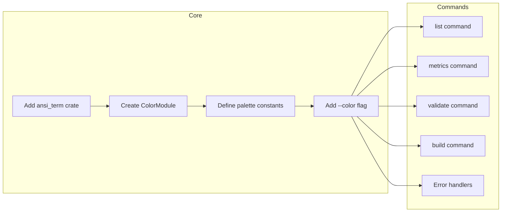

# CLI UI Improvements Plan

## Overview

This document outlines a comprehensive plan to enhance the Switchboard CLI user interface with colored text, better formatting, and improved user experience.

---

## 1. Current State Analysis

### Commands and Their Output

| Command | Output Type | Current Styling |
|---------|------------|-----------------|
| `list` | Table | Cyan headers only |
| `metrics` | Table + Icons | Status icons (✓, ⚠, ✗) without colors |
| `validate` | Text | Plain text |
| `build` | Progress | println! statements |
| `logs` | Log output | Plain text |
| `skills` | Table | comfy-table basic styling |
| `up/run` | Status messages | Plain text |
| `down` | Status messages | Plain text |
| Error messages | stderr | Plain eprintln! |

### Existing Dependencies Supporting Colors

- **[`comfy-table`](Cargo.toml:47)** - Already imported, has Color support
- **[`tracing-subscriber`](Cargo.toml:38)** - Env filter with color support
- **[`tracing`](Cargo.toml:37)** - Structured logging

---

## 2. Improvement Categories

### 2.1 Color System

#### Goal: Unified color palette across all commands

| Element | Color | Hex |
|---------|-------|-----|
| Errors | Red | #FF5555 |
| Warnings | Yellow | #F1FA8C |
| Success | Green | #50FA7B |
| Info | Cyan | #8BE9FD |
| Headers | Cyan | #8BE9FD |
| Debug | Gray | #6272A4 |

#### Implementation Strategy



### 2.2 Table Enhancements

#### Current (`list.rs:114-136`)
- UTF8_FULL preset
- Cyan bold headers
- No row coloring

#### Enhanced
- Status-based row coloring
- Color-coded priority indicators
- Better column alignment

### 2.3 Progress Indicators

#### Build Command Enhancements
- Add spinner during Docker build
- Show percentage progress
- Color-coded status (building=cyan, success=green, failed=red)

### 2.4 Error Messaging

#### Current (`main.rs:11`)
```rust
eprintln!("Error: {}", e);
```

#### Enhanced
```rust
eprintln!("{} Error: {}", RED_X, e);  // With color
// Or use error module with structured formatting
```

---

## 3. Implementation Tasks

### Phase 1: Foundation (Low Effort, High Impact)

#### Task 1.1: Add Color Dependency
```toml
# Cargo.toml
ansi_term = "0.12"
```

#### Task 1.2: Create Color Module
```rust
// src/ui/colors.rs
pub struct Colors {
    pub error: Style,
    pub warning: Style,
    pub success: Style,
    pub info: Style,
    pub header: Style,
}
```

#### Task 1.3: Add --color Flag
```rust
// In Cli struct
#[arg(long, default_value = "auto")]
pub color: ColorMode,

pub enum ColorMode {
    Auto,
    Always,
    Never,
}
```

### Phase 2: Command Enhancements

#### Task 2.1: Enhance List Command
- [ ] Add status column with colored badges
- [ ] Color schedule based on validity (green=valid, red=invalid)
- [ ] Color timeout warnings (yellow if < 5min)

#### Task 2.2: Enhance Metrics Command
- [ ] Color status icons (green ✓, yellow ⚠, red ✗)
- [ ] Color success rate percentages
- [ ] Add color to duration displays

#### Task 2.3: Enhance Validate Command
- [ ] Color validation errors (red)
- [ ] Color warnings (yellow)
- [ ] Color success messages (green)

#### Task 2.4: Enhance Build Command
- [ ] Add colored progress indicators
- [ ] Color Docker output appropriately
- [ ] Show colored success/failure states

### Phase 3: Advanced Features

#### Task 3.1: Interactive Prompts
- [ ] Confirm before destructive actions (down --cleanup)
- [ ] Agent selection menu

#### Task 3.2: Rich Output
- [ ] ASCII art for major events
- [ ] Box drawing for tables (alternative to UTF8)
- [ ] Terminal window sizing

#### Task 3.3: Help Improvements
- [ ] Colorized help output
- [ ] Examples with syntax highlighting

---

## 4. File Changes Summary

### New Files
- `src/ui/mod.rs` - UI module exports
- `src/ui/colors.rs` - Color palette and helpers
- `src/ui/progress.rs` - Progress indicators

### Modified Files
| File | Changes |
|------|---------|
| `Cargo.toml` | Add ansi_term dependency |
| `src/cli/mod.rs` | Add --color flag, colorize error output |
| `src/commands/list.rs` | Add row status colors |
| `src/commands/metrics.rs` | Color status icons |
| `src/commands/validate.rs` | Color validation output |
| `src/commands/build.rs` | Add progress indicators |
| `src/main.rs` | Use colored error output |

---

## 5. Dependencies

```toml
# Required
ansi_term = "0.12"           # Lightweight color support

# Optional for advanced features
indicatif = "0.17"           # Rich progress bars (if needed)
dialoguer = "0.10"           # Interactive prompts (if needed)
```

---

## 6. Testing Considerations

- [ ] Test color output in different terminals
- [ ] Test --color=never flag
- [ ] Test CI environment (no colors expected)
- [ ] Test Windows compatibility
- [ ] Verify comfy-table colors still work

---

## 7. Priority Order

1. **P0 (Do First)**: Add ansi_term, create color module, colorize errors
2. **P1 (Important)**: Enhance list/metrics tables with status colors
3. **P2 (Nice to Have)**: Build progress indicators
4. **P3 (Future)**: Interactive prompts, rich output

---

## 8. Backward Compatibility

- Default to `--color=auto` (detect terminal)
- Never break existing functionality
- Keep plain text fallback for --color=never
- Ensure all existing tests pass

---

## 9. Effort Estimate

| Phase | Tasks | Effort |
|-------|-------|--------|
| Phase 1 | 3 tasks | 2-4 hours |
| Phase 2 | 4 tasks | 4-6 hours |
| Phase 3 | 3 tasks | 4-8 hours |

**Total: 10-18 hours for full implementation**

---

## 10. Success Criteria

- [ ] All error messages are colored red
- [ ] List command shows colored status indicators
- [ ] Metrics command shows colored success/failure rates
- [ ] Build command shows progress with colors
- [ ] --color flag works (auto/always/never)
- [ ] All existing tests pass
- [ ] Works on Windows and Unix
