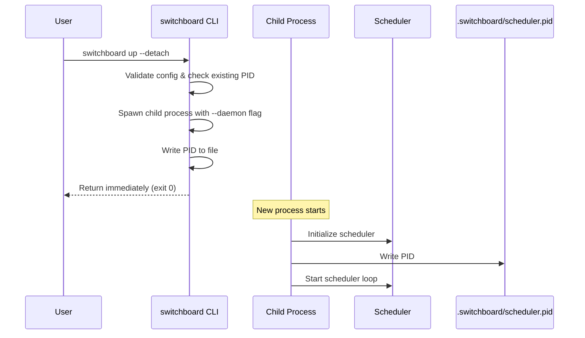

# Fix switchboard up --detach Plan

## 1. Overview

This plan addresses the issue where `switchboard up --detach` does not actually detach - it blocks the terminal instead of returning immediately like `docker-compose up -d`.

### Current Problem
- In `src/cli/commands/up.rs` lines 678-680, the scheduler runs as a Tokio task via `tokio::spawn()`
- In lines 928-931, the code calls `task.await` which blocks until the scheduler stops
- This means the parent process never returns control to the terminal
- Even without the await, the Tokio runtime would shut down when main returns

### Solution Approach
Spawn a new child process using `std::process::Command`, allowing the parent process to exit immediately while the child runs independently - similar to how Docker Compose does it.

---

## 2. Implementation Approach

### 2.1 Process Spawning vs Daemonization

| Approach | Pros | Cons | Decision |
|----------|------|------|----------|
| **Process Spawning** | Cross-platform, simple, reliable | Requires wrapper script | **Recommended** |
| **Daemonization** | True background service | Complex, platform-specific | Not recommended for initial implementation |

### 2.2 How It Will Work



---

## 3. Required Code Changes

### 3.1 Phase 1: Core Detach Fix

#### Step 1.1: Modify CLI to Support Daemon Flag

**File:** `src/cli/commands/up.rs`

Add a new internal flag `--daemon` that the spawned child process will use:

```rust
// Add to UpCommand in src/cli/mod.rs
#[derive(Parser)]
pub struct UpCommand {
    /// Run in background
    #[arg(short, long)]
    pub detach: bool,
    
    /// INTERNAL: Run as daemon (used by spawned process)
    #[arg(long, hide = true)]
    pub daemon: bool,
}
```

#### Step 1.2: Implement Process Spawning Logic

**File:** `src/cli/commands/up.rs`

When `detach=true`:

```rust
if args.detach {
    // 1. Check for existing scheduler
    let pid_file_path = switchboard_dir.join("scheduler.pid");
    if pid_file_path.exists() {
        // Check if process is still running
        if is_process_running_from_file(&pid_file_path)? {
            return Err("Scheduler is already running. Use 'switchboard down' first.".into());
        }
    }
    
    // 2. Spawn a new process with --daemon flag
    let current_exe = std::env::current_exe()
        .map_err(|e| format!("Failed to get current executable: {}", e))?;
    
    // Pass config path if specified
    let mut cmd = std::process::Command::new(&current_exe);
    cmd.arg("up").arg("--daemon");
    if let Some(ref config) = config_path {
        cmd.arg("--config").arg(config);
    }
    
    // 3. Spawn and detach
    cmd.spawn()
        .map_err(|e| format!("Failed to spawn detached process: {}", e))?;
    
    // 4. Return immediately
    println!("Scheduler started in detached mode");
    return Ok(());
}
```

#### Step 1.3: Implement Daemon Mode Handler

**File:** `src/cli/commands/up.rs`

When `--daemon` flag is passed (internal use):

```rust
if args.daemon {
    // Run the scheduler in foreground mode (without blocking on await)
    // but skip the final task.await that blocks
    // This is essentially the current detach mode but without the blocking
    
    // Write PID file first
    let current_pid = std::process::id();
    fs::write(&pid_file_path, current_pid.to_string())?;
    
    // Run scheduler (foreground mode logic, but don't await indefinitely)
    if let Err(e) = sched.start().await {
        eprintln!("Scheduler error: {}", e);
        return Err(e.into());
    }
    
    // Clean up PID file on exit
    let _ = fs::remove_file(&pid_file_path);
    
    Ok(())
}
```

Actually, we need a different approach. The current code has `task.await` at line 928-931 which blocks. The fix is to NOT have that await when in daemon mode. Let me revise:

**Revised Step 1.3:**

```rust
// In the detach=true branch around line 650
if args.detach {
    // Spawn child process
    let current_exe = std::env::current_exe()
        .map_err(|e| format!("Failed to get current executable: {}", e))?;
    
    let mut cmd = std::process::Command::new(&current_exe);
    cmd.arg("up").arg("--daemon");
    // ... add config path args
    
    // Detach the child process
    use std::process::Stdio;
    cmd.stdin(Stdio::null());
    cmd.stdout(Stdio::null());
    cmd.stderr(Stdio::null());
    // On Windows, use CREATE_NEW_PROCESS_GROUP
    // On Unix, use setsid
    #[cfg(windows)]
    {
        use std::os::windows::process::CommandExt;
        cmd.creation_flags(0x08000000); // CREATE_NEW_PROCESS_GROUP
    }
    
    let child = cmd.spawn()
        .map_err(|e| format!("Failed to spawn detached process: {}", e))?;
    
    // Parent exits immediately
    println!("Scheduler started in detached mode (PID: {})", child.id());
    return Ok(());
}
```

Then in the handler for `--daemon`:

```rust
if args.daemon {
    // In daemon mode, we run scheduler but don't block
    // We just run the scheduler directly and let it run until stopped
    
    if registered_count > 0 {
        // Write PID
        let current_pid = std::process::id();
        fs::write(&pid_file_path, current_pid.to_string())?;
        
        // Start scheduler
        if let Err(e) = sched.start().await {
            eprintln!("Failed to start scheduler: {}", e);
            return Err(e.into());
        }
        
        // Don't await here - the scheduler.start() runs indefinitely
        // When it returns, we clean up and exit
    }
    
    // Clean up PID file
    let _ = fs::remove_file(&pid_file_path);
    
    return Ok(());
}
```

Wait, looking at the current code more carefully, the `sched.start().await` is what runs the scheduler loop. So the fix is simpler - we just need to spawn a new process that calls `sched.start().await` and NOT await it from the parent.

---

## 4. New CLI Commands

### 4.1 Commands We Already Have

The following commands already exist:
- `switchboard up --detach` - Start scheduler in background (needs fix)
- `switchboard down` - Stop scheduler (works via PID file)
- `switchboard status` - Check scheduler health (works via heartbeat.json)

### 4.2 Commands to Implement

#### 4.2.1 `switchboard ps` - List Detached Processes

**Purpose:** Show status of all switchboard processes (like `docker-compose ps`)

**Implementation:**

```bash
# src/cli/commands/ps.rs

// Show running scheduler and agent containers
switchboard ps

// Options:
# -a, --all    Show all containers (not just running)
```

Output:
```
NAME              STATUS          PID     CREATED
scheduler        Running         12345   2 minutes ago
dev-agent        Running         -       -
```

#### 4.2.2 `switchboard logs` Enhancement

**Purpose:** Already exists, but should work with detached mode. Need to ensure logs are accessible when scheduler runs in background.

**Current state:** Already implemented in `src/commands/logs.rs`

**Enhancement needed:**
- Ensure log files are written to `.switchboard/logs/` in detached mode
- Add `--scheduler` flag to view scheduler logs specifically

#### 4.2.3 `switchboard restart` - Restart Scheduler

**Purpose:** Convenience command to stop and start the scheduler

```bash
switchboard restart
switchboard restart --detach  # Start in detached mode
```

---

## 5. State Management

### 5.1 Files Used

| File | Purpose | Already Exists |
|------|---------|----------------|
| `.switchboard/scheduler.pid` | Process ID | ✅ Yes |
| `.switchboard/heartbeat.json` | Scheduler status | ✅ Yes |
| `.switchboard/logs/` | Log files | ✅ Yes |

### 5.2 PID File Format

```
<pid>
```

Example:
```
12345
```

### 5.3 Heartbeat File (already exists)

```json
{
  "pid": 12345,
  "last_heartbeat": "2026-03-06T19:00:00Z",
  "state": "running",
  "agents": [
    {
      "name": "dev-agent",
      "schedule": "0 * * * *",
      "current_run": null
    }
  ]
}
```

### 5.4 Enhancements Needed

1. **Add start time to heartbeat** - Track when scheduler started
2. **Add version info** - Track which version is running
3. **Add config hash** - Detect config changes

---

## 6. Edge Cases and Error Handling

### 6.1 Edge Cases

| Scenario | Handling |
|----------|----------|
| Scheduler already running | Check PID file, error if process alive |
| Stale PID file | Clean up on startup (already implemented) |
| Config file missing | Error before spawning |
| Docker not available | Warning but allow scheduler to start |
| No agents configured | Skip scheduler start, exit cleanly |
| Permission denied | Clear error message |
| Disk full | Handle write failures gracefully |
| Parent killed before child | Child continues running (inherited by init) |

### 6.2 Error Messages

| Error | Message |
|-------|---------|
| Already running | "Scheduler is already running (PID: 12345). Use 'switchboard down' first." |
| No config | "Configuration file not found. Run 'switchboard project init' first." |
| Invalid config | "Invalid configuration: <details>" |
| Spawn failed | "Failed to start detached process: <details>" |

---

## 7. Testing Approach

### 7.1 Unit Tests

Test individual components:
- PID file creation/cleanup
- Process running detection
- Config validation

### 7.2 Integration Tests

```
# Test detach flow
switchboard up --detach
# Should return immediately

switchboard status
# Should show Running

switchboard down
# Should stop gracefully

# Test with agents
switchboard up --detach
docker ps  # Should see agent containers running

switchboard ps
# Should show scheduler and agents
```

### 7.3 Test Scenarios

| Test | Expected Result |
|------|-----------------|
| `switchboard up --detach` returns immediately | Parent exits in < 1 second |
| `switchboard status` shows Running | PID matches child process |
| `switchboard down` stops scheduler | Process no longer running |
| `switchboard up --detach` when already running | Error message displayed |
| Kill scheduler externally | PID file cleaned up on next start |
| Terminal closed while detached | Scheduler continues running |

---

## 8. Implementation Steps Summary

### Phase 1: Core Fix

- [ ] Add `--daemon` internal flag to UpCommand
- [ ] Implement process spawning in detach mode
- [ ] Remove blocking `task.await` from daemon path
- [ ] Test detach returns immediately

### Phase 2: Management Commands

- [ ] Implement `switchboard ps` command
- [ ] Enhance `switchboard logs` for scheduler logs
- [ ] Implement `switchboard restart` command

### Phase 3: Polish

- [ ] Add start time to heartbeat
- [ ] Add version tracking
- [ ] Improve error messages
- [ ] Add integration tests

---

## 9. Files to Modify

| File | Changes |
|------|---------|
| `src/cli/mod.rs` | Add --daemon flag to UpCommand |
| `src/cli/commands/up.rs` | Implement process spawning, remove blocking await |
| `src/cli/commands/ps.rs` | NEW - List processes |
| `src/cli/commands/restart.rs` | NEW - Restart command |
| `src/cli/commands/mod.rs` | Export new commands |

---

## 10. Backward Compatibility

- Existing `switchboard up` (without --detach) continues to work
- Existing `switchboard down` continues to work
- Existing `switchboard status` continues to work
- Only new behavior is that `--detach` actually detaches
