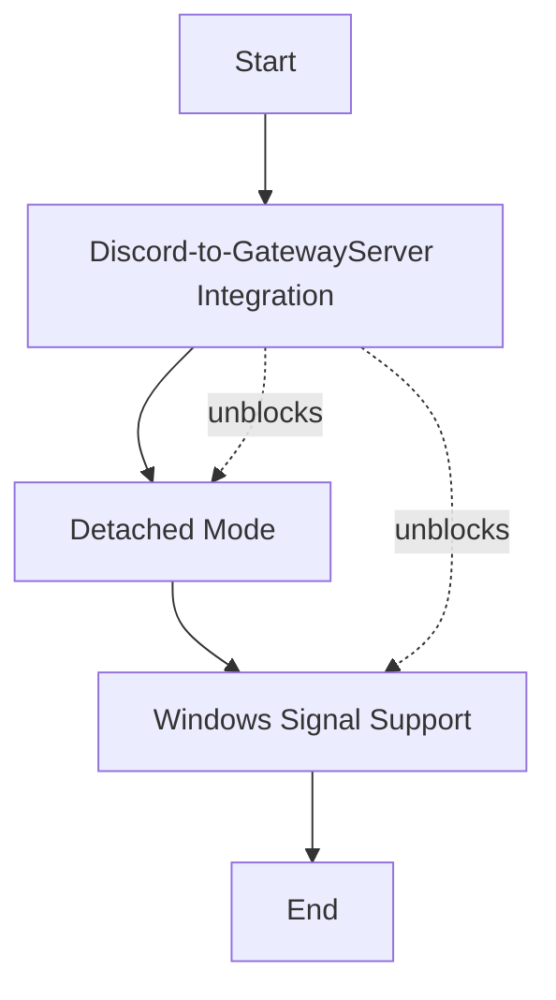

# Discord Multi-Agent Gateway Implementation Plan

## Overview

This plan covers the remaining work items to complete the Discord Gateway functionality. The Discord Gateway connects Discord channels to the project communication infrastructure, allowing projects to receive and respond to Discord messages.

---

## Work Items

### Priority 1: Discord-to-GatewayServer Integration

**Location:** [`src/gateway/server.rs:573`](src/gateway/server.rs:573)

**Description:** The main blocker where `discord_gateway` is initialized to `None`. Messages from Discord cannot route to registered projects without a real Discord Gateway instance.

**Technical Approach:**

1. **Understand the Data Flow:**
   ```
   Discord Gateway (WebSocket) → DiscordEvent → GatewayServer State → Project WebSocket
   ```

2. **Required Changes:**
   - Modify [`GatewayServer::new()`](src/gateway/server.rs:491) to accept Discord configuration
   - Create a Discord Gateway instance in [`GatewayServer::run()`](src/gateway/server.rs:516) using:
     - Token from `gateway_config.discord_token`
     - Intents from config (default: `MESSAGE_CONTENT | GUILDS`)
     - Event sender channel to push events to the server
   - Store the running Discord Gateway in `AppState.discord_gateway`
   - Handle Discord events in the server's message handling loop

3. **Key Integration Points:**
   - The [`DiscordGateway`](src/discord/gateway.rs:95) struct already exists and can be created with `DiscordGateway::new(token, intents, event_sender)`
   - Need to spawn the gateway in a background task with `tokio::spawn`
   - Events flow through the `event_sender` channel created in [`server.rs:333`](src/gateway/server.rs:333)

4. **Message Routing Logic:**
   - When a `DiscordEvent::MessageCreate` arrives, extract `channel_id`
   - Look up which project(s) are subscribed to that channel via `ChannelRegistry`
   - Forward the message payload to the project's WebSocket connection

---

### Priority 2: Detached Mode (Background Daemon)

**Location:** [`src/cli/commands/gateway.rs:84`](src/cli/commands/gateway.rs:84)

**Description:** The `--detach` flag is defined but not implemented. Need to implement background daemon mode so the gateway can run as a long-lived service.

**Technical Approach:**

1. **Process Forking Strategy:**
   - On Unix: Use `DaemonController` with `fork()` to detach from terminal
   - On Windows: Use `CreateProcess` with `DETACHED_PROCESS` flag (or keep it no-op for now since Windows doesn't have true daemon fork)

2. **Implementation Steps:**

   a) **Create DetachedGateway module** (new file or add to gateway.rs):
      ```rust
      pub struct DetachedGateway;
      
      impl DetachedGateway {
          /// Spawn the gateway in a detached subprocess
          pub async fn spawn(config: &GatewayConfig) -> Result<u32, Error>;
          
          /// Check if a detached gateway is running
          pub fn is_running() -> bool;
          
          /// Stop the detached gateway
          pub async fn stop(timeout_secs: u64) -> Result<(), Error>;
      }
      ```

   b) **Modify [`run_gateway_up()`](src/cli/commands/gateway.rs:180):**
      - If `args.detach` is true, call `DetachedGateway::spawn()` instead of running server inline
      - Return immediately after spawn with the PID

   c) **PID File Management:**
      - Already exists in [`src/gateway/pid.rs`](src/gateway/pid.rs) - use for tracking detached process

3. **Detached Process Responsibilities:**
   - Redirect stdin/stdout/stderr to `/dev/null` or log files
   - Create the PID file before forking
   - Clean up PID file on exit

---

### Priority 3: Windows Signal Support

**Location:** [`src/cli/commands/gateway.rs:441`](src/cli/commands/gateway.rs:441)

**Description:** The gateway down command only works on Unix systems. Need Windows support using `windows-rs` or similar.

**Technical Approach:**

1. **Windows API Integration:**

   a) **Add Windows Dependencies** to `Cargo.toml`:
      ```toml
      [target.'cfg(windows)'.dependencies]
      windows = { version = "0.58", features = [
          "Win32_Foundation",
          "Win32_System_Threading",
          "Win32_System_ProcessStatus"
      ]}
      ```

   b) **Implement Windows Process Control:**

   ```rust
   #[cfg(windows)]
   mod windows_signals {
       use windows::Win32::Foundation::CloseHandle;
       use windows::Win32::System::Threading::{
           OpenProcess, TerminateProcess, PROCESS_TERMINATE
       };
       
       pub fn send_terminate_signal(pid: u32) -> Result<(), Error> {
           unsafe {
               let handle = OpenProcess(PROCESS_TERMINATE, false, pid)?;
               let _ = TerminateProcess(handle, 1);
               let _ = CloseHandle(handle);
           }
           Ok(())
       }
       
       pub fn is_process_running(pid: u32) -> bool {
           // Use OpenProcess with 0 access to check if process exists
       }
   }
   ```

2. **Cross-Platform Abstraction:**

   ```rust
   pub trait ProcessControl {
       fn send_terminate(pid: u32) -> Result<(), Error>;
       fn is_running(pid: u32) -> bool;
   }
   
   #[cfg(unix)]
   impl ProcessControl for UnixProcess { ... }
   
   #[cfg(windows)]
   impl ProcessControl for WindowsProcess { ... }
   ```

3. **Modify [`run_gateway_down()`](src/cli/commands/gateway.rs:370):**
   - Replace Unix-only signal code with cross-platform `ProcessControl` trait
   - Remove the `#[cfg(not(unix))]` error return

---

### Priority 4: Populate Plan File

**Status:** ✅ Completed (this document)

---

## Implementation Order



### Rationale:

1. **Discord-to-GatewayServer Integration first** - This is the core functionality that enables the entire system to work. Without it, other features have limited value.

2. **Detached Mode second** - Once Discord integration works, running the gateway as a background daemon becomes useful for production deployment.

3. **Windows Signal Support last** - While important for Windows users, the Unix implementation works. This can be done after core functionality is validated.

---

## Dependencies

| Item | Depends On |
|------|------------|
| Discord-to-GatewayServer Integration | Gateway config, Discord gateway module |
| Detached Mode | PID file module, Discord integration (for full testing) |
| Windows Signal Support | None (can be done in parallel) |

---

## Testing Strategy

### Discord-to-GatewayServer Integration:
1. Unit test Discord event → channel mapping
2. Integration test: Send test message via Discord API → verify it reaches registered project WebSocket

### Detached Mode:
1. Test: Start with `--detach` → verify process detaches → verify PID file created → verify `gateway down` works
2. Test: Start with `--detach` → kill process → verify PID file cleanup

### Windows Signal Support:
1. Build on Windows
2. Test: Start gateway → run `gateway down` → verify process terminates

---

## Files to Modify

| File | Changes |
|------|---------|
| [`src/gateway/server.rs`](src/gateway/server.rs) | Wire up Discord Gateway in `run()`, add event handling |
| [`src/cli/commands/gateway.rs`](src/cli/commands/gateway.rs) | Implement `--detach`, add Windows process control |
| [`Cargo.toml`](Cargo.toml) | Add Windows crate dependency |
| [`plans/discord-multi-agent-gateway-plan.md`](plans/discord-multi-agent-gateway-plan.md) | ✅ This file (completed) |
