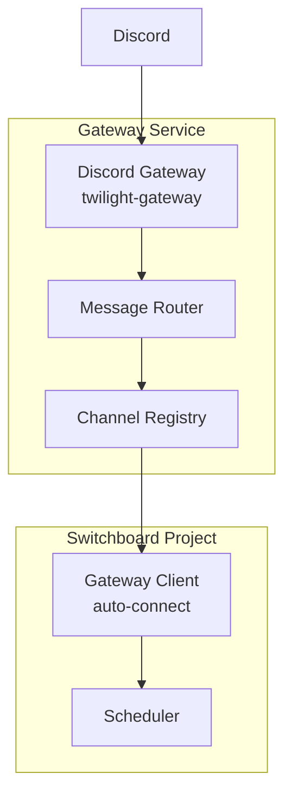

# Gateway Auto-Connect Implementation Plan

## Overview

This plan outlines the implementation of automatic gateway connection for switchboard projects, with consolidated configuration in `switchboard.toml`.

## Problem Statement

Currently:
1. Gateway requires channel configuration in `gateway.toml` (`[[channels]]` section)
2. Switchboard projects don't automatically connect to the gateway
3. Configuration is duplicated (channel mapping in gateway.toml, project-specific settings elsewhere)
4. Users must manually implement WebSocket client to connect to gateway

## Proposed Solution

Simplify by:
1. Adding `[gateway]` section to `switchboard.toml` for project-specific gateway config
2. Making switchboard automatically connect to gateway when configured
3. Removing `[[channels]]` from `gateway.toml` (projects self-register)
4. Gateway routes messages based on project subscriptions, not static config

## Architecture



## Implementation Steps

### Phase 1: Configuration Schema

#### 1.1 Add Gateway Config to switchboard.toml

**File:** `src/discord/config.rs`

Add new `GatewayConfig` struct:

```rust
#[derive(Debug, Clone, Deserialize, Serialize)]
pub struct GatewayClientConfig {
    /// Enable gateway connection
    #[serde(default)]
    pub enabled: bool,

    /// Gateway WebSocket URL (e.g., "ws://localhost:9000")
    #[serde(default = "default_gateway_url")]
    pub url: String,

    /// Project name for registration
    #[serde(default)]
    pub project_name: String,

    /// Discord channel IDs to subscribe to
    #[serde(default)]
    pub channels: Vec<String>,
}
```

**Update `DiscordSection`** to include:
```rust
pub gateway: Option<GatewayClientConfig>,
```

#### 1.2 Update switchboard.sample.toml

Add example `[discord.gateway]` section:

```toml
[discord.gateway]
enabled = true
url = "ws://localhost:9000"
project_name = "my-project"
channels = ["123456789012345678"]
```

### Phase 2: Gateway Client Integration

#### 2.1 Create Gateway Connection Manager

**New File:** `src/discord/gateway_client.rs`

Implement automatic connection management:
- Connect to gateway WebSocket on startup
- Register with project_name and channels
- Handle reconnection with exponential backoff
- Process incoming messages from gateway
- Route messages to appropriate handlers

Key components:
```rust
pub struct GatewayConnection {
    client: GatewayClient,
    config: GatewayClientConfig,
    shutdown_rx: broadcast::Receiver<()>,
}

impl GatewayConnection {
    pub async fn new(config: GatewayClientConfig, shutdown_rx: broadcast::Receiver<()>) -> Result<Self>;
    pub async fn connect(&mut self) -> Result<()>;
    pub async fn register(&mut self) -> Result<()>;
    pub async fn run(&mut self) -> Result<()>;
}
```

#### 2.2 Update Discord Listener

**File:** `src/discord/mod.rs`

Modify `start_discord_listener_with_shutdown` to:
1. Check for `[discord.gateway]` config
2. If enabled, spawn gateway connection task alongside Discord gateway
3. Route Discord messages through gateway when configured

### Phase 3: Simplify gateway.toml

#### 3.1 Remove [[channels]] Requirement

**File:** `src/gateway/config.rs`

Make `channels` optional in `GatewayConfig`:
```rust
pub struct GatewayConfig {
    // ... existing fields
    #[serde(default)]
    pub channels: Vec<ChannelMapping>,  // Now optional
}
```

Update validation to allow empty channels.

#### 3.2 Update gateway.toml.sample

Simplify to:
```toml
# Discord Bot Token
discord_token = "${DISCORD_TOKEN}"

[server]
host = "0.0.0.0"
http_port = 8080
ws_port = 9000

[logging]
level = "info"
# Removed: [[channels]] section
```

### Phase 4: Message Flow

#### 4.1 Gateway → Project Message Flow

When Discord message arrives at gateway:
1. Extract `channel_id` from message
2. Look up projects subscribed to channel_id
3. Forward message to each project's WebSocket

#### 4.2 Project → Gateway (Response Flow)

When project wants to send Discord message:
1. Project sends message via WebSocket to gateway
2. Gateway uses Discord HTTP API to send message to Discord

### Phase 5: Testing

#### 5.1 Unit Tests
- Config parsing for new `[discord.gateway]` section
- Gateway client registration
- Reconnection logic

#### 5.2 Integration Tests
- Gateway + single project end-to-end
- Gateway + multiple projects (fan-out)
- Gateway graceful shutdown

## Files to Modify

| File | Changes |
|------|---------|
| `src/discord/config.rs` | Add `GatewayClientConfig` struct, update `DiscordSection` |
| `src/discord/mod.rs` | Integrate gateway connection into listener |
| `src/discord/gateway.rs` | (existing - may need minor updates) |
| `src/gateway/config.rs` | Make channels optional |
| `src/gateway/routing.rs` | (existing - should work as-is) |
| `src/gateway/client.rs` | (existing - should work as-is) |
| `switchboard.sample.toml` | Add `[discord.gateway]` example |
| `gateway.toml` | Remove `[[channels]]` example or mark optional |

## New Files

| File | Purpose |
|------|---------|
| `src/discord/gateway_client.rs` | Gateway connection manager |

## Configuration Examples

### Before (Current)

**gateway.toml:**
```toml
discord_token = "${DISCORD_TOKEN}"

[[channels]]
channel_id = "123"
project_name = "project-a"
endpoint = "ws://localhost:8080"
```

**switchboard.toml:**
```toml
[discord]
enabled = true
channel_id = "123"
```

### After (Proposed)

**gateway.toml:**
```toml
discord_token = "${DISCORD_TOKEN}"

[server]
ws_port = 9000
```

**switchboard.toml:**
```toml
[discord]
enabled = true
channel_id = "123"

[discord.gateway]
enabled = true
url = "ws://localhost:9000"
project_name = "project-a"
channels = ["123"]
```

## Backward Compatibility

1. **Existing gateway.toml with [[channels]]** - Continue to work (channels still supported but optional)
2. **Existing switchboard.toml without [discord.gateway]** - No change in behavior
3. **New projects** - Can use simplified gateway config

## Security Considerations

1. **Project name validation** - Gateway could optionally validate project names against an allowlist
2. **Channel access control** - Gateway could restrict which channels each project can subscribe to
3. **Token handling** - Gateway token still from environment variable

## Open Questions

1. Should the gateway validate project_name against a configured allowlist?
2. How to handle Discord message responses - does project send via gateway or directly?
3. Should gateway store channel->project mappings persistently?

## Success Criteria

1. ✅ Single source of configuration (switchboard.toml)
2. ✅ Automatic connection on switchboard startup
3. ✅ Works with multiple projects per gateway
4. ✅ Backward compatible with existing configs
5. ✅ Clean error messages when gateway unavailable
