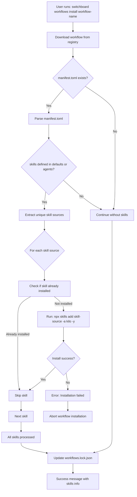

# Implementation Plan: Auto-Install Required Skills for Workflows

## Overview

This plan enables `manifest.toml` to specify required skills that are automatically installed when a workflow is installed. The feature ensures that when users install a workflow, all its required skills are installed automatically without manual intervention.

## Requirements Summary

| Requirement | Decision |
|-------------|----------|
| Installation location | Project-level (`./skills/`) - same as `switchboard skills install` |
| Update behavior | Skills are updated when workflow is updated |
| Validation | `switchboard workflows validate` checks skills exist |
| Failure handling | Installation fails completely if any skill fails to install |
| Optional skills | Not supported - all declared skills are required |

---

## Architecture



---

## Step-by-Step Implementation

### 1. Update manifest.toml Schema to Support Required Skills in Defaults and Per-Agent

**Current State:**
- [`ManifestDefaults`](src/workflows/manifest.rs:15-37) already has `skills: Option<Vec<String>>` field
- [`ManifestAgent`](src/workflows/manifest.rs:52-78) already has `skills: Option<Vec<String>>` field

**Required Changes:**
- The schema is already in place! We just need to ensure it's properly documented and utilized.

**Files to Modify:**
- [`src/workflows/manifest.rs`](src/workflows/manifest.rs) - Already has skills field

---

### 2. Validate Skills During Manifest Parsing

**Required Changes:**
- Add validation to ensure skill source format is valid
- Validate that skills field exists in defaults or at least one agent

**New Function to Add:**
```rust
// In src/workflows/manifest.rs

/// Validates that skill entries have correct format
/// Returns error for invalid skill source formats
pub fn validate_skill_sources(manifest: &ManifestConfig) -> Result<(), ManifestError> {
    // Check defaults skills
    if let Some(defaults) = &manifest.defaults {
        if let Some(skills) = &defaults.skills {
            for skill in skills {
                validate_skill_format(skill)?;
            }
        }
    }
    
    // Check per-agent skills
    for agent in &manifest.agents {
        if let Some(skills) = &agent.skills {
            for skill in skills {
                validate_skill_format(skill)?;
            }
        }
    }
    
    Ok(())
}

fn validate_skill_format(skill: &str) -> Result<(), ManifestError> {
    // Accept: owner/repo, owner/repo@skill-name, https://github.com/owner/repo
    // Simple validation - just check it's not empty and doesn't contain spaces
    if skill.trim().is_empty() {
        return Err(ManifestError::ValidationError(
            "Skill source cannot be empty".to_string()
        ));
    }
    
    if skill.contains(' ') {
        return Err(ManifestError::ValidationError(
            format!("Skill source '{}' cannot contain spaces", skill)
        ));
    }
    
    Ok(())
}
```

---

### 3. Create Skills Installation Service for Workflow Installation

**Required Changes:**
- Create a new module that handles skill installation for workflows
- This service will be used by both install and update commands

**New File:** `src/commands/workflows/skills.rs`

```rust
//! Skills installation service for workflows
//!
//! This module provides functionality to install and manage skills
//! required by workflows.

use crate::skills::{SkillsManager, SkillsError};
use crate::commands::skills::install::{extract_skill_name, perform_post_install_move};
use std::path::PathBuf;

/// Installs all skills required by a workflow manifest
///
/// # Arguments
/// * `skills` - List of skill sources to install
/// * `yes` - Whether to skip confirmation prompts
///
/// # Returns
/// * `Ok(Vec<String>)` - List of installed skill names
/// * `Err(WorkflowsError)` - If any skill fails to install
pub async fn install_workflow_skills(
    skills: &[String],
    yes: bool,
) -> Result<Vec<String>, WorkflowsError> {
    let mut installed = Vec::new();
    let mut manager = SkillsManager::new(None);
    
    // Check npx availability
    if manager.check_npx_available().is_err() {
        return Err(WorkflowsError::SkillInstallError {
            skill_source: "npx".to_string(),
            message: "npx is required but not found. Install Node.js from https://nodejs.org".to_string(),
        });
    }
    
    // Get unique skills to install
    let unique_skills: Vec<&String> = skills.iter().collect();
    
    for skill_source in unique_skills {
        // Check if skill is already installed
        let skill_name = extract_skill_name(skill_source);
        let skills_dir = manager.skills_dir.clone();
        let skill_path = skills_dir.join(&skill_name);
        
        if skill_path.exists() {
            println!("Skill '{}' already installed, skipping", skill_name);
            installed.push(skill_name);
            continue;
        }
        
        // Install the skill
        println!("Installing skill: {}", skill_source);
        
        let mut cmd = create_npx_command();
        cmd.arg("skills");
        cmd.arg("add");
        
        // Parse source to handle @skill-name format
        if let Some(at_pos) = skill_source.rfind('@') {
            let repo = &skill_source[..at_pos];
            let skill_name_from_source = &skill_source[at_pos + 1..];
            cmd.arg(repo);
            cmd.arg("--skill");
            cmd.arg(skill_name_from_source);
        } else {
            cmd.arg(skill_source);
        }
        
        cmd.arg("-a");
        cmd.arg("kilo");
        cmd.arg("-y"); // Auto-confirm
        
        let result = cmd.status();
        
        match result {
            Ok(status) if status.success() => {
                // Move skill to final location
                if let Err(e) = perform_post_install_move(&skills_dir, &skill_name, skill_source) {
                    return Err(WorkflowsError::SkillInstallError {
                        skill_source: skill_source.clone(),
                        message: format!("Failed to move skill: {}", e),
                    });
                }
                
                // Add to lockfile
                if let Err(e) = crate::skills::add_skill_to_lockfile(
                    &skills_dir, 
                    &skill_name, 
                    skill_source
                ) {
                    eprintln!("Warning: Failed to update skills lockfile: {}", e);
                }
                
                println!("Installed skill: {}", skill_name);
                installed.push(skill_name);
            }
            Ok(status) => {
                return Err(WorkflowsError::SkillInstallError {
                    skill_source: skill_source.clone(),
                    message: format!("npx skills add failed with exit code: {}", status.code().unwrap_or(-1)),
                });
            }
            Err(e) => {
                return Err(WorkflowsError::SkillInstallError {
                    skill_source: skill_source.clone(),
                    message: format!("Failed to execute npx: {}", e),
                });
            }
        }
    }
    
    Ok(installed)
}

/// Updates all skills required by a workflow
///
/// # Arguments
/// * `skills` - List of skill sources that should be installed
///
/// # Returns
/// * `Ok(Vec<String>)` - List of updated skill names
/// * `Err(WorkflowsError)` - If any skill fails to update
pub async fn update_workflow_skills(
    skills: &[String],
) -> Result<Vec<String>, WorkflowsError> {
    let mut updated = Vec::new();
    
    // For each skill, we need to re-install to get latest version
    for skill_source in skills {
        let skill_name = extract_skill_name(skill_source);
        
        println!("Updating skill: {}", skill_source);
        
        // Run npx skills update for this skill
        let result = crate::skills::run_npx_skills_update(Some(&skill_name), None).await;
        
        match result {
            Ok(status) if status.success() => {
                println!("Updated skill: {}", skill_name);
                updated.push(skill_name);
            }
            Ok(status) => {
                // Update failed - try fresh install
                println!("Update failed, attempting fresh install for: {}", skill_name);
                install_workflow_skills(&[skill_source.clone()], true).await?;
                updated.push(skill_name);
            }
            Err(e) => {
                return Err(WorkflowsError::SkillInstallError {
                    skill_source: skill_source.clone(),
                    message: format!("Failed to update skill: {}", e),
                });
            }
        }
    }
    
    Ok(updated)
}

/// Checks if all required skills are installed
///
/// # Arguments
/// * `skills` - List of skill sources that should be installed
///
/// # Returns
/// * `Ok(Vec<String>)` - List of missing skill names
/// * `Err(WorkflowsError)` - On error checking skills
pub fn check_skills_installed(skills: &[String]) -> Result<Vec<String>, WorkflowsError> {
    let manager = SkillsManager::new(None);
    let mut missing = Vec::new();
    
    for skill_source in skills {
        let skill_name = extract_skill_name(skill_source);
        let skill_path = manager.skills_dir.join(&skill_name);
        
        if !skill_path.exists() {
            missing.push(skill_source.clone());
        }
    }
    
    Ok(missing)
}
```

---

### 4. Modify Workflow Install Command to Auto-Install Required Skills

**Files to Modify:**
- [`src/commands/workflows/install.rs`](src/commands/workflows/install.rs)

**Required Changes:**

After downloading the workflow and before updating the lockfile, add:

```rust
// After line ~194 in install.rs (after downloading manifest.toml)

// Check if manifest has required skills
let manifest_path = workflow_path.join("manifest.toml");
let mut skills_to_install: Vec<String> = Vec::new();

if manifest_path.exists() {
    match crate::workflows::manifest::ManifestConfig::from_path(&manifest_path) {
        Ok(manifest) => {
            // Collect skills from defaults
            if let Some(defaults) = &manifest.defaults {
                if let Some(skills) = &defaults.skills {
                    skills_to_install.extend(skills.clone());
                }
            }
            
            // Collect skills from each agent
            for agent in &manifest.agents {
                if let Some(skills) = &agent.skills {
                    skills_to_install.extend(skills.clone());
                }
            }
            
            // Remove duplicates
            skills_to_install.sort();
            skills_to_install.dedup();
            
            if !skills_to_install.is_empty() {
                println!("\nInstalling {} required skill(s) for workflow...", skills_to_install.len());
                
                match install_workflow_skills(&skills_to_install, args.yes).await {
                    Ok(installed) => {
                        println!("Successfully installed {} skill(s): {}", 
                            installed.len(), 
                            installed.join(", ")
                        );
                    }
                    Err(e) => {
                        eprintln!("Error: Failed to install required skills: {}", e);
                        // Clean up downloaded workflow
                        let _ = fs::remove_dir_all(&workflow_path);
                        return ExitCode::Error;
                    }
                }
            }
        }
        Err(e) => {
            println!("Warning: Failed to parse manifest.toml: {}", e);
        }
    }
}
```

---

### 5. Update Workflow Update Command to Also Update Required Skills

**Files to Modify:**
- [`src/commands/workflows/update.rs`](src/commands/workflows/update.rs)

**Required Changes:**

After updating the workflow, also update all required skills:

```rust
// After updating workflow files, check and update skills

// Get skills from manifest
if manifest_path.exists() {
    if let Ok(manifest) = crate::workflows::manifest::ManifestConfig::from_path(&manifest_path) {
        let mut skills_to_update: Vec<String> = Vec::new();
        
        // Collect skills (same logic as install)
        // ...
        
        if !skills_to_update.is_empty() {
            println!("\nUpdating {} required skill(s)...", skills_to_update.len());
            
            match update_workflow_skills(&skills_to_update).await {
                Ok(updated) => {
                    println!("Successfully updated {} skill(s)", updated.len());
                }
                Err(e) => {
                    eprintln!("Warning: Failed to update some skills: {}", e);
                }
            }
        }
    }
}
```

---

### 6. Add Skill Validation to Workflow Validate Command

**Files to Modify:**
- [`src/commands/workflows/validate.rs`](src/commands/workflows/validate.rs)

**Required Changes:**

Add a new validation function and call it from the validate command:

```rust
/// Validates that required skills are installed
pub fn validate_workflow_skills(manifest: &ManifestConfig) -> Vec<String> {
    let mut warnings = Vec::new();
    let manager = SkillsManager::new(None);
    
    // Collect all skills from manifest
    let mut all_skills: Vec<String> = Vec::new();
    
    if let Some(defaults) = &manifest.defaults {
        if let Some(skills) = &defaults.skills {
            all_skills.extend(skills.clone());
        }
    }
    
    for agent in &manifest.agents {
        if let Some(skills) = &agent.skills {
            all_skills.extend(skills.clone());
        }
    }
    
    // Remove duplicates
    all_skills.sort();
    all_skills.dedup();
    
    // Check each skill
    for skill_source in &all_skills {
        let skill_name = extract_skill_name(skill_source);
        let skill_path = manager.skills_dir.join(&skill_name);
        
        if !skill_path.exists() {
            warnings.push(format!(
                "Skill '{}' (required by workflow) is not installed. \
                Run 'switchboard skills install {}' to install it.",
                skill_name, skill_source
            ));
        }
    }
    
    warnings
}
```

Then integrate into the validate command:

```rust
// In run_workflows_validate function

// After other validations...
let skill_warnings = validate_workflow_skills(&manifest);
for warning in &skill_warnings {
    println!("Warning: {}", warning);
}

if !skill_warnings.is_empty() {
    println!("\nTo install missing skills, run:");
    for skill_source in unique_skills {
        println!("  switchboard skills install {}", skill_source);
    }
}
```

---

### 7. Update CLI Help Text to Document New Auto-Install Behavior

**Files to Modify:**
- [`src/commands/workflows/types.rs`](src/commands/workflows/types.rs)

**Required Changes:**

Update the help text for `WorkflowsInstall`:

```rust
/// Command to install a workflow
#[derive(Parser, Debug)]
pub struct WorkflowsInstall {
    /// Name of the workflow to install
    ///
    /// The name of the workflow to install from the switchboard-workflows registry.
    /// Source is hardcoded to kkingsbe/switchboard-workflows.
    ///
    /// Required skills defined in the workflow's manifest.toml will be automatically
    /// installed to ./skills/ during installation. If a skill installation fails,
    /// the workflow installation will be aborted.
    #[arg(value_name = "WORKFLOW_NAME")]
    pub workflow_name: String,

    /// Skip confirmation prompt
    ///
    /// When set, bypasses the confirmation prompt and installs the workflow
    /// immediately. Also skips confirmation for skill installations.
    /// Use with caution.
    #[arg(long, help = "Skip confirmation prompt")]
    pub yes: bool,
}
```

Also update `WorkflowsUpdate`:

```rust
/// Update installed workflows to their latest versions.
///
/// If a specific workflow name is provided, only that workflow is updated.
/// If no workflow name is provided, all installed workflows are updated.
///
/// Required skills defined in the workflow's manifest.toml will also be updated
/// to their latest versions.
#[derive(Parser, Debug)]
pub struct WorkflowsUpdate {
    /// Optional workflow name to update. If omitted, updates all installed workflows.
    #[arg(value_name = "workflow-name", last = true)]
    pub workflow_name: Option<String>,
}
```

---

### 8. Add Tests for New Workflow+Skills Integration

**Files to Modify:**
- Add tests to [`src/commands/workflows/install.rs`](src/commands/workflows/install.rs)
- Add tests to [`src/commands/workflows/validate.rs`](src/commands/workflows/validate.rs)

**Test Cases:**

```rust
#[cfg(test)]
mod skill_integration_tests {
    use super::*;
    
    #[test]
    fn test_install_workflow_skills_empty_list() {
        // Test with empty skills list
        let runtime = tokio::runtime::Runtime::new().unwrap();
        let result = runtime.block_on(install_workflow_skills(&[], true));
        assert!(result.is_ok());
        assert!(result.unwrap().is_empty());
    }
    
    #[test]
    fn test_check_skills_installed_all_present() {
        // Test when all skills are installed
    }
    
    #[test]
    fn test_check_skills_installed_missing() {
        // Test when some skills are missing
    }
    
    #[test]
    fn test_validate_workflow_skills_warnings() {
        // Test that warnings are generated for missing skills
    }
}
```

---

### 9. Update Documentation

**Files to Modify:**
- [`docs/workflows.md`](docs/workflows.md) - Create if doesn't exist
- Update [`docs/skills.md`](docs/skills.md) with new workflow integration section

**Documentation to Add:**

```markdown
# Workflow Skills Integration

When you install a workflow that requires skills, they are automatically installed to your project's `./skills/` directory.

## How It Works

1. When you run `switchboard workflows install <workflow-name>`, Switchboard:
   - Downloads the workflow from the registry
   - Parses the workflow's `manifest.toml`
   - Extracts required skills from `[defaults].skills` and `[[agents]].skills`
   - Installs each skill that isn't already present
   - Updates the skills lockfile

2. When you run `switchboard workflows update`, Switchboard:
   - Updates the workflow files
   - Updates all required skills to their latest versions

## Required Skills

Skills can be specified at two levels in `manifest.toml`:

### Default Skills (applies to all agents)

```toml
[defaults]
skills = ["owner/repo@skill-name"]
```

### Per-Agent Skills

```toml
[[agents]]
name = "architect"
prompt_file = "ARCHITECT.md"
skills = ["owner/repo@agent-skill"]
```

## Validation

Running `switchboard workflows validate <workflow-name>` will check if all required skills are installed and warn you if any are missing.

## Troubleshooting

### Skill Installation Fails

If a skill fails to install during workflow installation, the workflow installation will be aborted. To resolve:

1. Install Node.js from https://nodejs.org
2. Try installing the workflow again: `switchboard workflows install <workflow-name>`

### Missing Skills Warning

If you see warnings about missing skills:

```bash
# Install the missing skill manually
switchboard skills install owner/repo@skill-name

# Or let the workflow install handle it
switchboard workflows install workflow-name
```
```

---

## Summary of Files to Modify

| File | Changes |
|------|---------|
| [`src/workflows/manifest.rs`](src/workflows/manifest.rs) | Add skill validation functions |
| [`src/commands/workflows/skills.rs`](src/commands/workflows/skills.rs) | **NEW** - Skills installation service |
| [`src/commands/workflows/install.rs`](src/commands/workflows/install.rs) | Auto-install skills after download |
| [`src/commands/workflows/update.rs`](src/commands/workflows/update.rs) | Auto-update skills |
| [`src/commands/workflows/validate.rs`](src/commands/workflows/validate.rs) | Add skills validation |
| [`src/commands/workflows/types.rs`](src/commands/workflows/types.rs) | Update help text |
| [`docs/skills.md`](docs/skills.md) | Update documentation |

---

## Backward Compatibility

This feature is fully backward compatible:

- Workflows without `skills` in their manifest will work exactly as before
- The `--yes` flag behavior is consistent with existing skill installation
- Existing `switchboard skills` commands continue to work unchanged

---

## Error Handling Summary

| Scenario | Behavior |
|----------|----------|
| npx not found | Error message with install instructions, abort workflow install |
| Skill already installed | Skip installation, continue |
| Skill install fails | Abort workflow installation, clean up workflow files |
| Network error | Show error from npx, abort workflow install |
| Skills defined but manifest fails to parse | Warning, continue without skills |
| Workflow update + skill update fails | Warning, continue with workflow update |
