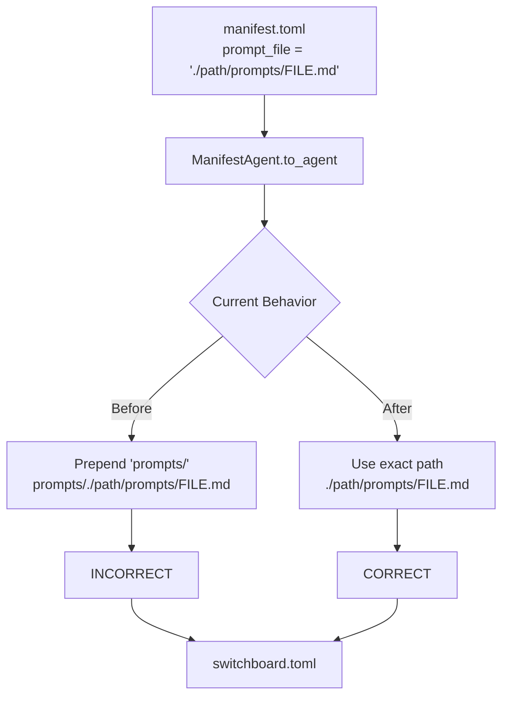

# Plan: Fix Prompt Path Transformation Bug in Workflow Apply

## Problem Statement

In [`src/workflows/manifest.rs:287`](src/workflows/manifest.rs:287), the code blindly prepends `prompts/` to the prompt_file path:

```rust
let prompt_file = format!("prompts/{}", self.prompt_file);
```

This transforms `./switchboard/workflows/goal-based/prompts/GOAL_PLANNER.md` to `prompts/./switchboard/workflows/goal-based/prompts/GOAL_PLANNER.md`.

## Desired Behavior

When a user specifies a full relative path in `manifest.toml` like:
```toml
prompt_file = "./switchboard/workflows/goal-based/prompts/GOAL_PLANNER.md"
```

The workflow apply command should write the **exact same path** to `switchboard.toml` without any transformation.

---

## Code Analysis Summary

### Current Flow
1. User defines `prompt_file` in `manifest.toml` (e.g., `"ARCHITECT.md"` or `"./switchboard/workflows/goal-based/prompts/GOAL_PLANNER.md"`)
2. [`ManifestAgent::to_agent()`](src/workflows/manifest.rs:250) converts to Config Agent
3. Line 287 blindly prepends `prompts/` - **this is the bug**
4. Agent is written to `switchboard.toml`

### Validation Logic (Already Correct)
The validation in [`manifest.rs:178-188`](src/workflows/manifest.rs:178) correctly extracts just the filename using `.file_name()`:
```rust
let prompt_filename = Path::new(&agent.prompt_file)
    .file_name()
    .and_then(|n| n.to_str())
    .unwrap_or(&agent.prompt_file)
    .to_string();
```

### Path Resolution (Already Correct)
In [`src/config/mod.rs:1053-1064`](src/config/mod.rs:1053), paths are resolved relative to the config directory correctly - they handle absolute paths, relative paths, and simple filenames.

---

## Code Changes Required

### 1. Remove the prompts/ Prefix Transformation

**File**: `src/workflows/manifest.rs`  
**Function**: `ManifestAgent::to_agent()` (line 287)

**Current code**:
```rust
// Convert prompt_file to prompts/ prefix
let prompt_file = format!("prompts/{}", self.prompt_file);
```

**Replace with**:
```rust
// Use the prompt_file path exactly as specified
let prompt_file = self.prompt_file.clone();
```

**Rationale**: The user should specify the exact path they want in their `switchboard.toml`. The old behavior of prepending `prompts/` was incorrect because:
- It assumes prompts are always in a `prompts/` subdirectory relative to `switchboard.toml`
- It breaks when users specify full relative paths
- It breaks when users specify absolute paths

---

## Test Updates Required

### 1. Update Existing Test in manifest.rs

**File**: `src/workflows/manifest.rs`  
**Test**: `test_to_agent_with_defaults` (line 422)

**Current test**:
```rust
// prompt_file should have prompts/ prefix
assert_eq!(config_agent.prompt_file, Some("prompts/ARCHITECT.md".to_string()));
```

**Replace with**:
```rust
// prompt_file should be used exactly as specified (no transformation)
assert_eq!(config_agent.prompt_file, Some("ARCHITECT.md".to_string()));
```

### 2. Add New Test for Full Path Scenario

**File**: `src/workflows/manifest.rs`

Add a new test to verify that full relative paths are preserved:

```rust
#[test]
fn test_to_agent_full_path_preserved() {
    let defaults = ManifestDefaults {
        schedule: Some("0 9 * * *".to_string()),
        timeout: None,
        readonly: None,
        overlap_mode: None,
        max_queue_size: None,
        env: None,
        skills: None,
    };

    let agent = ManifestAgent {
        name: "planner".to_string(),
        prompt_file: "./switchboard/workflows/goal-based/prompts/GOAL_PLANNER.md".to_string(),
        schedule: None,
        timeout: None,
        readonly: None,
        overlap_mode: None,
        max_queue_size: None,
        env: None,
        skills: None,
    };

    let config_agent = agent.to_agent("goal-based", &defaults);
    
    // Full path should be preserved exactly
    assert_eq!(
        config_agent.prompt_file, 
        Some("./switchboard/workflows/goal-based/prompts/GOAL_PLANNER.md".to_string())
    );
}
```

### 3. Add Test for Absolute Path Scenario

Add another test for absolute paths:

```rust
#[test]
fn test_to_agent_absolute_path_preserved() {
    let defaults = ManifestDefaults { /* ... */ };
    
    let agent = ManifestAgent {
        name: "planner".to_string(),
        prompt_file: "/absolute/path/to/prompts/GOAL_PLANNER.md".to_string(),
        // ... other fields
    };
    
    let config_agent = agent.to_agent("test", &defaults);
    
    // Absolute path should be preserved exactly
    assert_eq!(
        config_agent.prompt_file,
        Some("/absolute/path/to/prompts/GOAL_PLANNER.md".to_string())
    );
}
```

---

## Edge Cases to Consider

### 1. Simple Filename (Backward Compatibility)
**Input**: `prompt_file = "ARCHITECT.md"`  
**Output**: `prompt_file = "ARCHITECT.md"`  
**Note**: This changes behavior - previously it would become `prompts/ARCHITECT.md`. Users need to update their manifest.toml to include the full path if they want it in switchboard.toml.

### 2. Relative Path Starting with `./`
**Input**: `prompt_file = "./prompts/ARCHITECT.md"`  
**Output**: `prompt_file = "./prompts/ARCHITECT.md"`  
**Note**: This works correctly after the fix.

### 3. Full Relative Path
**Input**: `prompt_file = "./switchboard/workflows/goal-based/prompts/GOAL_PLANNER.md"`  
**Output**: `prompt_file = "./switchboard/workflows/goal-based/prompts/GOAL_PLANNER.md"`  
**Note**: This is the main use case for the fix.

### 4. Absolute Path
**Input**: `prompt_file = "/home/user/projects/switchboard/prompts/agent.md"`  
**Output**: `prompt_file = "/home/user/projects/switchboard/prompts/agent.md"`  
**Note**: Absolute paths should be preserved as-is.

### 5. Path with `../` Navigation
**Input**: `prompt_file = "../shared-prompts/agent.md"`  
**Output**: `prompt_file = "../shared-prompts/agent.md"`  
**Note**: Relative path navigation should be preserved.

---

## Documentation Updates Required

### 1. Update Workflow Documentation
**File**: `docs/workflows.md`

Add a section explaining prompt_file path handling:

```markdown
## Agent prompt_file Configuration

When defining agents in `manifest.toml`, the `prompt_file` path is used exactly as specified in the generated `switchboard.toml`. 

### Path Examples

```toml
# Simple filename (must exist in prompts/ directory relative to switchboard.toml)
prompt_file = "agent.md"

# Relative path from switchboard.toml location
prompt_file = "./prompts/agent.md"

# Full relative path from project root
prompt_file = "./switchboard/workflows/my-workflow/prompts/agent.md"

# Absolute path
prompt_file = "/absolute/path/to/prompts/agent.md"
```

**Note**: Unlike some earlier versions, the path is not automatically prefixed with `prompts/`. Specify the exact path you want in your switchboard.toml.
```

### 2. Update CLI Reference (if applicable)
**File**: `docs/cli-reference.md`

If there's documentation for `workflows apply`, update it to mention that prompt_file paths are preserved exactly.

---

## Backward Compatibility Notes

### Breaking Change
This fix represents a **breaking change** for users who:
- Currently rely on the automatic `prompts/` prefix behavior
- Use simple filenames in their manifest.toml like `prompt_file = "ARCHITECT.md"`

### Migration Path
Users with existing manifests should update their `manifest.toml` to specify the full relative path to the prompt file:

**Before (manifest.toml)**:
```toml
[[agents]]
name = "architect"
prompt_file = "ARCHITECT.md"
```

**After (manifest.toml)**:
```toml
[[agents]]
name = "architect"
prompt_file = "./prompts/ARCHITECT.md"
```

Or they can reference prompts from wherever is appropriate for their project structure.

### Release Note Suggestion
```
BREAKING: The `workflows apply` command no longer automatically prepends `prompts/` to 
the prompt_file path. Use the exact path you want in your switchboard.toml. 
This fixes issues with full relative paths being incorrectly transformed.
```

---

## Implementation Checklist

- [ ] **Code Change**: Remove `prompts/` prefix transformation in `src/workflows/manifest.rs:287`
- [ ] **Test Update**: Fix existing test assertion in `test_to_agent_with_defaults`
- [ ] **Test Addition**: Add `test_to_agent_full_path_preserved` test
- [ ] **Test Addition**: Add `test_to_agent_absolute_path_preserved` test
- [ ] **Documentation**: Update `docs/workflows.md` with prompt_file path guidance
- [ ] **Release Notes**: Document breaking change for users upgrading

---

## Diagram: Current vs Fixed Behavior


