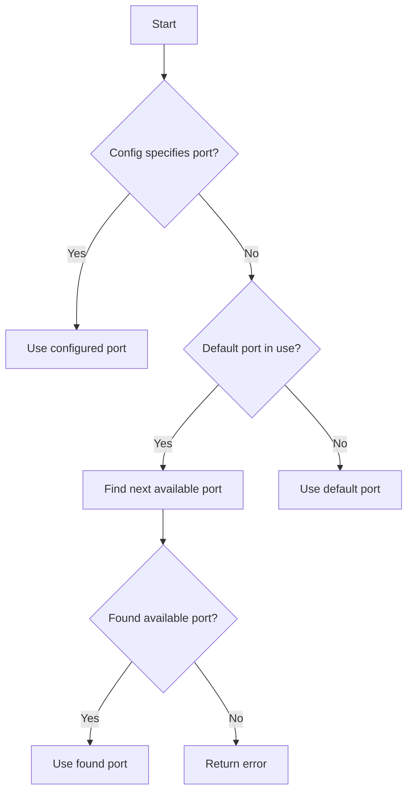
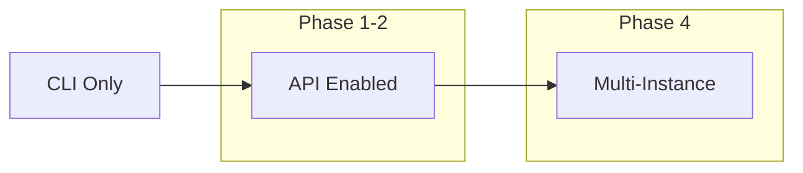

# REST API Plan for Switchboard Local IPC

## Executive Summary

This document outlines a comprehensive plan for adding a REST API to Switchboard for local Inter-Process Communication (IPC). The API will expose all CLI commands (except `switchboard up`) via HTTP endpoints, enabling programmatic control of Switchboard instances. The design prioritizes support for 100+ simultaneous instances running on a single machine.

---

## Table of Contents

1. [API Architecture Design](#1-api-architecture-design)
2. [Endpoint Mapping](#2-endpoint-mapping)
3. [Auto-Generated Documentation](#3-auto-generated-documentation)
4. [Multi-Instance Support](#4-multi-instance-support)
5. [Configuration](#5-configuration)
6. [Security Considerations](#6-security-considerations)
7. [Implementation Phases](#7-implementation-phases)
8. [Migration Path](#8-migration-path)

---

## 1. API Architecture Design

### 1.1 Web Framework Choice

**Selected Framework: Axum**

Rationale:
- Already integrated in codebase (via `gateway` feature)
- Lightweight, ergonomic, and type-safe
- Excellent async performance with Tokio
- Built-in OpenAPI support via `axum-doc` or `utoipa`
- Strong ecosystem with `tower` middleware

**Additional Dependencies:**
```toml
[dependencies]
axum = { version = "0.7", features = ["json", "tokio", "http1", "ws"] }
tower = { version = "0.5", features = ["util"] }
tower-http = { version = "0.6", features = ["trace", "cors"] }
serde = { version = "1.0", features = ["derive"] }
utoipa = { version = "4", features = ["axum", "openapi-features"] }
utoipa-swagger-ui = { version = "6", features = ["axum"] }
tokio = { version = "1.40", features = ["full"] }
```

### 1.2 Port Allocation Strategy

**Port Range: 18500-18699 (100 ports for 100+ instances)**

| Range | Purpose |
|-------|---------|
| 18500-18599 | Default instance ports (first 100) |
| 18600-18699 | Overflow ports if default range exhausted |

**Allocation Algorithm:**


**Instance Identification:**
- Each instance requires a unique `instance_id` in config
- Default: derived from config file name (e.g., `switchboard-dev` from `dev/switchboard.toml`)
- Instance ID used for:
  - Logging prefixes
  - PID file naming (`.switchboard/{instance_id}.pid`)
  - Metrics labels

### 1.3 Request/Response Handling Patterns

**Standard Response Envelope:**
```rust
// Success response
#[derive(Serialize)]
pub struct ApiResponse<T> {
    pub success: bool,
    pub data: Option<T>,
    pub message: Option<String>,
}

// Error response
#[derive(Serialize)]
pub struct ApiError {
    pub success: bool,
    pub error: String,
    pub code: ErrorCode,
    pub details: Option<serde_json::Value>,
}
```

**HTTP Status Codes:**
| Code | Usage |
|------|-------|
| 200 | Success |
| 201 | Created (e.g., new resource) |
| 400 | Bad Request (invalid parameters) |
| 401 | Unauthorized (not used - local-only) |
| 404 | Not Found |
| 409 | Conflict (resource already exists) |
| 422 | Unprocessable Entity (validation error) |
| 429 | Too Many Requests (rate limited) |
| 500 | Internal Server Error |
| 503 | Service Unavailable |

**Async Handling:**
- Long-running operations (run, build) return immediately with operation ID
- Client can poll status endpoint for completion
- WebSocket support for real-time log streaming

### 1.4 Error Handling

**Error Codes Enum:**
```rust
#[derive(Error, Code)]
pub enum ApiErrorCode {
    #[error("Configuration error")]
    ConfigError,
    
    #[error("Agent not found")]
    AgentNotFound,
    
    #[error("Agent already running")]
    AgentAlreadyRunning,
    
    #[error("Docker error")]
    DockerError,
    
    #[error("Scheduler not running")]
    SchedulerNotRunning,
    
    #[error("Validation error")]
    ValidationError,
    
    #[error("Operation timeout")]
    Timeout,
    
    #[error("Port allocation failed")]
    PortAllocationFailed,
    
    #[error("Instance not found")]
    InstanceNotFound,
}
```

---

## 2. Endpoint Mapping

### 2.1 Core Commands

| CLI Command | HTTP Method | Endpoint | Description |
|-------------|-------------|----------|-------------|
| `run <agent>` | POST | `/api/v1/agents/{agent_name}/run` | Execute single agent immediately |
| `build` | POST | `/api/v1/build` | Build/rebuild Docker image |
| `list` | GET | `/api/v1/agents` | List all configured agents |
| `logs` | GET | `/api/v1/agents/{agent_name}/logs` | View agent execution logs |
| `logs --follow` | WS | `/api/v1/agents/{agent_name}/logs/ws` | Stream logs in real-time |
| `metrics` | GET | `/api/v1/metrics` | Display execution metrics |
| `down` | POST | `/api/v1/shutdown` | Stop scheduler and containers |
| `validate` | POST | `/api/v1/validate` | Validate config file |
| `status` | GET | `/api/v1/status` | Check scheduler health |

### 2.2 Skills Commands

| CLI Command | HTTP Method | Endpoint |
|-------------|-------------|----------|
| `skills list` | GET | `/api/v1/skills` |
| `skills install <name>` | POST | `/api/v1/skills` |
| `skills installed` | GET | `/api/v1/skills/installed` |
| `skills update [name]` | PUT | `/api/v1/skills/{skill_name}` |
| `skills remove <name>` | DELETE | `/api/v1/skills/{skill_name}` |

### 2.3 Workflows Commands

| CLI Command | HTTP Method | Endpoint |
|-------------|-------------|----------|
| `workflows list` | GET | `/api/v1/workflows` |
| `workflows install <name>` | POST | `/api/v1/workflows` |
| `workflows installed` | GET | `/api/v1/workflows/installed` |
| `workflows update [name]` | PUT | `/api/v1/workflows/{workflow_name}` |
| `workflows remove <name>` | DELETE | `/api/v1/workflows/{workflow_name}` |
| `workflows validate <path>` | POST | `/api/v1/workflows/validate` |
| `workflows apply <path>` | POST | `/api/v1/workflows/apply` |

### 2.4 Project Commands

| CLI Command | HTTP Method | Endpoint |
|-------------|-------------|----------|
| `project init` | POST | `/api/v1/project/init` |

### 2.5 Workflow Init Commands

| CLI Command | HTTP Method | Endpoint |
|-------------|-------------|----------|
| `workflow init` | POST | `/api/v1/workflow/init` |

### 2.6 Gateway Commands (Feature-Gated)

| CLI Command | HTTP Method | Endpoint |
|-------------|-------------|----------|
| `gateway up` | POST | `/api/v1/gateway/up` |
| `gateway status` | GET | `/api/v1/gateway/status` |
| `gateway down` | POST | `/api/v1/gateway/down` |

### 2.7 API Health & Info Endpoints

| Endpoint | Method | Description |
|----------|--------|-------------|
| `/health` | GET | Health check (always accessible - local-only) |
| `/` | GET | API info and available endpoints |
| `/docs` | GET | Swagger UI |
| `/docs.json` | GET | OpenAPI spec |

---

## 3. Auto-Generated Documentation

### 3.1 OpenAPI/Swagger Integration

**Using utoipa for OpenAPI Generation:**

```rust
use utoipa::{OpenApi, ToSchema};
use utoipa_swagger_ui::SwaggerUi;

// Define API schema
#[derive(OpenApi)]
#[openapi(
    paths(
        api::agents::list_agents,
        api::agents::run_agent,
        api::build::build_image,
        // ... other endpoints
    ),
    components(
        schemas(Agent, AgentRunRequest, AgentRunResponse, ...),
        schemas(ApiResponse, ApiError),
    ),
    tags(
        (name = "agents", description = "Agent management endpoints"),
        (name = "skills", description = "Skills management endpoints"),
        (name = "workflows", description = "Workflows management endpoints"),
    )
)]
pub struct ApiDoc;
```

### 3.2 Swagger UI & ReDoc

**Serve locally at `/docs` and `/redoc`:**

```rust
// In router setup
Router::new()
    .merge(SwaggerUi::new("/docs").url("/api-docs/openapi.json", ApiDoc::openapi()))
    .merge(ReDoc::with_url("/redoc", "/api-docs/openapi.json"))
```

### 3.3 Documentation Generation

- **Compile-time**: utoipa generates OpenAPI spec from code annotations
- **Runtime**: Serve at `/docs` and `/docs.json`
- **Code annotations**:
```rust
/// List all configured agents
///
/// Returns a list of all agents defined in the configuration file
/// with their schedules, prompts, and current status.
#[utoipa::path(
    get,
    path = "/api/v1/agents",
    tag = "agents",
    responses(
        (status = 200, body = [Agent], description = "List of agents"),
    )
)]
async fn list_agents() -> impl IntoResponse { ... }
```

---

## 4. Multi-Instance Support

### 4.1 Port Allocation Strategy

**Static Port Assignment (Recommended for 100+ instances):**

```toml
[api]
# Required: Unique instance identifier
instance_id = "switchboard-dev"

# Optional: Fixed port (recommended for stability)
port = 18500

# Optional: Host binding
host = "127.0.0.1"

# Fallback: If port is in use, find next available
auto_port = true
```

**Environment Variable Override:**
```bash
export SWITCHBOARD_API_PORT=18500
export SWITCHBOARD_API_HOST="127.0.0.1"
```

### 4.2 Instance Configuration

**Instance Metadata:**
```rust
pub struct InstanceConfig {
    pub instance_id: String,
    pub port: u16,
    pub host: String,
    pub config_path: String,
    pub data_dir: PathBuf,
    pub log_dir: PathBuf,
}
```

**Instance Directory Structure:**
```
.switchboard/
├── instances/
│   ├── switchboard-dev/
│   │   ├── scheduler.pid
│   │   ├── logs/
│   │   └── metrics.json
│   ├── switchboard-prod/
│   │   ├── scheduler.pid
│   │   ├── logs/
│   │   └── metrics.json
```

### 4.3 Data Isolation

| Resource | Isolation Method |
|----------|------------------|
| Config | Per-instance config file |
| Logs | Instance-specific log directory |
| Metrics | Instance-labeled Prometheus metrics |
| PID files | `.switchboard/{instance_id}.pid` |
| Docker containers | Label with instance ID |
| Skills | Per-instance or shared global |
| Workflows | Per-instance or shared global |

### 4.4 Instance Discovery/Registration

**Instance Registry (for orchestration tools):**
```rust
// Optional: Register with local registry
#[derive(Serialize, Deserialize)]
pub struct InstanceRegistration {
    instance_id: String,
    port: u16,
    started_at: DateTime<Utc>,
    config_path: String,
    status: InstanceStatus,
}

// Registry file: .switchboard/instances.json
[
  {
    "instance_id": "switchboard-dev",
    "port": 18500,
    "started_at": "2026-03-06T12:00:00Z",
    "config_path": "./dev/switchboard.toml",
    "status": "running"
  }
]
```

---

## 5. Configuration

### 5.1 New Config Options

**switchboard.toml:**
```toml
[api]
# Enable REST API server
enabled = true

# Unique instance identifier (required if API enabled)
instance_id = "switchboard-default"

# API server port (default: 18500)
port = 18500

# Bind host (default: "127.0.0.1")
host = "127.0.0.1"

# Auto port selection if port in use (default: true)
auto_port = true

# Enable Swagger UI (default: true)
swagger = true

# Rate limiting
[api.rate_limit]
# Enable rate limiting (default: true)
enabled = true

# Requests per minute (default: 60)
requests_per_minute = 60
```

### 5.2 Environment Variable Support

| Variable | Description | Default |
|----------|-------------|---------|
| `SWITCHBOARD_API_ENABLED` | Enable API server | `false` |
| `SWITCHBOARD_API_PORT` | API server port | `18500` |
| `SWITCHBOARD_API_HOST` | Bind host | `127.0.0.1` |
| `SWITCHBOARD_INSTANCE_ID` | Instance identifier | (derived from config) |

### 5.3 Default Values

```rust
impl Default for ApiConfig {
    fn default() -> Self {
        Self {
            enabled: false,
            instance_id: None, // Derived from config file
            port: 18500,
            host: "127.0.0.1".to_string(),
            auto_port: true,
            swagger: true,
            rate_limit: RateLimitConfig::default(),
        }
    }
}
```

---

## 6. Security Considerations

### 6.1 Local-Only Access

- **Default binding**: `127.0.0.1` (localhost only)
- **No external exposure**: Cannot bind to `0.0.0.0` by default
- **Firewall**: Document recommendation to keep localhost-only

### 6.2 Design Principles

The API is designed to be local-only and unauthenticated by design, intended for local process communication only.

### 6.3 Rate Limiting

**Tower-http Rate Limiter:**
```rust
// In memory rate limiting (per instance)
let rate_limiter = RateLimitLayer::new(
    NonZeroU32::new(60).unwrap(), // requests
    Duration::from_secs(60),       // per minute
);
```

### 6.4 Additional Security Measures

| Measure | Implementation |
|---------|-----------------|
| Request timeout | 30s for most endpoints, 5min for long operations |
| Body size limit | 1MB for requests |
| CORS | Disabled by default (localhost only) |
| HTTPS | Not supported (local-only design) |

---

## 7. Implementation Phases

### Phase 1: Core Infrastructure (Week 1)

**Goal**: Basic API server with health check and config validation

| Task | Description | Dependencies |
|------|-------------|--------------|
| 1.1 | Add API config struct to config module | None |
| 1.2 | Create Axum router with basic structure | 1.1 |
| 1.3 | Implement `/health` endpoint | 1.2 |
| 1.4 | Implement `/api/v1/validate` endpoint | 1.2 |
| 1.5 | Add port allocation logic | 1.1 |
| 1.6 | Integrate with CLI `api` subcommand | 1.2, 1.5 |

**Deliverables:**
- API server starts with `switchboard api start`
- Health endpoint accessible at `http://localhost:18500/health`
- Config validation via API

### Phase 2: Agent Commands (Week 2)

**Goal**: Expose core agent operations via REST API

| Task | Description | Dependencies |
|------|-------------|--------------|
| 2.1 | Implement `/api/v1/agents` (list) | Phase 1 |
| 2.2 | Implement `/api/v1/agents/{name}/run` | Phase 1 |
| 2.3 | Implement `/api/v1/agents/{name}/logs` | Phase 1 |
| 2.4 | Implement `/api/v1/metrics` | Phase 1 |
| 2.5 | Implement `/api/v1/status` | Phase 1 |
| 2.6 | Implement `/api/v1/shutdown` (down) | Phase 1 |

**Deliverables:**
- All core agent commands accessible via REST
- WebSocket log streaming support

### Phase 3: Skills & Workflows (Week 3)

**Goal**: Complete management API coverage

| Task | Description | Dependencies |
|------|-------------|--------------|
| 3.1 | Implement skills endpoints | Phase 2 |
| 3.2 | Implement workflows endpoints | Phase 2 |
| 3.3 | Implement project/workflow init | Phase 2 |
| 3.4 | Gateway endpoints (feature-gated) | Phase 2 |

**Deliverables:**
- Complete CLI command coverage via API

### Phase 4: Documentation & Polish (Week 4)

**Goal**: Auto-generated docs and production readiness

| Task | Description | Dependencies |
|------|-------------|--------------|
| 4.1 | Integrate utoipa for OpenAPI | Phase 3 |
| 4.2 | Add Swagger UI endpoint | 4.1 |
| 4.3 | Implement rate limiting | 4.1 |
| 4.4 | Add comprehensive error handling | All |

**Deliverables:**
- `/docs` endpoint with interactive API documentation
- Rate limiting

### Phase 5: Multi-Instance Support (Week 5)

**Goal**: Production-ready multi-instance deployment

| Task | Description | Dependencies |
|------|-------------|--------------|
| 5.1 | Instance ID configuration | Phase 1 |
| 5.2 | Per-instance data isolation | 5.1 |
| 5.3 | Instance registry | 5.1 |
| 5.4 | Port allocation improvements | 5.1 |

**Deliverables:**
- Support for 100+ simultaneous instances
- Instance isolation verified

---

## 8. Migration Path

### 8.1 Backward Compatibility

- **CLI unchanged**: All existing CLI commands continue to work
- **API opt-in**: REST API disabled by default
- **Feature flag**: `api` feature in Cargo.toml

### 8.2 Gradual Rollout



### 8.3 Testing Strategy

| Test Type | Coverage |
|-----------|----------|
| Unit tests | Individual endpoint handlers |
| Integration tests | Full API flow with mocked dependencies |
| Multi-instance | 10+ instances on single machine |
| Load testing | 100+ concurrent requests |

---

## Appendix A: Complete Endpoint Reference

### A.1 Core Endpoints

```yaml
/openapi.json:
  get:
    summary: Get OpenAPI specification
    tags: [Documentation]

/docs:
  get:
    summary: Swagger UI
    tags: [Documentation]

/redoc:
  get:
    summary: ReDoc UI
    tags: [Documentation]

/health:
  get:
    summary: Health check
    tags: [Health]
    security: []

/api/v1/status:
  get:
    summary: Get scheduler status
    tags: [Scheduler]

/api/v1/shutdown:
  post:
    summary: Stop scheduler and containers
    tags: [Scheduler]

/api/v1/build:
  post:
    summary: Build Docker image
    tags: [Build]

/api/v1/validate:
  post:
    summary: Validate configuration
    tags: [Config]
```

### A.2 Agents Endpoints

```yaml
/api/v1/agents:
  get:
    summary: List all agents
    tags: [Agents]

/api/v1/agents/{name}:
  get:
    summary: Get agent details
    tags: [Agents]

/api/v1/agents/{name}/run:
  post:
    summary: Run agent immediately
    tags: [Agents]

/api/v1/agents/{name}/logs:
  get:
    summary: Get agent logs
    tags: [Agents]

/api/v1/agents/{name}/logs/ws:
  get:
    summary: WebSocket log stream
    tags: [Agents]
```

### A.3 Skills Endpoints

```yaml
/api/v1/skills:
  get:
    summary: List available skills
    tags: [Skills]
  post:
    summary: Install a skill
    tags: [Skills]

/api/v1/skills/installed:
  get:
    summary: List installed skills
    tags: [Skills]

/api/v1/skills/{name}:
  put:
    summary: Update skill
    tags: [Skills]
  delete:
    summary: Remove skill
    tags: [Skills]
```

### A.4 Workflows Endpoints

```yaml
/api/v1/workflows:
  get:
    summary: List available workflows
    tags: [Workflows]
  post:
    summary: Install workflow
    tags: [Workflows]

/api/v1/workflows/installed:
  get:
    summary: List installed workflows
    tags: [Workflows]

/api/v1/workflows/validate:
  post:
    summary: Validate workflow file
    tags: [Workflows]

/api/v1/workflows/apply:
  post:
    summary: Apply workflow
    tags: [Workflows]

/api/v1/workflows/{name}:
  put:
    summary: Update workflow
    tags: [Workflows]
  delete:
    summary: Remove workflow
    tags: [Workflows]
```

---

## Appendix B: Example API Usage

### B.1 Start API Server
```bash
# Using CLI
switchboard api start --config ./switchboard.toml

# Or via environment
export SWITCHBOARD_API_ENABLED=true
export SWITCHBOARD_API_PORT=18500
switchboard up
```

### B.2 cURL Examples

```bash
# Health check
curl http://localhost:18500/health

# List agents
curl http://localhost:18500/api/v1/agents

# Run agent
curl -X POST http://localhost:18500/api/v1/agents/dev-agent/run

# Get logs
curl http://localhost:18500/api/v1/agents/dev-agent/logs

# Validate config
curl -X POST http://localhost:18500/api/v1/validate \
  -H "Content-Type: application/json" \
  -d '{"config_path": "./switchboard.toml"}'

# List all agents
curl http://localhost:18500/api/v1/agents
```

### B.3 Python Client Example

```python
import requests

class SwitchboardClient:
    def __init__(self, base_url: str):
        self.base_url = base_url
        self.headers = {}
    
    def list_agents(self):
        return requests.get(f"{self.base_url}/api/v1/agents", headers=self.headers)
    
    def run_agent(self, name: str):
        return requests.post(f"{self.base_url}/api/v1/agents/{name}/run", headers=self.headers)
    
    def get_logs(self, name: str, tail: int = 50):
        return requests.get(
            f"{self.base_url}/api/v1/agents/{name}/logs",
            params={"tail": tail},
            headers=self.headers
        )
```

---

## Appendix C: Configuration Schema

```rust
// Complete API configuration schema
#[derive(Debug, Clone, Serialize, Deserialize)]
pub struct ApiConfig {
    /// Enable REST API server
    #[serde(default = "default_enabled")]
    pub enabled: bool,

    /// Unique instance identifier
    pub instance_id: Option<String>,

    /// API server port (default: 18500)
    #[serde(default = "default_port")]
    pub port: u16,

    /// Bind host (default: "127.0.0.1")
    #[serde(default = "default_host")]
    pub host: String,

    /// Auto port selection if port in use
    #[serde(default = "default_auto_port")]
    pub auto_port: bool,

    /// Enable Swagger UI
    #[serde(default = "default_swagger")]
    pub swagger: bool,

    /// Rate limiting configuration
    #[serde(default)]
    pub rate_limit: RateLimitConfig,
}

#[derive(Debug, Clone, Serialize, Deserialize)]
pub struct RateLimitConfig {
    /// Enable rate limiting
    #[serde(default = "default_rate_limit_enabled")]
    pub enabled: bool,

    /// Requests per minute
    #[serde(default = "default_requests_per_minute")]
    pub requests_per_minute: u32,
}
```

---

## Summary

This plan provides a comprehensive roadmap for implementing a REST API in Switchboard with the following key characteristics:

1. **Framework**: Axum-based HTTP server (already partially integrated)
2. **Port Strategy**: 18500-18699 range supporting 100+ instances
3. **Security**: Local-only access (127.0.0.1), no authentication
4. **Documentation**: Auto-generated OpenAPI/Swagger UI
5. **Implementation**: 5-phase approach over 5 weeks
6. **Backward Compatibility**: CLI remains unchanged, API is opt-in

The design prioritizes local-only access, security, and multi-instance support as core requirements.
