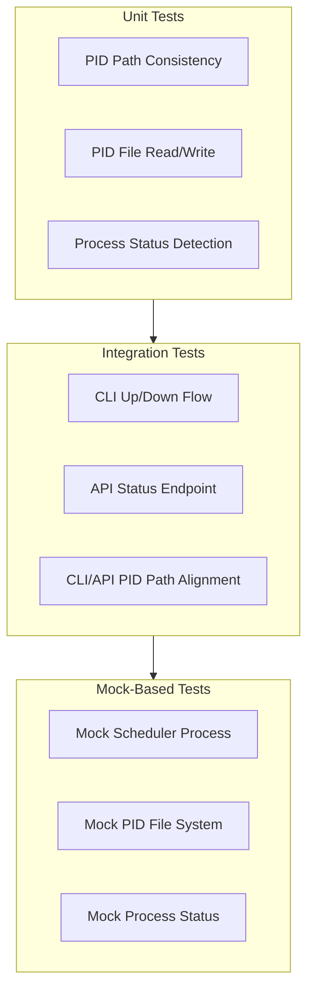
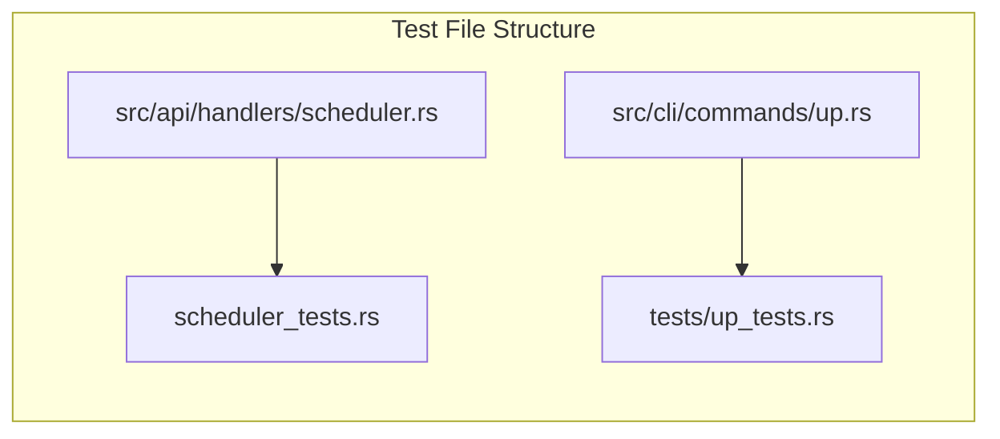

# Scheduler Status Endpoint Test Plan

## Executive Summary

This test plan addresses three critical issues in the scheduler status endpoint:

1. **PID Path Mismatch in CLI**: The [`up.rs`](src/cli/commands/up.rs) file uses inconsistent PID file paths
2. **API Status Handler Bug**: Status endpoint returns incorrect values when PID file exists
3. **Scheduler Process Death**: Scheduler process exits immediately after spawning

---

## Issue Analysis

### Issue 1: PID Path Mismatch in CLI

**Location**: [`src/cli/commands/up.rs`](src/cli/commands/up.rs)

| Line | Path Used | Status |
|------|-----------|--------|
| 400 | `.switchboard/instances/<instance_id>/scheduler.pid` | Correct |
| 569 | `.switchboard/instances/<instance_id>/scheduler.pid` | Correct |
| 701 | `.switchboard/scheduler.pid` | **Incorrect** - Missing instance path |

**Root Cause**: Line 701 in detach mode path uses hardcoded `.switchboard/scheduler.pid` instead of instance-specific path.

### Issue 2: API Status Handler Bug

**Location**: [`src/api/handlers/scheduler.rs`](src/api/handlers/scheduler.rs:449-500)

The [`scheduler_status`](src/api/handlers/scheduler.rs:449) handler calls [`is_scheduler_running(&state)`](src/api/handlers/scheduler.rs:186) which:
1. Gets PID file path via [`get_pid_file_path(state)`](src/api/handlers/scheduler.rs:110) → `state.instance_pid_file`
2. Calls [`read_pid_file(&pid_file_path)`](src/api/handlers/scheduler.rs:116)

**Path Resolution Chain**:
```
ApiState.instance_pid_file
  → get_instance_pid_file(&instance_id)
    → get_instance_dir(instance_id).join("scheduler.pid")
      → PathBuf::from(".switchboard").join("instances").join(instance_id).join("scheduler.pid")
```

**Potential Issues**:
- Instance ID mismatch between CLI-created PID file and API's expected instance ID
- Default instance ID derivation: `format!("switchboard-{}", config.port)` or `derive_instance_id_from_config()`

### Issue 3: Scheduler Process Death

**Spawn Points**:
- CLI: [`up.rs:726-754`](src/cli/commands/up.rs:726) - Detached spawn
- API: [`scheduler.rs:210-252`](src/api/handlers/scheduler.rs:210) - Via `spawn_scheduler()`

---

## Test Strategy Overview



---

## Test Cases

### Category 1: Unit Tests for PID File Path Consistency

#### TC-UT-001: Verify get_instance_pid_file returns correct path

**Module**: [`src/api/registry.rs`](src/api/registry.rs:412)

**Test Objective**: Ensure [`get_instance_pid_file()`](src/api/registry.rs:412) returns instance-specific path.

**Test Steps**:
1. Call `get_instance_pid_file("default")`
2. Call `get_instance_pid_file("test-instance")`
3. Call `get_instance_pid_file("prod-us-east")`

**Expected Results**:
- `default` → `.switchboard/instances/default/scheduler.pid`
- `test-instance` → `.switchboard/instances/test-instance/scheduler.pid`
- `prod-us-east` → `.switchboard/instances/prod-us-east/scheduler.pid`

**Pass Criteria**: All paths follow `.switchboard/instances/<instance_id>/scheduler.pid` pattern.

---

#### TC-UT-002: Verify CLI up.rs path consistency

**Module**: [`src/cli/commands/up.rs`](src/cli/commands/up.rs)

**Test Objective**: Ensure all PID file path references use instance-specific format.

**Test Steps**:
1. Parse [`up.rs`](src/cli/commands/up.rs) for all occurrences of `.switchboard`
2. Identify PID file path construction patterns
3. Verify each occurrence uses instance-specific path

**Expected Results**:
- Line 400: Uses `.switchboard/instances/<instance_id>/scheduler.pid` ✓
- Line 569: Uses `.switchboard/instances/<instance_id>/scheduler.pid` ✓
- Line 701: Uses `.switchboard/scheduler.pid` ✗ (BUG)

**Pass Criteria**: No hardcoded `.switchboard/scheduler.pid` without instance_id.

---

#### TC-UT-003: Verify API state instance_pid_file alignment

**Module**: [`src/api/state.rs`](src/api/state.rs:59)

**Test Objective**: Ensure ApiState uses instance-specific PID file path.

**Test Steps**:
1. Create ApiState with instance_id "test-instance"
2. Verify `state.instance_pid_file` equals expected path

**Expected Results**: `instance_pid_file` = `.switchboard/instances/test-instance/scheduler.pid`

---

### Category 2: Unit Tests for Scheduler Status Handler

#### TC-UT-010: Test read_pid_file with valid PID

**Module**: [`src/api/handlers/scheduler.rs`](src/api/handlers/scheduler.rs:116)

**Test Objective**: Verify [`read_pid_file()`](src/api/handlers/scheduler.rs:116) correctly parses valid PID file.

**Dependencies**: Mock file system

**Test Steps**:
1. Create temporary PID file with content "12345"
2. Call `read_pid_file(&temp_path)`
3. Verify returned PID = 12345

**Expected Results**: `Ok(Some(12345))`

---

#### TC-UT-011: Test read_pid_file with non-existent file

**Module**: [`src/api/handlers/scheduler.rs`](src/api/handlers/scheduler.rs:116)

**Test Objective**: Verify [`read_pid_file()`](src/api/handlers/scheduler.rs:116) returns None for missing file.

**Test Steps**:
1. Call `read_pid_file(&non_existent_path)`
2. Verify returned value

**Expected Results**: `Ok(None)`

---

#### TC-UT-012: Test read_pid_file with invalid content

**Module**: [`src/api/handlers/scheduler.rs`](src/api/handlers/scheduler.rs:116)

**Test Objective**: Verify [`read_pid_file()`](src/api/handlers/scheduler.rs:116) handles malformed content gracefully.

**Test Steps**:
1. Create temporary PID file with content "not-a-number"
2. Call `read_pid_file(&temp_path)`
3. Verify error handling

**Expected Results**: `Err(ApiError::Internal(...))` with parse error message

---

#### TC-UT-013: Test is_process_running detection

**Module**: [`src/api/handlers/scheduler.rs`](src/api/handlers/scheduler.rs:157-183)

**Test Objective**: Verify process status detection works correctly.

**Test Steps**:
1. Get current process PID via `std::process::id()`
2. Call `is_process_running(current_pid)` → should be true
3. Call `is_process_running(99999)` (non-existent) → should be false

**Expected Results**:
- Current process: `true`
- Non-existent: `false`

---

#### TC-UT-014: Test is_scheduler_running with valid running process

**Module**: [`src/api/handlers/scheduler.rs`](src/api/handlers/scheduler.rs:186)

**Test Objective**: Verify [`is_scheduler_running()`](src/api/handlers/scheduler.rs:186) correctly detects running scheduler.

**Dependencies**: Mock process detection, Mock state

**Test Steps**:
1. Create mock state with test instance
2. Write current process PID to instance PID file
3. Call `is_scheduler_running(&state)`
4. Verify returns `(true, Some(pid))`

**Expected Results**: `(true, Some(current_pid))`

---

#### TC-UT-015: Test is_scheduler_running with stale PID file

**Module**: [`src/api/handlers/scheduler.rs`](src/api/handlers/scheduler.rs:186)

**Test Objective**: Verify stale PID file cleanup.

**Dependencies**: Mock process detection

**Test Steps**:
1. Create mock state with test instance
2. Write non-existent PID (e.g., 99999) to instance PID file
3. Call `is_scheduler_running(&state)`
4. Verify PID file is deleted and returns `(false, None)`

**Expected Results**: 
- Returns `(false, None)`
- PID file is deleted

---

#### TC-UT-016: Test scheduler_status endpoint response format

**Module**: [`src/api/handlers/scheduler.rs`](src/api/handlers/scheduler.rs:449)

**Test Objective**: Verify [`scheduler_status`](src/api/handlers/scheduler.rs:449) returns correct JSON structure.

**Dependencies**: Mock state with config

**Test Steps**:
1. Create test ApiState with instance_id "test-instance"
2. Mock PID file with valid PID
3. Call `scheduler_status(State(Arc::new(state)))`
4. Verify response structure

**Expected Response**:
```json
{
  "success": true,
  "data": {
    "running": true,
    "pid": 12345,
    "instance_id": "test-instance",
    "uptime_seconds": 100,
    "agents_registered": 5,
    "started_at": "2026-03-09T12:00:00Z"
  },
  "message": null
}
```

---

### Category 3: Integration Tests for Scheduler Up/Down/Status Flow

#### TC-IT-001: CLI up creates instance-specific PID file

**Module**: [`src/cli/commands/up.rs`](src/cli/commands/up.rs)

**Test Objective**: Verify `switchboard up --detach` creates PID file in correct location.

**Test Steps**:
1. Create minimal switchboard.toml with one agent
2. Run `switchboard up --detach`
3. Check for PID file at `.switchboard/instances/<instance_id>/scheduler.pid`

**Expected Results**: PID file exists with valid PID content.

**Cleanup**: Run `switchboard down` to clean up.

---

#### TC-IT-002: CLI status reads correct PID file

**Module**: [`src/cli/commands/up.rs`](src/cli/commands/up.rs)

**Test Objective**: Verify status detection reads from correct path.

**Test Steps**:
1. Run `switchboard up --detach`
2. Run `switchboard status` (if exists) or verify via API
3. Check returned PID matches PID file content

**Expected Results**: Returned PID matches content in instance-specific PID file.

---

#### TC-IT-003: API scheduler/status returns correct running state

**Module**: [`src/api/handlers/scheduler.rs`](src/api/handlers/scheduler.rs:449)

**Test Objective**: Verify API status endpoint reflects actual scheduler state.

**Test Steps**:
1. Start API server with test instance
2. Write valid PID to `.switchboard/instances/<instance_id>/scheduler.pid`
3. Call `GET /api/v1/scheduler/status`
4. Verify response shows `running: true` and correct PID

**Expected Results**: `running: true`, `pid` matches written value

---

#### TC-IT-004: API scheduler/up and scheduler/status alignment

**Module**: [`src/api/handlers/scheduler.rs`](src/api/handlers/scheduler.rs:349, 449)

**Test Objective**: Verify PID file created by up handler is readable by status handler.

**Test Steps**:
1. Start API server
2. Call `POST /api/v1/scheduler/up` with `detach: true`
3. Note returned PID from response
4. Call `GET /api/v1/scheduler/status`
5. Verify returned PID matches

**Expected Results**: Both endpoints return same PID.

---

#### TC-IT-005: CLI and API PID path interoperability

**Test Objective**: Ensure CLI-created PID files are readable by API and vice versa.

**Test Steps**:
1. Start API server with instance_id "default"
2. CLI: Run `switchboard up --detach` (uses instance_id from config)
3. API: Call `GET /api/v1/scheduler/status`
4. Verify API detects CLI-started scheduler

**Expected Results**: API status reflects CLI scheduler state.

---

### Category 4: Mock-Based Tests

#### TC-MT-001: Mock scheduler process lifecycle

**Test Objective**: Test status handler with controlled scheduler process.

**Implementation**:
- Create a mock "scheduler" that writes PID and sleeps
- Use mock in place of actual scheduler spawn
- Test status detection against mock

---

#### TC-MT-002: Mock PID file system for multi-instance

**Test Objective**: Test multi-instance PID file isolation.

**Implementation**:
- Create temp directories for multiple instances
- Write different PIDs to each instance's PID file
- Verify each instance's status returns correct PID

---

#### TC-MT-003: Mock process running check

**Test Objective**: Isolate process detection for deterministic testing.

**Implementation**:
- Create trait `ProcessChecker` with mock implementation
- Inject mock into `is_process_running`
- Test various scenarios without real processes

---

#### TC-MT-004: Test stale PID file cleanup

**Test Objective**: Verify cleanup of stale PID files.

**Implementation**:
- Write PID 99999 to PID file
- Mock process check to always return false
- Call is_scheduler_running
- Verify PID file deleted

---

## Test Implementation Guide

### Required Test Utilities

1. **TempDir for PID files**: Use `tempfile::TempDir` for isolated file system tests
2. **Mock Process Checker**: Create trait `ProcessChecker` with default implementation
3. **TestStateBuilder Enhancement**: Extend `TestApiStateBuilder` with PID file configuration

### Test File Location

Create test file: `src/api/handlers/scheduler_tests.rs`

```rust
#[cfg(test)]
mod scheduler_status_tests {
    use super::*;
    use crate::api::tests::TestApiStateBuilder;
    use tempfile::TempDir;
    
    // Add test cases here
}
```

### Test Organization



---

## Bug Fix Verification Checklist

After implementing fixes, verify:

- [ ] **CLI Fix**: Line 701 in up.rs uses instance-specific path
- [ ] **API Fix**: Status endpoint correctly reads from `state.instance_pid_file`
- [ ] **Path Alignment**: CLI and API use same path resolution logic
- [ ] **Stale Cleanup**: Stale PID files are cleaned on status check
- [ ] **Multi-instance**: Multiple instances don't interfere with each other

---

## Test Execution Order

1. **Phase 1 - Unit Tests** (Can run in isolation)
   - TC-UT-001 through TC-UT-016
   
2. **Phase 2 - Mock Tests** (Fast, no external dependencies)
   - TC-MT-001 through TC-MT-004

3. **Phase 3 - Integration Tests** (Require running system)
   - TC-IT-001 through TC-IT-005

---

## References

- PID Path Functions: [`get_instance_pid_file()`](src/api/registry.rs:412)
- Status Handler: [`scheduler_status()`](src/api/handlers/scheduler.rs:449)
- CLI Up Command: [`up.rs`](src/cli/commands/up.rs)
- Test Utilities: [`src/api/tests/`](src/api/tests/)
