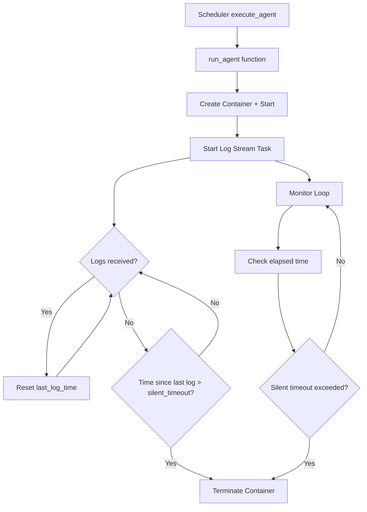

# Silent Timeout Feature Implementation Plan

## Overview

This plan outlines the implementation of a **silent timeout** feature that terminates agents when they don't produce any log output for a specified duration. This helps identify and clean up stuck or unresponsive agents.

### Requirements
- Default timeout: **5 minutes** of no log output
- Configurable at global level (`[settings]`) and per-agent level (`[[agent]]`)
- Override in `switchboard.toml`

---

## Architecture



---

## Component Changes

### 1. Configuration Module (`src/config/mod.rs`)

#### Changes to `Settings` struct (global defaults)
```rust
// Add new field around line 705
pub struct Settings {
    // ... existing fields ...
    
    /// Silent timeout - max duration without log output before termination
    /// Default: "5m" (5 minutes)
    #[serde(default = "default_silent_timeout")]
    pub silent_timeout: String,
}

fn default_silent_timeout() -> String {
    "5m".to_string()
}
```

#### Changes to `Agent` struct (per-agent override)
```rust
// Add new field around line 835
pub struct Agent {
    // ... existing fields ...
    
    /// Silent timeout for this agent (overrides global setting)
    /// Format: "<number><unit>" where unit is "s", "m", or "h"
    #[serde(default)]
    pub silent_timeout: Option<String>,
}

// Add method to resolve effective value
impl Agent {
    pub fn effective_silent_timeout(&self, global: Option<&Settings>) -> String {
        self.silent_timeout.clone()
            .or_else(|| global.map(|s| s.silent_timeout.clone()))
            .unwrap_or_else(|| "5m".to_string())
    }
}
```

#### Update Default for Agent
```rust
impl Default for Agent {
    fn default() -> Self {
        Agent {
            // ... existing fields ...
            silent_timeout: None,  // Uses global default
        }
    }
}
```

---

### 2. Container Config (`src/docker/run/types.rs`)

Add `silent_timeout` to the container configuration:

```rust
pub struct ContainerConfig {
    // ... existing fields ...
    pub silent_timeout: Option<String>,
}
```

---

### 3. Agent Execution (`src/docker/run/run.rs`)

#### Modify `run_agent()` function signature
```rust
pub async fn run_agent(
    // ... existing params ...
    silent_timeout: Option<String>,  // NEW PARAMETER
    // ... rest ...
) -> Result<AgentExecutionResult, DockerError>
```

#### Add silent timeout monitoring logic

The implementation needs to:
1. Parse the silent timeout duration (default 5 minutes)
2. Start a background task that monitors log output
3. Track timestamps of when logs are received
4. Terminate the container if no logs are received within the timeout period

Key changes:
- Parse `silent_timeout` string to `Duration` (similar to existing `timeout` parsing)
- Pass `silent_timeout` to the container execution and monitoring logic
- In the log streaming loop, track last log timestamp
- Add a separate monitoring task that checks elapsed time since last log
- If exceeded, call container stop/kill and return appropriate error

---

### 4. Log Streaming (`src/docker/run/streams.rs`)

#### Modify `attach_and_stream_logs()`

Option A: Return last log timestamp information
```rust
// Track last log time and expose it
pub async fn attach_and_stream_logs(
    // ... existing params ...
    last_log_time: Arc<Mutex<Instant>>,  // NEW: Track last log time
) -> Result<(), DockerError>
```

Option B: Spawn monitoring task internally (simpler integration)

This approach is cleaner - spawn a background task that monitors the log stream and terminates the container if silent.

---

### 5. Scheduler Integration (`src/scheduler/mod.rs`)

Update `execute_agent()` to pass the silent timeout:

```rust
// In execute_agent(), around line 700
let result = match run_agent(
    &workspace_path,
    docker_client,
    &container_config,
    agent.timeout.clone(),
    &image,
    Some(cmd_args.as_slice()),
    Some(logger),
    Some(&metrics_store),
    &agent.name,
    queued_datetime,
    agent.effective_silent_timeout(Some(&settings)),  // NEW PARAMETER
).await
```

---

## Configuration File Changes

### `switchboard.sample.toml`

Add documentation and examples around lines 18-40:

```toml
[settings]
# ... existing settings ...

# Silent timeout - terminates agent if no logs for this duration (default: "5m")
# Format: "<number><unit>" where unit is "s", "m", or "h"
# Examples: "5m" = 5 minutes, "10m" = 10 minutes, "2h" = 2 hours
# Set to "0" or empty to disable silent timeout
silent_timeout = "5m"
```

Add per-agent example around line 97:

```toml
# Optional: Silent timeout for this agent (overrides global setting)
# If not specified, uses the global setting from [settings]
silent_timeout = "10m"
```

---

## Documentation Updates

### `docs/configuration.md`

Add to `[settings]` section (around line 38):

| Field | Type | Default | Description |
|-------|------|---------|-------------|
| `silent_timeout` | String | `"5m"` | Maximum duration without log output before agent is terminated |

Add to `[[agent]]` optional fields (around line 72):

| Field | Type | Default | Description |
|-------|------|---------|-------------|
| `silent_timeout` | String | (from settings) | Override silent timeout for this agent |

Add explanation section:

```markdown
### Silent Timeout

The silent timeout feature terminates agents that stop producing log output. This helps identify stuck or unresponsive agents and frees up resources.

**How it works:**
- When an agent starts, a timer begins counting
- Each time log output is received, the timer resets
- If the timer exceeds the configured silent timeout, the agent container is terminated
- The agent run is marked as failed with termination type "silent_timeout"

**Configuration:**
- Global default: Set in `[settings].silent_timeout` (default: "5m")
- Per-agent override: Set in `[[agent]].silent_timeout`
- Disable: Set to "0" or leave empty to disable

**Use cases:**
- Long-running agents that may get stuck
- Detecting infinite loops or deadlocks
- Resource management for unresponsive agents
```

### `README.md`

Add to feature list (around line 48):

- **Silent Timeout** — Automatically terminate agents that stop producing output

---

## Testing Plan

### Unit Tests
1. Test `effective_silent_timeout()` resolution
2. Test timeout parsing ("5m", "10s", "1h", etc.)
3. Test disabled timeout ("0")

### Integration Tests
1. Test agent terminates after silent timeout with no logs
2. Test agent continues running when logs are produced
3. Test per-agent override takes precedence over global
4. Test global default when not specified
5. Test disabled timeout allows indefinite silence

---

## Implementation Steps

1. **Configuration** - Add `silent_timeout` field to Settings and Agent structs
2. **Types** - Add `silent_timeout` to ContainerConfig
3. **Runtime** - Implement silent timeout monitoring in run_agent
4. **Scheduler** - Pass silent timeout from config to run_agent
5. **Config Files** - Update switchboard.sample.toml with examples
6. **Documentation** - Update docs/configuration.md and README.md
7. **Testing** - Add unit and integration tests

---

## Files to Modify

| File | Changes |
|------|---------|
| `src/config/mod.rs` | Add silent_timeout to Settings and Agent |
| `src/docker/run/types.rs` | Add silent_timeout to ContainerConfig |
| `src/docker/run/run.rs` | Implement silent timeout monitoring |
| `src/scheduler/mod.rs` | Pass silent timeout to run_agent |
| `switchboard.sample.toml` | Add configuration examples |
| `docs/configuration.md` | Document new feature |
| `README.md` | Update feature list |
