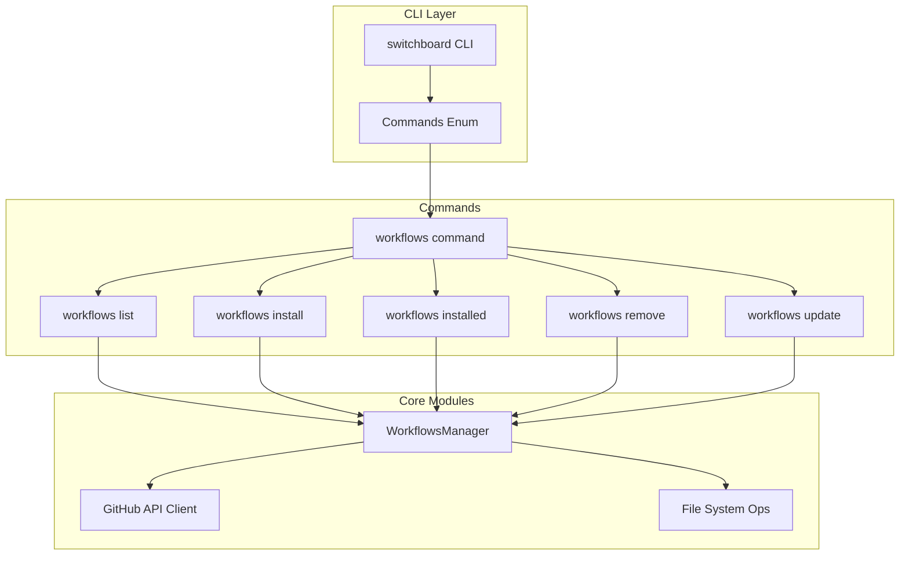

# Switchboard Workflows Management - Implementation Plan

## Overview

This plan outlines the implementation of a `switchboard workflows` command to manage workflows from https://github.com/kkingsbe/switchboard-workflows. The implementation follows the same pattern as the existing `switchboard skills` command.

## Workflow Repository Structure

The target repository (`kkingsbe/switchboard-workflows`) contains workflow packages:

```
switchboard-workflows/
├── bmad/
│   ├── README.md           # Workflow description
│   ├── input/              # Input files directory
│   └── prompts/           # Agent prompt files
│       ├── ARCHITECT.md
│       ├── DEV_PARALLEL.md
│       └── ...
├── codebase-maintinance/
├── development/
├── documentation/
└── qa/
```

Each workflow:
- Is identified by its directory name (e.g., "bmad", "development")
- Has a README.md for description
- Contains a `prompts/` subdirectory with agent prompt files

---

## Architecture



---

## Implementation Steps

### Phase 1: Core Infrastructure

#### 1.1 Create Workflow Types Module
- **File**: `src/commands/workflows/types.rs`
- Define `WorkflowsCommand` enum with subcommands: List, Install, Installed, Remove, Update
- Define `WorkflowsSubcommand` variants matching the skills pattern
- Define argument structs: `WorkflowsList`, `WorkflowsInstall`, `WorkflowsInstalled`, `WorkflowsRemove`, `WorkflowsUpdate`
- Define `ExitCode` enum (can reuse from skills or create new)

#### 1.2 Create WorkflowsManager Module
- **File**: `src/workflows/mod.rs` (new module)
- Create `WorkflowsManager` struct similar to `SkillsManager`
- Define paths:
  - Project workflows directory: `.switchboard/workflows/`
  - Global workflows directory: (same as project for now, or configurable)
- Implement methods:
  - `list_available()` - Fetch workflows from GitHub API
  - `install_workflow()` - Clone/copy workflow from repo
  - `list_installed()` - List locally installed workflows
  - `remove_workflow()` - Delete installed workflow
  - `update_workflow()` - Update workflow to latest version

#### 1.3 Create Workflow Metadata Module
- **File**: `src/workflows/metadata.rs`
- Define `WorkflowMetadata` struct:
  ```rust
  pub struct WorkflowMetadata {
      pub name: String,                    // e.g., "bmad"
      pub description: String,             // from README.md
      pub source: String,                   // "kkingsbe/switchboard-workflows"
      pub prompts: Vec<String>,             // List of prompt files
      pub version: Option<String>,          // Optional version
  }
  ```
- Implement functions:
  - `fetch_workflows_list()` - Call GitHub API to list workflows
  - `load_workflow_metadata()` - Parse workflow directory
  - `scan_workflows_directory()` - Find all installed workflows

#### 1.4 Create GitHub API Client
- **File**: `src/workflows/github.rs`
- Implement GitHub API calls:
  - `list_repo_contents()` - Get workflow directories from the repo
  - `get_file_contents()` - Get README.md and prompt files
  - `download_workflow()` - Clone or fetch workflow files
- Use `reqwest` or existing HTTP client

---

### Phase 2: Command Handlers

#### 2.1 Create Workflows Command Module
- **File**: `src/commands/workflows/mod.rs`
- Implement `run_workflows()` dispatcher function
- Route subcommands to appropriate handlers

#### 2.2 Implement List Command
- **File**: `src/commands/workflows/list.rs`
- Fetch available workflows from GitHub
- Display in table format (similar to skills list)
- Support search/filter option

#### 2.3 Implement Install Command
- **File**: `src/commands/workflows/install.rs`
- Clone/fetch specific workflow from repo
- Copy to `.switchboard/workflows/<workflow-name>/`
- Copy `prompts/` subdirectory contents
- Create/update `workflows.lock.json` (similar to skills.lock.json)

#### 2.4 Implement Installed Command
- **File**: `src/commands/workflows/installed.rs`
- Scan `.switchboard/workflows/` directory
- Load metadata for each workflow
- Display installed workflows with descriptions

#### 2.5 Implement Remove Command
- **File**: `src/commands/workflows/remove.rs`
- Delete workflow directory
- Update lockfile
- Handle confirmation prompts

#### 2.6 Implement Update Command
- **File**: `src/commands/workflows/update.rs`
- Re-fetch workflow from GitHub
- Update local copy
- Update lockfile

---

### Phase 3: CLI Integration

#### 3.1 Add Workflows Command to CLI
- **File**: `src/cli/mod.rs`
- Add `Workflows(WorkflowsCommand)` variant to `Commands` enum
- Add handler in `run()` match statement

#### 3.2 Create CLI Handler
- **File**: `src/cli/commands/workflows.rs`
- Implement `run_workflows()` function
- Load config and dispatch to `commands::workflows::run_workflows()`

#### 3.3 Register Module
- **File**: `src/cli/commands/mod.rs`
- Add `pub mod workflows;`

---

### Phase 4: Lockfile Support

#### 4.1 Create Workflows Lockfile
- **File**: `src/workflows/lockfile.rs`
- Define `WorkflowLockfile` struct
- Implement functions:
  - `load_lockfile()` - Read workflows.lock.json
  - `save_lockfile()` - Write workflows.lock.json
  - `add_workflow_to_lockfile()` - Add installed workflow
  - `remove_workflow_from_lockfile()` - Remove workflow
  - `sync_workflows_to_lockfile()` - Sync installed workflows

---

### Phase 5: Testing & Documentation

#### 5.1 Unit Tests
- Test workflow metadata parsing
- Test lockfile operations
- Test CLI argument parsing

#### 5.2 Integration Tests
- Test workflow installation end-to-end
- Test workflow listing
- Test workflow removal

#### 5.3 Documentation
- Update CLI help text
- Add documentation in `docs/workflows.md`

---

## File Structure Summary

```
src/
├── cli/
│   ├── commands/
│   │   ├── mod.rs          # Add: pub mod workflows;
│   │   └── workflows.rs    # NEW: CLI handler
│   └── mod.rs              # Add: Workflows command
├── commands/
│   ├── mod.rs              # Add: pub mod workflows;
│   └── workflows/          # NEW: Complete module
│       ├── mod.rs
│       ├── types.rs
│       ├── list.rs
│       ├── install.rs
│       ├── installed.rs
│       ├── remove.rs
│       └── update.rs
├── workflows/               # NEW: Core workflows module
│   ├── mod.rs
│   ├── manager.rs
│   ├── metadata.rs
│   ├── github.rs
│   └── lockfile.rs
└── lib.rs                  # Export workflows module
```

---

## Commands Reference

### `switchboard workflows list`
List available workflows from https://github.com/kkingsbe/switchboard-workflows

```
switchboard workflows list
switchboard workflows list --search bmad
switchboard workflows list --limit 5
```

### `switchboard workflows install`
Install a workflow to `.switchboard/workflows/`

```
switchboard workflows install bmad
switchboard workflows install development
switchboard workflows install --yes bmad  # Skip confirmation
```

### `switchboard workflows installed`
List installed workflows

```
switchboard workflows installed
```

### `switchboard workflows remove`
Remove an installed workflow

```
switchboard workflows remove bmad
switchboard workflows remove --yes bmad  # Skip confirmation
```

### `switchboard workflows update`
Update installed workflows

```
switchboard workflows update           # Update all
switchboard workflows update bmad       # Update specific
```

---

## Key Design Decisions

1. **Directory Location**: `.switchboard/workflows/` (per user requirement)
2. **Source**: Hardcoded to `kkingsbe/switchboard-workflows` (no registry, direct GitHub)
3. **No Global Option**: Workflows are project-specific (unlike skills which have global)
4. **No npx Dependency**: Direct GitHub API calls instead of npx delegation
5. **Similar Lockfile**: Use `workflows.lock.json` similar to `skills.lock.json`
